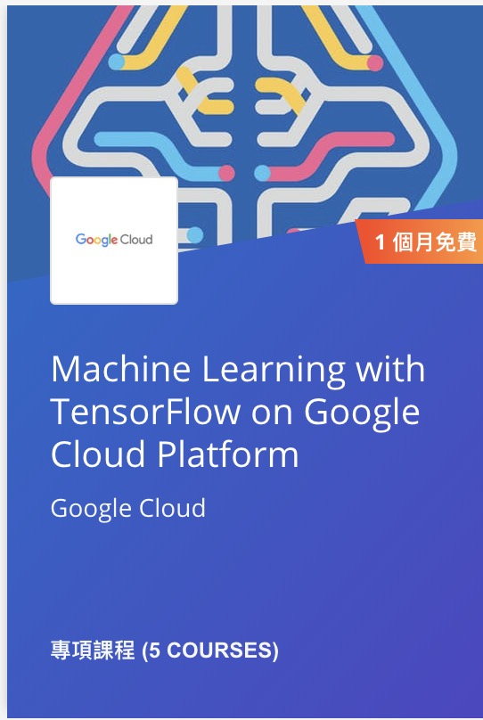

# [Machine Learning with TensorFlow on Google Cloud Platform](https://www.coursera.org/specializations/machine-learning-tensorflow-gcp) 系列上課心得

- How Google does Machine Learning 
- Introduce Tensorflow (本篇文章)

## Introduce Tensorflow 課程鏈結:  [這裡](https://www.coursera.org/learn/intro-tensorflow/home/welcome)

# 文章鏈結:

- Week 1
- Week 2
- Week 3

# 前言：

## 課程大綱:

### How to debug full tensorflow program

- `tf.Print()`
- tfdbg
- TensorBoard

# 小結:

# Reference:

- [Introduce Tensorflow](https://www.coursera.org/learn/intro-tensorflow/home/welcome)
