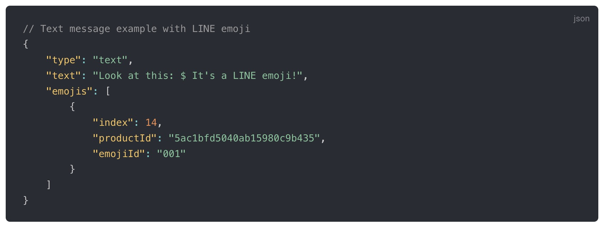
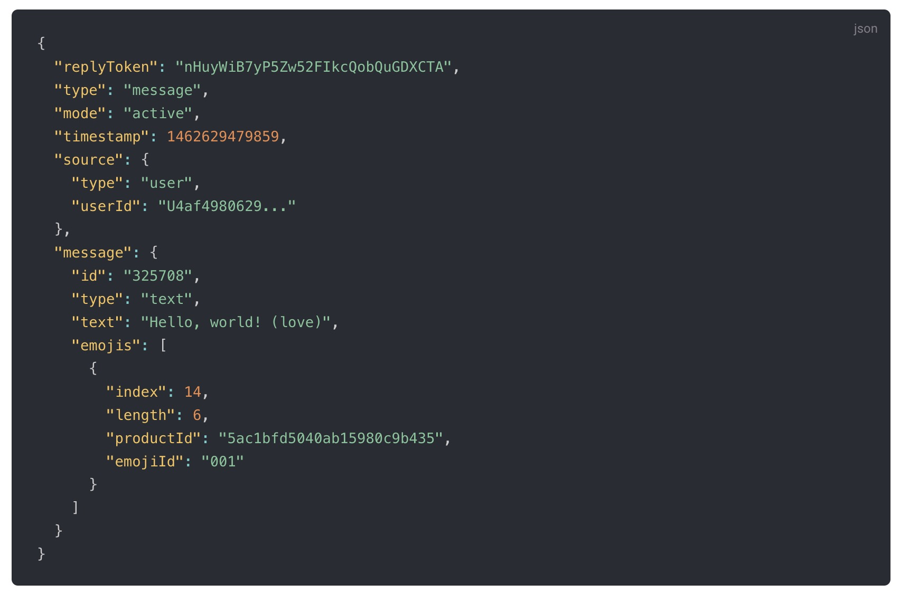

## 前言

LINE Emoji 是指在 LINE App 中可以使用的 LINE 表情集，其中有分為通用的（免費）與付費的表情集。 使用 LINE Emoji 在訊息當中可以讓使用者閱讀的時候更有感覺。 但是身為開發者該如何正確地發送與接受處理這些 LINE Emoji 呢？

這一篇文章將透過 Golang 的範例程式碼，指引該如何正確地發送與接受 LINE 表情集 (LINE Emoji) 。

## 範例程式碼

#### [https://github.com/kkdai/linebot-emoji](https://github.com/kkdai/linebot-emoji)

## 實際跑一個範例 (demo)

- 加入這個官方帳號：

- 隨便傳送一個表情符號，會看到聊天機器人用三種方式回覆你。 分別是：	
  - 舊的 Emoji 傳遞方式來發送
  - 新的 Emoji 傳遞方式來發送
  - 加上使用者的 Emoji 並且透過新的 Emoji 來發送

## 新的 API 說明:

### Use LINE emoji in messages (2020/April)

現在開始要在文字訊息裡面發送 LINE emoji 不需要自行做 unicode 轉換。可以直接在 API 中加上相關的 LINE emoji 編號就可以達成了，開發上變得更方便，也更有彈性。

可以參考新的 API :  [Text message](https://developers.line.biz/en/reference/messaging-api/#text-message) 或是參考新的公告：[[Updated\] Messaging API update for April 2020](https://developers.line.biz/en/news/2020/04/14/messaging-api-update-april-2020/)

### Getting LINE emoji information from the text object of a webhook event (2020/May)

在四月提供了新的發送 API 之後，五月的 Webhook 也提供了新的 Webhook 資訊可以讓聊天機器人有效的處理 LINE Emoji 。  透過 `emojis` 可以取得所有訊息中出現的 LINE Emoji 詳細資訊如下：

可以參考新的 API :  [Text message webhook](https://developers.line.biz/en/reference/messaging-api/#wh-text) 或是參考新的公告：[Messaging API update for May 2020](https://developers.line.biz/en/news/2020/05/12/messaging-api-update-may-2020/)。

## 使用 Golang 開發一個 LINE Emoji Echo Bot:

接下來的會使用 Golang ，根據 [https://github.com/line/line-bot-sdk-go]( https://github.com/line/line-bot-sdk-go) 提供的功能來開發 Echo Bot 。也就是一個會依照使用者講的文字來回覆的聊天機器人。 但是不同於一般 Echo Chatbot ，這個 Echo Bot 將會回傳使用者傳過來的 LINE Emoji ，所以需要具有以下幾個功能：

- 擷取 Webhook text Message 中的 `emojis` 資訊 。
- 將原先文字中的 `(xxx)` (作為表示表情符號的意思，舉例來說 (heart) 是愛心)，替換成 `$`。
- 組合需要回覆使用者的文字與表情，需要注意的事情有兩件：
  - 將使用者回覆的文字加上 `emoji` 資訊，裡面需要注意，相關的 `index` 資訊需要調整。
  - 傳送 `emoji` 前要注意，是否是存在於`可發送的表情清單(sendable LINE Emoji list)`。 由於某一些表情包是需要付費的，只有免費且是 LINE 官方提供使用的可以透過聊天機器人來傳送。 詳情請看： [https://d.line-scdn.net/r/devcenter/sendable_line_emoji_list.pdf](https://d.line-scdn.net/r/devcenter/sendable_line_emoji_list.pdf)

接下來將透過原始碼的說明來解釋相關的流程：

### 擷取 Webhook text Message 中的 `emojis` 資訊 :

## 總結

## 參考

- [https://developers.line.biz/en/news/2020/05/12/messaging-api-update-may-2020/](https://developers.line.biz/en/news/2020/05/12/messaging-api-update-may-2020/)
- [https://developers.line.biz/en/news/2020/04/14/messaging-api-update-april-2020/](https://developers.line.biz/en/news/2020/04/14/messaging-api-update-april-2020/)
- [https://developers.line.biz/en/reference/messaging-api/#text-message](https://developers.line.biz/en/reference/messaging-api/#text-message)
- [https://github.com/kkdai/linebot-emoji](https://github.com/kkdai/linebot-emoji)
