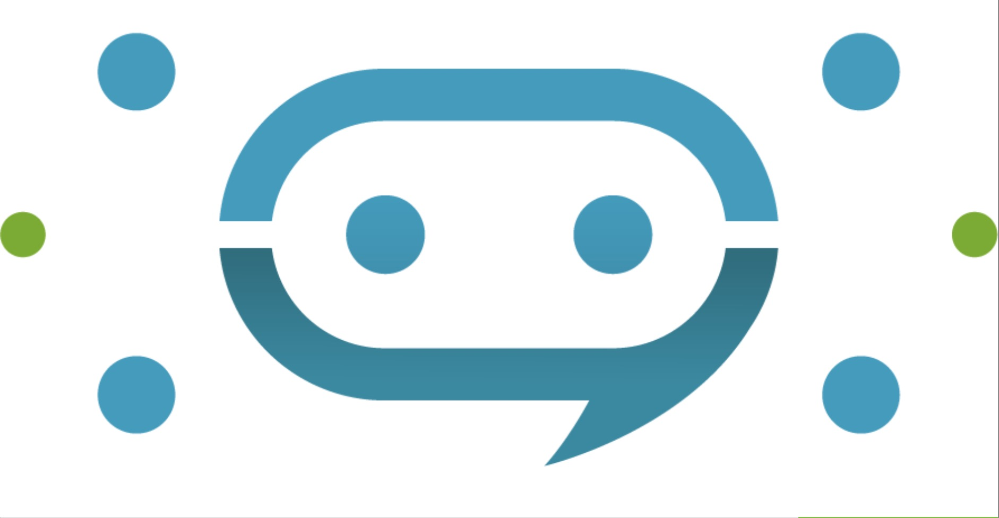

# 前言

大家好，我是 LINE Taiwan 的 Tech Evangelist - Evan Lin。這次很開心受到 chatbot 社群的邀請，參加了 "[Chatbot meetup 聊天機器人小小聚 19 @Online](https://chatbots.kktix.cc/events/meetup-019)" 的聚會活動，並且分享 LINE API 更新與個人開發的心得。在此也跟各位分享本次參與的心得，並且也希望透過社群分享的力量能夠讓聊天機器人的開發動能更加的盛大。  

- 社群 Chatbots Meetup： [https://chatbots.kktix.cc/](https://chatbots.kktix.cc/ ) 
- 本次活動網頁:  [活動網址](https://chatbots.kktix.cc/events/meetup-019)
- 本次活動的共筆紀錄： [ https://hackmd.io/@chatbot-tw/meetups-019]( https://hackmd.io/@chatbot-tw/meetups-019)

由於 Chatbots Meetup 本身屬於社群自主性的活動，裡面也有許多社群朋友所贊助的閃電秀。裡面的所有內容也是相當的難得與有趣。也希望能夠透過本篇文章讓大家稍微了解 Chatbots Meetup 社群閃電秀的魅力。

由於防疫的要求，這次是在線上參與這次的聚會活動。很感謝每一位參與的朋友帶來的問題，希望透過線上以及錄影的方式可以讓更多的朋友可以了解。

##  LINE Platform Update 202005 / 資深開發技術推廣工程師 Evan Lin

<iframe width="560" height="315" src="https://www.youtube.com/embed/MN2VFesxB3U" frameborder="0" allow="accelerometer; autoplay; encrypted-media; gyroscope; picture-in-picture" allowfullscreen></iframe>

#### [投影片](https://speakerdeck.com/line_developers_tw/line-developer-oa-update-and-api-update-2020-may)

### [04/30: liff.getLineVersion() and liff.id added to LIFF v2](https://developers.line.biz/en/news/2020/04/30/liff-get-line-version-and-id-released/)

雖然之前 LIFF 有提供了 [liff.isApiAvailable()](https://developers.line.biz/en/reference/liff/#is-api-available) 的功能來檢查該 API 是否能夠支援。 但是許多時候，開發者是需要取得使用者的 LINE App 版本來對於問題的復現與除錯之用。 這時候可以透過 LIFF 的 [liff.getLineVersion()](https://developers.line.biz/en/reference/liff/#get-line-version) 可以取得目前執行這個 LIFF 的 LINE App 版本號碼。 當然如果使用者是使用 External Browser 來開啟 LIFF 的話這個就會回傳 `null` 。

### [05/08: LIFF Versioning policy and life cycle have been released](https://developers.line.biz/en/news/2020/05/08/liff-versioning-policy/)

接下來這個部分是討論 LIFF 的 Versioning policy 之後將採取 [Semantic Versioning ](https://semver.org/) 也就是針對版本號碼的管理，將依照以下原則:  `MAJOR.MINOR.PATCH` 。至於 `MAJOR`，`MINOR` 與 `PATCH` 分別代表什麼意義，歡迎查看相關資料。

此外，這一次的公告也提出了。將版本停止支援( End-of-life) 之後，相關的 SDK 也會從 CDN 移除，也就不會有任何 API 可以使用。

最後，也是最重要的就是開發者們關心的 LIFF 支援的週期： `LIFF v1 將支援到 2021 的九月` 。

希望所有開發者能夠記住這個時間，儘早準備 migrate LIFF App  到 LIFF v2 。

### [05/12: Messaging API update for May 2020](https://developers.line.biz/en/news/2020/05/12/messaging-api-update-may-2020/)

#### Message character limit and media file usage conditions have been changed

又到了每個月的平台更新相關解說，五月份的平台更新。第一個部分的更新，是關於 Messaging API 有一些訊息的額度要增加了。 依序有相關的 Image Message， Video Message 跟 Text Message 的上限增加。 需要的人可以[查看這個部分](https://developers.line.biz/en/news/2020/05/12/messaging-api-update-may-2020/)。

#### Getting LINE emoji information from the text object of a webhook event

第二個部分的更新是新增了 LINE Emoji webhook 的支援，讓開發者可以收到使用者傳來的 LINE Emoji 訊息資料。 詳細的部分歡迎查看：  [關於 LINE Emoji 的一些細節（以 Golang 為例)](https://engineering.linecorp.com/zh-hant/blog/)。

#### Safely retrying a failed API request

許多開發者在發送 Broadcast 或是 Multicast 訊息的時候，可能因為訊息量過大沒有收到平台這邊回覆正確。 也有可能因為某些意外狀況平台回覆並非正常的狀況，造成開發者們無法確認使用者有沒有收到正確的訊息。  以往的狀況是透過重複發送的方式來確保使用者能夠收到訊息，但是如此一來有不少重複的使用者可能會收到重複的訊息，進而造成費用的重複計算。

這一次五月的更新，提供了 "Safely retrying" 機制。 可以讓開發者測試一下上次的訊息是否有正確的發送成功，並且也可以確保有無任何的使用者被漏發了。 相關的使用情境如下：

- 上次不知道有無法送完成，呼叫 "Safely retrying" 可以重複發送同一則訊息。 有收過得不會收到重複訊息，沒收到的可以確保收到。
- 上次發送發生了平台無法完成指令的意外，透過 "Safely retrying" 可以跟平台確認上次的狀況。 如果上次有完整發送完畢，也不會有重複計費的疑慮。

### [ 05/19 OGP tags are now available in the LIFF app](https://developers.line.biz/en/news/2020/05/19/liff-supports-ogp-tags/)

OGP (Open Graph Protocol)  原本就是一個給 SNS 或是瀏覽器作為擷取縮圖與相關資訊的協定。 但是之前透過 http://liff.line.me 的轉址原因，無法正確讓 LIFF 上面的 OGP 成功運作。 現在也已經正常的支援，不論是哪一種 LIFF 資訊都可以透過填寫正確的 OGP 資訊在其他 SNS (或是 LINE App) 上取得正確的資訊與縮圖。

### [05/21: Publish API documentation to get a permanent link](https://developers.line.biz/en/news/2020/05/21/permanentlink-related-api/)

之前透過 LIFF 進去某個頁面後，無法正確的取得某個子頁面的網址作為傳遞與分享。 現在可以透過 `liff.permanentLink.createUrl()` 的新支援的 API 來分享 LIFF 頁面給其他使用者。 也可以透過 `liff.permanentLink.setExtraQueryParams()` 來幫忙將使用者目前的環境參數用來組合相關的資訊，成為一整個可以分享的網址。

### LINE Beacon 的介紹:

最後也跟開發者們分享，目前的 LINE Beacon 也已經正式開始營運。有任何開發上需求的開發者（或是業者），歡迎透過 [LINE for Business](https://linebiz.com) 與經銷業務接洽。

# 使用 lotify + Swagger 建置可共用的 LINE Notify bot / **LINE API Expert - NiJia**

#### [影片](https://www.youtube.com/watch?v=agYVz6dzh1I)

#### [投影片](https://www.slideshare.net/JiaYuLin6/build-line-notify-bot-by-lotify-and-create-client-library-by-swagger-20200527-234623929)

## 如何在 LIFF 傳送隱藏資料給機器人 /  **微程式股份有限公司 - 均民**

#### [影片](https://www.youtube.com/watch?v=PuGOObhI5oA)

#### [投影片](https://hackmd.io/@taichunmin/chatbot-tw-202005)

## 閃電秀 - LINEBOT 學習地圖】 - [#Jeffrey](https://www.youtube.com/results?search_query=%23Jeffrey) 

#### [影片](https://www.youtube.com/watch?v=FxLxyhGyP-4)
#### [投影片](https://jamboard.google.com/d/17PXCjzj2dTsxyjRglLaWibW2ul02pcb2yk7qtNhHSC8)

## 活動小結

社群分享永遠是讓創意激盪的最佳方式，而 Chatbots Meetup 是一個很熱情與充滿創造力的社群組織。也希望有更多有創意的開發者願意加入 LINE Chatbot 的開發行列，更希望能熱情的參與社群的活動與一起來分享。

立即加入「LINE開發者官方社群」官方帳號，就能收到第一手Meetup活動，或與開發者計畫有關的最新消息的推播通知。▼

「LINE開發者官方社群」官方帳號ID：[@line_tw_dev](https://lin.ee/s5RsZHo)

## 關於「LINE開發社群計畫」

LINE今年年初在台灣啟動「LINE開發社群計畫」，將長期投入人力與資源在台灣舉辦對內對外、線上線下的開發者社群聚會、徵才日、開發者大會等，已經舉辦30場以上的活動。歡迎讀者們能夠持續回來察看最新的狀況。詳情請看:

- [2019 年LINE 開發社群計畫活動時程表](https://engineering.linecorp.com/zh-hant/blog/line-taiwan-developer-relations-2019-plan/)
- [LINE Taiwan Developer Relations 2019 回顧與 2019 開發社群計畫報告](https://engineering.linecorp.com/zh-hant/blog/line-taiwan-developer-relations-2019/)
- [2020 年LINE 開發社群計畫活動時程表](https://engineering.linecorp.com/zh-hant/blog/2020-line-tw-devrel/)

