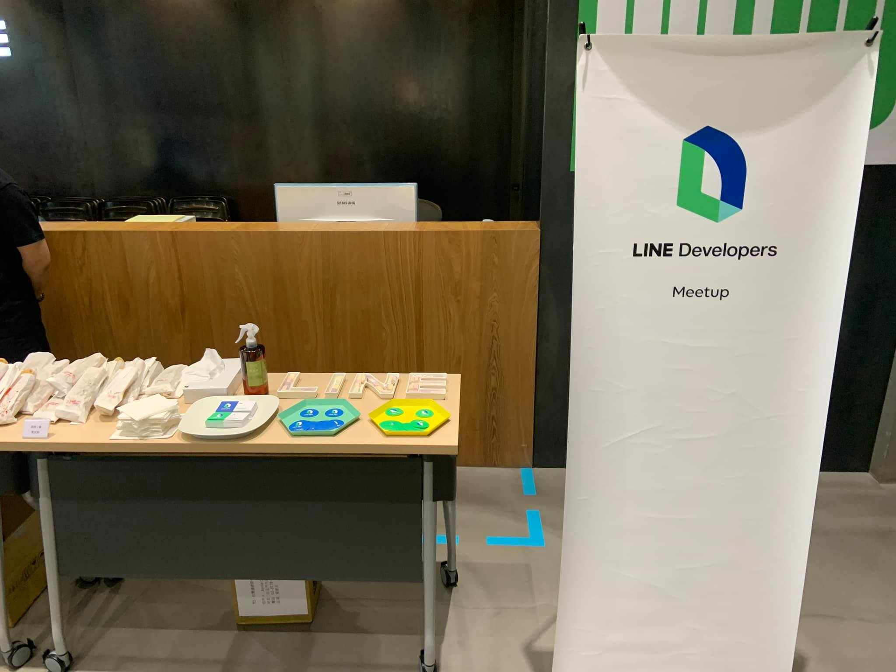

# 前言

大家好，我是 LINE Taiwan 的 Tech Evangelist - Evan Lin。這次很開心受到 chatbot 社群的邀請，參加了 "[Chatbot meetup 聊天機器人小小聚 20 @Online](https://chatbots.kktix.cc/events/meetup-020)" 的聚會活動，並且分享 LINE API 更新與個人開發的心得。在此也跟各位分享本次參與的心得，並且也希望透過社群分享的力量能夠讓聊天機器人的開發動能更加的盛大。  

- 社群 Chatbots Meetup： [https://chatbots.kktix.cc/](https://chatbots.kktix.cc/ ) 
- 本次活動網頁:  [活動網址](https://chatbots.kktix.cc/events/meetup-019)
- 本次活動的共筆紀錄： [https://hackmd.io/@chatbot-tw/meetups-020](https://hackmd.io/@chatbot-tw/meetups-020)

由於 Chatbots Meetup 本身屬於社群自主性的活動，裡面也有許多社群朋友所贊助的閃電秀。裡面的所有內容也是相當的難得與有趣。也希望能夠透過本篇文章讓大家稍微了解 Chatbots Meetup 社群閃電秀的魅力。

這次活動總算又回到 LINE 台灣的辦公室來舉辦，同時這也是疫情後 LINE 辦公室第一次舉辦線下的聚會。希望透過這次的聚會可以讓更多朋友了解到打造自己的聊天機器人是如此讓人開心的事情。

##  LINE Platform Update 202005 / 資深開發技術推廣工程師 Evan Lin

<iframe width="560" height="315" src="https://www.youtube.com/embed/gtpm4zKlsXI" frameborder="0" allow="accelerometer; autoplay; encrypted-media; gyroscope; picture-in-picture" allowfullscreen></iframe>

#### [投影片](https://speakerdeck.com/line_developers_tw/room-api-demo)

### [06/09: Flex Message Simulator tutorial now available](https://developers.line.biz/en/news/2020/06/09/flex-message-simulator-tutorial/)

Flex Message 一直都是開發者在開發 chatbot 上面最常用來跟使用者互動的訊息格式。除了提供各種基礎的樣版之外，更有許多有元件可以讓開發者發揮創造力。 而  [Flex Message Simulator](https://developers.line.biz/flex-simulator/) 更是開發者與設計師溝通最好的橋樑，設計師可以透過  [Flex Message Simulator](https://developers.line.biz/flex-simulator/) 來套出漂亮的 Flex Message 之後，再透過 JSON 資料給開發人員加入 Chatbot 中。 

但是要如何透過 [Flex Message Simulator](https://developers.line.biz/flex-simulator/) 來開發 Flex Message 呢？ 本月份就有新的文件更新，透過逐步的教學讓沒有程式開發基礎的人也能透過 [Flex Message Simulator](https://developers.line.biz/flex-simulator/) 開發出一個數位的名片。

如果需要更多的 Flex Message 的樣板，也可以參考這篇我翻譯來自泰國 LINE API Expert 所提供的樣板。

#### 參考鏈結:

- [Flex Message Template](http://www.evanlin.com/th-lae-flextemplate/)

### [06/10: Messaging API update for June 2020](https://developers.line.biz/en/news/2020/06/10/messaging-api-update-june-2020/)

接下就是到了本月份的 Messaging API 新功能更新了，這個月主要的更新都跟群組(Group) 與聊天室 (Room) 有關，主要圍繞著以下三個新功能：

- [取得群組的資訊 (Get Group Profile)](https://developers.line.biz/en/reference/messaging-api/#get-group-summary) 
- [取得群組裡面成員總數](https://developers.line.biz/en/reference/messaging-api/#get-members-group-count)
- [取得聊天室的成員總數](https://developers.line.biz/en/reference/messaging-api/#get-members-room-count)

透過這三個資訊，筆者也在稍後的內容整理出如何製作出一個簡易的群組/聊天室管理機器人。

### [06/15: Developer Console 裡面的設定  "Linked OA"  的位置修改](https://developers.line.biz/en/news/2020/06/15/linked-oa-relocation/)

原本 LINE Login Channel 裡面都有一個 "Linked OA" 也就是指定 LINE Login Channel 鏈結的官方帳號 Channel 。 經過設定鏈結後，可以透過 LINE Login 的同時，詢問使用者要不要一起加入官方帳號為好友。 相當的有用啊！ 
設定的位置從 "LINE Login" Tab 移到 "Basic Setting" 的位置，大家千萬別忘記。

### [06/15: LIFF 支援 Error Code](https://developers.line.biz/en/news/2020/06/15/liff-added-lifferror-code/)

以往對於 LIFF 開發者而言，對於 API 請求如果失敗（或是發生錯誤）。只會出現 Exception 需要來處理，但是往往不知道到底是發生什麼問題？ 是參數設定錯誤？ 還是呼叫的方式不正確？

現在開始有了 `LiffErr` 資料可以取得，目前先支援以下的 API :

- [liff.init()](https://developers.line.biz/en/reference/liff/#initialize-liff-app)
- [liff.getProfile()](https://developers.line.biz/en/reference/liff/#get-profile)
- [liff.getFriendship()](https://developers.line.biz/en/reference/liff/#get-friendship)

## 活動小結

社群分享永遠是讓創意激盪的最佳方式，而 Chatbots Meetup 是一個很熱情與充滿創造力的社群組織。也希望有更多有創意的開發者願意加入 LINE Chatbot 的開發行列，更希望能熱情的參與社群的活動與一起來分享。

立即加入「LINE開發者官方社群」官方帳號，就能收到第一手Meetup活動，或與開發者計畫有關的最新消息的推播通知。▼

「LINE開發者官方社群」官方帳號ID：[@line_tw_dev](https://lin.ee/s5RsZHo)

## 關於「LINE開發社群計畫」

LINE今年年初在台灣啟動「LINE開發社群計畫」，將長期投入人力與資源在台灣舉辦對內對外、線上線下的開發者社群聚會、徵才日、開發者大會等，已經舉辦30場以上的活動。歡迎讀者們能夠持續回來察看最新的狀況。詳情請看:

- [2019 年LINE 開發社群計畫活動時程表](https://engineering.linecorp.com/zh-hant/blog/line-taiwan-developer-relations-2019-plan/)
- [LINE Taiwan Developer Relations 2019 回顧與 2019 開發社群計畫報告](https://engineering.linecorp.com/zh-hant/blog/line-taiwan-developer-relations-2019/)
- [2020 年LINE 開發社群計畫活動時程表](https://engineering.linecorp.com/zh-hant/blog/2020-line-tw-devrel/)

