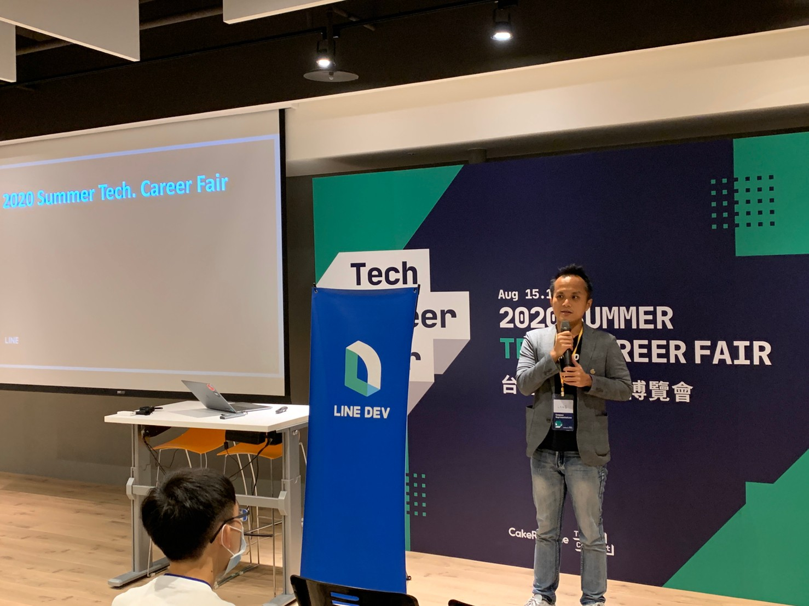
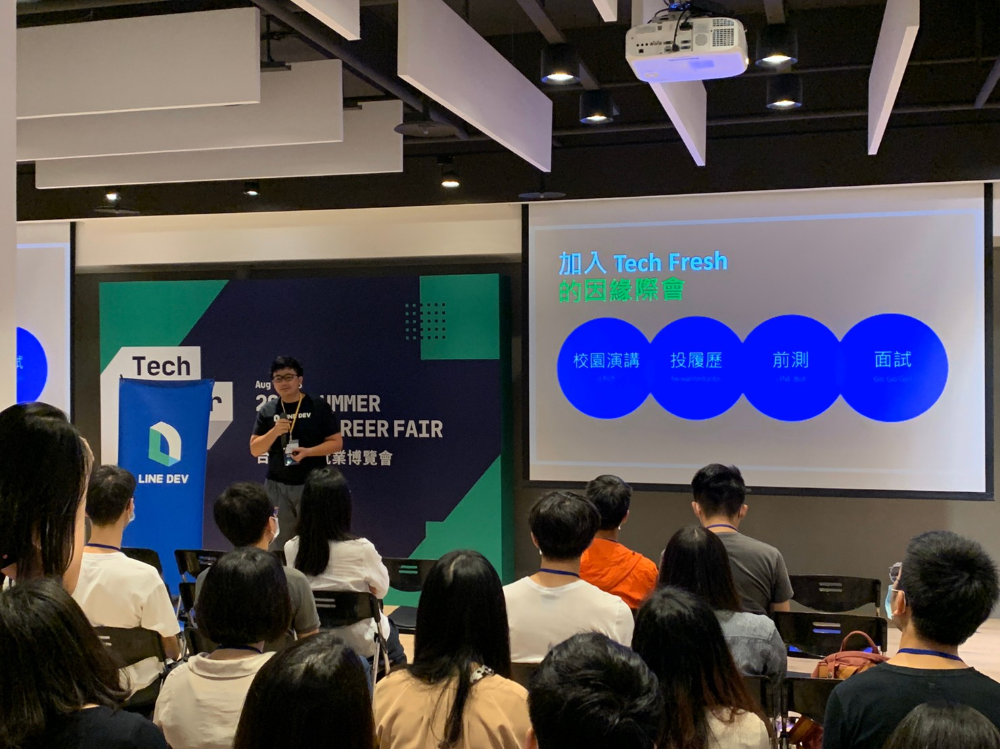
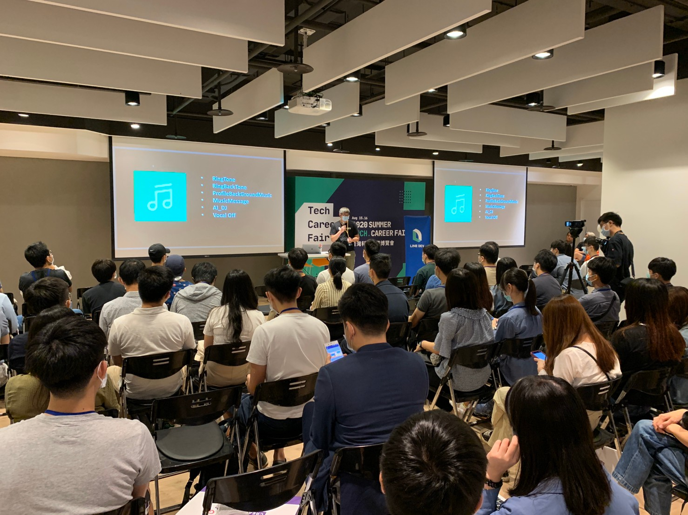

大家好，我是 LINE Tech Evangelist - Evan Lin 。LINE 致力於舉辦對內的技術交流、教育訓練，以及對外的社群聚會、校園演講、開發者徵才日與開發者大會等各式各樣的活動。我們希望創造更多技術分享與跨國交流的機會，同時持續招募優秀人才加入 LINE 台灣開發工程團隊! 

這是參加到今年第一個聯合徵才的台灣科技就業博覽會，希望能讓更多的學生朋友能了解 LINE 所帶來的學生實習計畫。「 LINE 技術新星人才計劃 - LINE TECHFRERSH 」。

首先先來介紹第一場也就是 LINE 台灣的 LINE TECH FRESH 與相關團隊的介紹。

## ** TECHFRESH 計畫介紹 - Evan Lin**

首先還是先讓大家了解 LINE 的成立是因為 2011 年東京發生大地震的時候，許多人因為擔心著朋友的近況。於是開發了透過貼圖的訊息溝通軟體。 正也是呼應了 LINE 的成立宗旨：「 Closing The Disctance 」。 希望透過科技來拉近人與人，人與資訊，人與科技之間的距離。 

### LIFE on LINE with AI

由這張圖可以看到，感謝台灣群眾的喜愛。其實日常生活中充滿著許多 LINE 的相關服務。 而其中更是有許多服務都透過 AI 的技術來提供讓使用者更方便的服務。

- 早上一起來看著 LINE Today 提供的個人化新聞，根據使用者經常閱讀的新聞來猜你喜歡的頭條。
- 中午逛街的時候，經過捷運站可能會觸發 LINE Beacon 的服務，並且 LINE 貼圖的購買也會根據圖片內容下一些關鍵字協助搜尋。
- 朋友間討論 LINE 功能，需要知道更進一步的使用方式。不需要真人客服的服務，可以透過 [LINE 客服小幫手](http://official-blog.line.me/tw/archives/79423075.html)給予適當的協助。
- 收到一些疑似的假訊息，可以馬上透過 [LINE 訊息查證小幫手](https://fact-checker.line.me/) 的人工智慧判別機制，馬上告訴你假消息。讓你不會成為假消息的幫兇。
- 晚餐想找點特別的餐廳，可以透過 [LINE SPOT](http://official-blog.line.me/tw-biz/archives/78600425.html) 來尋找最近的地點。並且透過 AI 的方式來推薦你可能有興趣的景點或是店家。
- 回到家之後可以透過 [LINE Music](https://event-web.line.me/ECTW/article/Qq5Njl) 來播放令人覺得放鬆的音樂，並且可以透過 AI 來快速找尋到你喜歡的歌曲與歌手。
- 睡覺前意猶未竟？可以透過 [LINE 購物](https://buy.line.me/)的 AI 購物推薦，馬上找到你最有興趣的商品，節省下單時間。

### LINE TECH FRESH 介紹

LINE 台灣工程團隊每年透過 [LINE TECH FRESH – 技術新星人才計劃](https://career.linecorp.com/linecorp/career/detail/20000111/704/5570?classId=&locationCd=TW&page=)，招募資訊科技相關科系，或對此領域有所涉略的大學生 / 研究生加入 LINE 團隊進行長期實習 (一年期)，讓同學們能在國際級科技公司中觀摩學習。

更多內容，可以參考這篇文章： [LINE TECH FRESH – 技術新星人才計劃，實習經驗大公開](https://engineering.linecorp.com/zh-hant/blog/tech-fresh-2020/)

每一位實習同學都會分配到不同的團隊中，擔任著團隊裡面的種子工程師。經過一些內部與訓練型專案的指導，讓每一位參與的同學能夠了解跨國產品的開發流程與大公司的軟體工程技巧。 

接下來由各個不同團隊來分享不論是擔任 TECH FRESH 的心得，或是許多有 TECH FRESH 的用人主管來分享他們專案的訓練方式與負責的業務範圍。

### 相關內容

- [「LINE 客服小幫手」智能客服全新升級～對談中解決用LINE大小事](http://official-blog.line.me/tw/archives/79423075.html)

- [LINE 貼圖小舖](https://store.line.me/home/zh-Hant)

- [LINE 訊息查證小幫手](https://fact-checker.line.me/)

- [LINE 全新服務即將登場！LINE SPOT 店家召集令正式展開！](http://official-blog.line.me/tw-biz/archives/78600425.html)

- [LINE MUSIC 去人聲功能上線](https://event-web.line.me/ECTW/article/Qq5Njl)

- [LINE購物｜先LINE購物再購物· LINE POINTS回饋賺不停](https://buy.line.me/)

  

## ** TECHFRESH 實習心得分享  - Wei**

接著上場的目前在 LINE Music 擔任正職開發工程師的 Wei ，講者之前也是由 TECH-FRESH 實習計畫畢業後獲得正職的機會。因為剛畢業的新鮮人要直接能獲得 LINE 的面試機會是相當的難得，往往面試官在挑選上都會希望畢業生或是新鮮人是經過 LINE 實習計畫出來的。才能夠確認是否符合公司文化外，透過為期一年的培養下，讓有潛力的開發人員能夠獲得有制度的訓練。

### 為何想加入 TECH-FRESH

講者首先在分享就有提到當初由於在校園的場子，偶然聽到 LINE 提供了實習計畫。於是馬上在 [LINE Career 網頁](https://career.linecorp.com/linecorp/career/detail/20000111/704/5570?classId=&locationCd=TW&page=)上面提出申請。 經過了線上測試與線上作業後。獲得了面試的機會，面試官透過講者所繳交的專案來相互討論設計的想法與更多可以改善的空間。 進而獲得近來實習的機會。

### TECH-FRESH 的實習生活

除了有相當高檔的辦公室椅子與個人工作電腦之外，最讓講者覺得驚奇的是工作方式的自由與鼓勵創意的方式。

- **開發方式的自由:**
  - 可以透過與 mentor 的討論，提議想要開發使用的框架與方法。
- **跨部門合作:**
  - 透過與其他 TECH-FRESH 的相互合作，甚至是學習到跨部門的合作（往往都是與日本的跨國合作。）。讓講者感受到跨國產品的開發流程。
- **有制度的開發與上線流程:**
  - 身為國內前幾大的網路服務提供商，所有的服務在上架之前都有嚴格的審核機制。在內部開發的時候更有詳細規定好該如何做 code review 與相關的測試規範。 讓當時身為學生的講者，學習到許多的經驗。
- **優渥的福利：**
  - 雖然身為實習的學生，但是應該要有的員工訓練與相關的同仁聚餐也都不會少。 隨著許多專案的上線，身為專案的貢獻者，更是有著跟著 LINE 工程團隊一起慶祝。

### 給想報名 TECH-FRESH 的學生建議

最後對於 LINE TECH-FRESH 有興趣的人，講者也有一些建議。

- **良好查資料能力：**
  - 在 LINE 中經常會使用新的技術與架構來嘗試專案，並且透過這些技術來改善許多舊有的工作流程。工程師的自學能力相當的重要，所以要建立好如何能快速找尋到需要的資料是相當的重要。
- **網路教學影片與多看原始碼:**
  - 對於自我學習部分，除了網路上有相當多的教學影片外。更建議同學們要經常主動閱讀開源程式裡面的原始碼，這樣除了能自行找尋問題之外。對於許多 coding style 與 coding convention 才能習慣，對於應徵實習機會的時候會相當的佔優勢。
- **多做 Side Project ，作為熟悉技術的方法:**
  - 透過作多 side project ，除了可以了解 git 的基本流程，了解開源專案的進行方式外，更能夠熟悉許多技術與了解該技術開發上可能會遇到的困難。

### 參考資料:

- [LINE Career - TECH FRESH 職務說明與應徵（英文）](https://career.linecorp.com/linecorp/career/detail/20000111/704/5570?classId=&locationCd=TW&page=)

## LINE Music 團隊介紹  - Cid

接下來由 [LINE Music](https://event-web.line.me/ECTW/article/Qq5Njl) 的開發團隊 lead - Cid 來分享與介紹。

### 什麼是 LINE Music 

LINE Music 是 LINE 所提出的線上音樂串流播放平台。並且與許多 LINE 的功能有深入的整合：

- 「LINE鈴聲自造」功能讓用戶能從LINE MUSIC中離線下載任何歌曲，剪輯喜歡的音樂片段製作成個人化的LINE音樂鈴聲及來電答鈴。
- 還能在LINE個人檔案頁面設定背景音樂。
- 「AI智慧推薦」功能將根據千萬首的曲庫及個人音樂點擊狀況，每天更新個人特選歌單。
- 「聊天室一鍵分享」功能讓用戶可以在聊天室中將30秒歌曲片段分享給朋友，即使對方不是LINE MUSIC會員也能免費收聽。
- 最新的更有 [LINE MUSIC 去人聲功能上線](https://event-web.line.me/ECTW/article/Qq5Njl)

## LINE HR ONLINE 專案分享  - Libra

## LINE QA 團隊介紹  - John Wu

## 攤位活動

## 活動小結

立即加入「LINE開發者官方社群」官方帳號，就能收到第一手Meetup活動，或與開發者計畫有關的最新消息的推播通知。▼

「LINE開發者官方社群」官方帳號ID：[@line_tw_dev](https://lin.ee/s5RsZHo)

## 關於「LINE開發社群計畫」

LINE今年年初在台灣啟動「LINE開發社群計畫」，將長期投入人力與資源在台灣舉辦對內對外、線上線下的開發者社群聚會、徵才日、開發者大會等，已經舉辦30場以上的活動。歡迎讀者們能夠持續回來察看最新的狀況。詳情請看:

- [2019 年LINE 開發社群計畫活動時程表](https://engineering.linecorp.com/zh-hant/blog/line-taiwan-developer-relations-2019-plan/)
- [LINE Taiwan Developer Relations 2019 回顧與 2019 開發社群計畫報告](https://engineering.linecorp.com/zh-hant/blog/line-taiwan-developer-relations-2019/)
- [2020 年LINE 開發社群計畫活動時程表](https://engineering.linecorp.com/zh-hant/blog/2020-line-tw-devrel/)

### 徵才訊息
《LINE 強力徵才中!》與我們一起 Close the Distance 串聯智慧新世界 >> [詳細職缺訊息](https://career.linecorp.com/linecorp/career/list?classId=&locationCd=TW)
