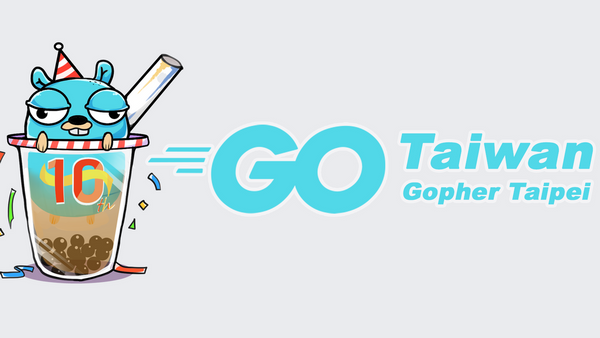

# 前言

大家好，我是 LINE Taiwan 的 Tech Evangelist - Evan Lin。這次很開心受到 Golang 社群的邀請，參加了 "[Golang Taipei Gathering #49 Webinar](https://www.meetup.com/golang-taipei-meetup/events/270708366/)" 的聚會活動，並且分享 Golang 開發的一些技巧與個人開發的心得。在此也跟各位分享本次參與的心得，並且也希望透過社群分享的力量能夠讓 Golang 更受到人了解。  

- 社群 Chatbots Meetup： [https://www.meetup.com/golang-taipei-meetup](https://www.meetup.com/golang-taipei-meetup) 
- 本次活動網頁:  [活動網址](https://www.meetup.com/golang-taipei-meetup/events/270708366/)

由於防疫的要求，這次是在線上參與這次的聚會活動。很感謝每一位參與的朋友帶來的問題，希望透過線上以及錄影的方式可以讓更多的朋友可以了解。

## How to rebuild a WebSocket service by golang and redis pubsub / LY @MaiCoin Group

#### RECAP

- Good Infra
- 
- Good Design

RabbitMQ:
-
 

##  Callbackgen / C9S @MaiCoin Group

## 活動小結

立即加入「LINE開發者官方社群」官方帳號，就能收到第一手Meetup活動，或與開發者計畫有關的最新消息的推播通知。▼

「LINE開發者官方社群」官方帳號ID：[@line_tw_dev](https://lin.ee/s5RsZHo)

## 關於「LINE開發社群計畫」

LINE今年年初在台灣啟動「LINE開發社群計畫」，將長期投入人力與資源在台灣舉辦對內對外、線上線下的開發者社群聚會、徵才日、開發者大會等，已經舉辦30場以上的活動。歡迎讀者們能夠持續回來察看最新的狀況。詳情請看:

- [2019 年LINE 開發社群計畫活動時程表](https://engineering.linecorp.com/zh-hant/blog/line-taiwan-developer-relations-2019-plan/)
- [LINE Taiwan Developer Relations 2019 回顧與 2019 開發社群計畫報告](https://engineering.linecorp.com/zh-hant/blog/line-taiwan-developer-relations-2019/)
- [2020 年LINE 開發社群計畫活動時程表](https://engineering.linecorp.com/zh-hant/blog/2020-line-tw-devrel/)

