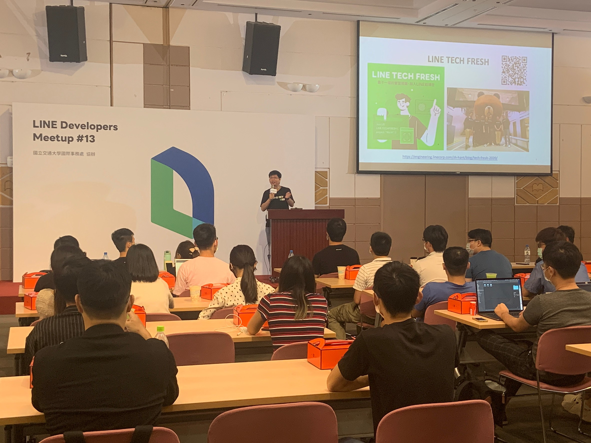

## 前提

大家好，我是 LINE Taiwan DevRel 團隊的  Evan Lin。很開心在這裡跟各位分享本年度的第三場開發者小聚。 這也是疫情後第一次在新竹舉辦的線下聚會的活動。 也是 LINE 台灣工程團隊第一次來到交通大學舉辦線下的活動。


KKTIX 活動網頁:  [活動網址](https://linegroup.kktix.cc/events/20200918)

本次 LINE Developer Meetup 開發者小聚，首先有 LINE 台灣技術長 Marco Chen 帶來的 LINE 技術新星實習計畫的相關介紹，並且有 LINE 資料工程團隊的負責人 Shawn Tsai 帶來關於 ”How ML Powers LINE Services" 。


## LINE TECH FRESH (LINE 技術新星人才計劃) 學生實習計畫宣傳 / CTO Marco Chen



首先上場的就是 LINE 台灣的 CTO - Marco Chen ，身為 LINE 工程團隊的大家長 Marco 為所有同學來解釋關於 TECH-FRESH 當初成立的緣由。以下有一些擷取自當天內容：

```
請問各位在職的來賓，你們當年在學校想著從事你現在的職務的人，請舉手。
請問各位在校的同學，你很確定你將來的工作内容是什麽的人，請舉手。

你們知道在 LINE 或像 LINE 這樣的網際網路應用服務的公司，開發一個大流量的系統，要有多少種專業角色的人參與？
使用多少種技術？ 各位知道有那些角色? 那些職務？

TECHFRESH 是 LINE Taiwan 的在校生技術實習計劃，有兩個主要的目的:

- 幫助準備要進入職場的同學,真正的去了解,在一家網際網路應用服務的公司中,會有那些軟體開發的工作。進而可以讓同學們，找出自己職涯中最合適自己的工作内容，發揮自己的專長。不論最後是不是在 LINE 發展，我們也幫助這個國家培養出好的人才，能發揮最大能力貢獻給這國家。

- 在過程中培養出熟悉我們開發技術與流程的人材，進而到最後願意留在 LINE 發展。原本 LINE 的暑期工讀計劃,三個月的時間,對於資訊科系學生想要能真的了解統開發生命週期中所有角色與工作内容，實在太有限了。 因此我們向總部提出一年的實習計劃，一週來三天，工作內容則是由 TPM 帶領，執行一些一次性的專案開發,或者加入專案團隊支援專案團隊的開發工作。
```

透過


### 相關資料:

- [LINE TECH FRESH – 技術新星人才計劃](https://career.linecorp.com/linecorp/career/detail/20000111/704/5570?classId=&locationCd=TW&page=)
-  [LINE TECH FRESH – 技術新星人才計劃，實習經驗大公開](https://engineering.linecorp.com/zh-hant/blog/tech-fresh-2020/)


## How ML Powers LINE Services / LINE Data Team - Shawn Tsai 


## LINE Shopping App with Flutter / LINE Client Team - Evan Fang


## Serving Location-based data / LINE 熱點 - Julian Shen


## Introducing LINE Pay / LINE Pay -  Kevin Hsiao


## Introducing LINE UIT Team / LINE Pay -  George Duan


## Introducing LINE QA Team  / LINE QA - Miki Liao


## LINE FRESH 校園競賽 2020 介紹 / LINE DevRel - Evan Lin 


## 現場活動花絮


## 活動小結

立即加入「LINE開發者官方社群」官方帳號，就能收到第一手Meetup活動，或與開發者計畫有關的最新消息的推播通知。▼

「LINE開發者官方社群」官方帳號ID：[@line_tw_dev](https://lin.ee/s5RsZHo)


## 關於「LINE開發社群計畫」

LINE今年年初在台灣啟動「LINE開發社群計畫」，將長期投入人力與資源在台灣舉辦對內對外、線上線下的開發者社群聚會、徵才日、開發者大會等，已經舉辦30場以上的活動。歡迎讀者們能夠持續回來察看最新的狀況。詳情請看:

- [2019 年LINE 開發社群計畫活動時程表](https://engineering.linecorp.com/zh-hant/blog/line-taiwan-developer-relations-2019-plan/)
- [LINE Taiwan Developer Relations 2019 回顧與 2019 開發社群計畫報告](https://engineering.linecorp.com/zh-hant/blog/line-taiwan-developer-relations-2019/)
- [2020 年LINE 開發社群計畫活動時程表](https://engineering.linecorp.com/zh-hant/blog/2020-line-tw-devrel/)

