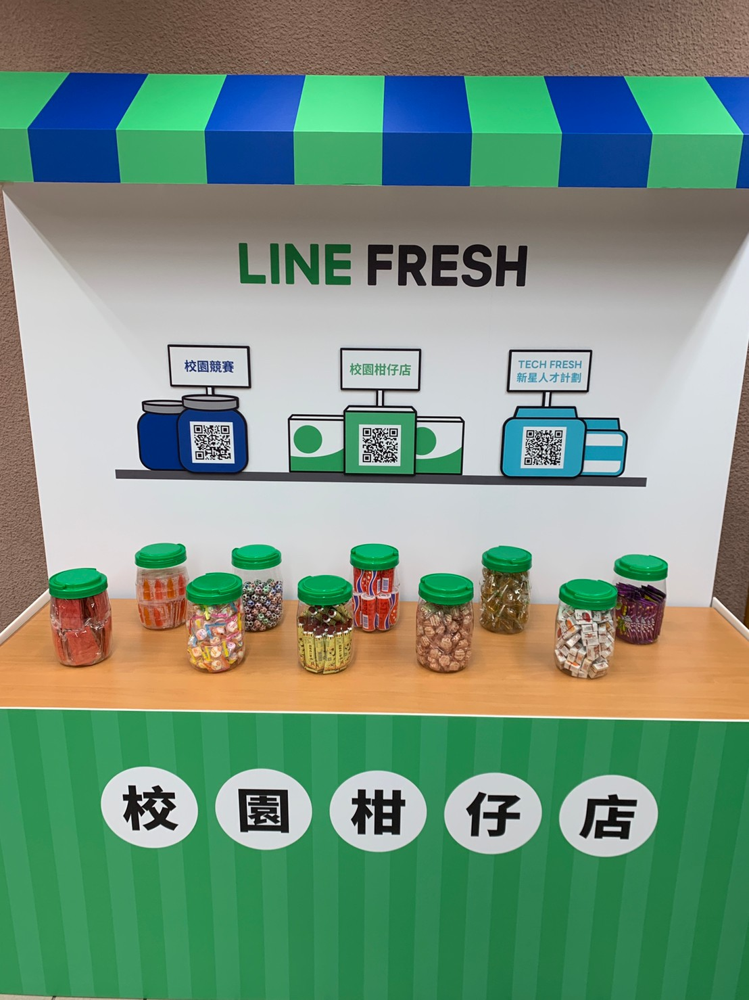

## 前提

大家好，我是 LINE Taiwan DevRel 團隊的  Evan Lin。很開心在這裡跟各位分享本年度的第三場開發者小聚。 這也是疫情後第一次在新竹舉辦的線下聚會的活動。 也是 LINE 台灣工程團隊第一次來到交通大學舉辦線下的活動。

KKTIX 活動網頁:  [活動網址](https://linegroup.kktix.cc/events/20200918)

本次 LINE Developer Meetup 開發者小聚，首先有 LINE 台灣技術長 Marco Chen 帶來的 LINE 技術新星實習計畫的相關介紹，並且有 LINE 資料工程團隊的負責人 Shawn Tsai 帶來關於 ”How ML Powers LINE Services" 。

### 文章列表

- 第一篇 : [[研討會心得] 2020/09/18 LINE Developer Meetup 13 （一）](http://www.evanlin.com/LDM13/)
- 第一篇 : [研討會心得] 2020/09/18 LINE Developer Meetup 13 （二）
- 第一篇 : [研討會心得] 2020/09/18 LINE Developer Meetup 13 （三）

## LINE Shopping App with Flutter / LINE Client Team - Evan Fang

[投影片](https://speakerdeck.com/line_developers_tw/line-shopping-app-with-flutter)

<iframe width="560" height="315" src="https://www.youtube.com/embed/lcBTHEhJJxw" frameborder="0" allow="accelerometer; autoplay; clipboard-write; encrypted-media; gyroscope; picture-in-picture" allowfullscreen></iframe>

(LINE 購物 App 功能介紹)

接下來輪到講者來自於 LINE Taiwan client App 開發團隊的 Evan Fang 。 來分享如何透過 Flutter 來開發下載榜第一名的 「[LINE 購物 App](https://event-web.line.me/ectw/publication/5483768ed7189d3c59e76eaaf4f003864554faaa1625ecc2a1121d1eb41eb054)」。 首先主要提到 LINE Taiwan Client App 團隊主要有負責的產品有:

- LINE TODAY 的 App （在印尼有上架）
- LINE SDK 也就是大家看得到的開源套件：
  - https://github.com/line/line-sdk-android
  - https://github.com/line/line-sdk-ios-swift
- 當然也有協助開發 LINE App 的一些功能。
- 最新的也就是今天要介紹的「[LINE 購物 App](https://event-web.line.me/ectw/publication/5483768ed7189d3c59e76eaaf4f003864554faaa1625ecc2a1121d1eb41eb054)」

### 關於 「LINE 購物」的介紹

[LINE購物](https://buy.line.me/)  與多家知名購物網站合作，匯集超過2,000萬件商品，只要在搜尋處輸入想找的商品，讓你一個網頁就能一次看各家購物網站的商品資訊和價格，讓你從此不用處處比！

透過 [LINE購物](https://buy.line.me/)  不僅僅可以一站找到你需要的商品，還可以獲得更多的回饋。 

### Flutter 打造 LINE 購物專屬 APP

為了提升更佳的使用者體驗，打造更精緻的服務介面，LINE 購物也決定在今年推出了專屬的 APP 。 但是希望能快速地到使用者的反饋，並且即時的改善更好的使用者體驗。 開發團隊選擇使用 Flutter 作為開發的程式架構，透過 Flutter 可以一次開發出 Android 與 iOS 的應用。 而選擇 Flutter 的理由如下:

#### **效能考量:**

以整合性設計框架而言，透過 Widget Rendering 可以讓 Flutter 直接在 Canvas 上面操作，具有類似於 Native App 的效能。

#### **快速開發:**

單一的 code base 來開發兩個平台的 App。在 UI 元件的開發上，很適合透過 Flutter 使用。可以確保 UI 設計的一制性，讓使用者有相同的使用體驗。

Flutter 支援 Hot reload 可以在 IDE 上面不需要編譯而即時看到變更的成果。

#### **豐富的開發資源:**

豐富的官方導覽教學，還有 Dart Devtool 與 [pub.dev](https://pub.dev/) 開發資源可以參考。

### 最後成果

最後的成果也相當的亮眼，使用 Flutter 可以在三個月之內於 iOS 與 Android 平台上完成一制性的使用設計體驗。 並且獲得當月份的下載量第一名的肯定。

### 遇到的問題分享

##  Serving Location-based data / LINE 熱點 - Julian Shen

## Introducing LINE Pay / LINE Pay -  Kevin Hsiao

## Introducing LINE UIT Team / LINE Pay -  George Duan

## Introducing LINE QA Team  / LINE QA - Miki Liao

## LINE FRESH 校園競賽 2020 介紹 / LINE DevRel - Evan Lin 

## 現場活動花絮

## 活動小結

立即加入「LINE開發者官方社群」官方帳號，就能收到第一手Meetup活動，或與開發者計畫有關的最新消息的推播通知。▼

「LINE開發者官方社群」官方帳號ID：[@line_tw_dev](https://lin.ee/s5RsZHo)

## 關於「LINE開發社群計畫」

LINE今年年初在台灣啟動「LINE開發社群計畫」，將長期投入人力與資源在台灣舉辦對內對外、線上線下的開發者社群聚會、徵才日、開發者大會等，已經舉辦30場以上的活動。歡迎讀者們能夠持續回來察看最新的狀況。詳情請看:

- [2019 年LINE 開發社群計畫活動時程表](https://engineering.linecorp.com/zh-hant/blog/line-taiwan-developer-relations-2019-plan/)
- [LINE Taiwan Developer Relations 2019 回顧與 2019 開發社群計畫報告](https://engineering.linecorp.com/zh-hant/blog/line-taiwan-developer-relations-2019/)
- [2020 年LINE 開發社群計畫活動時程表](https://engineering.linecorp.com/zh-hant/blog/2020-line-tw-devrel/)

