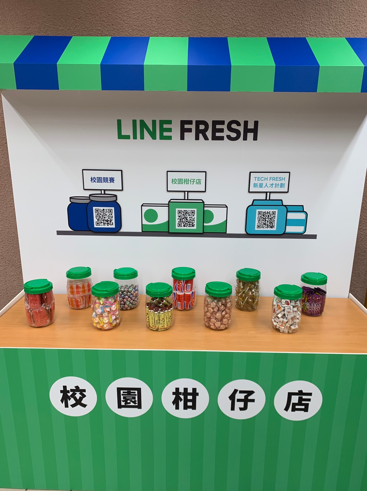

## 前提

大家好，我是 LINE Taiwan DevRel 團隊的  Evan Lin。很開心在這裡跟各位分享本年度的第三場開發者小聚。 這也是疫情後第一次在新竹舉辦的線下聚會的活動。 也是 LINE 台灣工程團隊第一次來到交通大學舉辦線下的活動。

KKTIX 活動網頁:  [活動網址](https://linegroup.kktix.cc/events/20200918)

本次 LINE Developer Meetup 開發者小聚，首先有 LINE 台灣技術長 Marco Chen 帶來的 LINE 技術新星實習計畫的相關介紹，並且有 LINE 資料工程團隊的負責人 Shawn Tsai 帶來關於 ”How ML Powers LINE Services" 。

### 文章列表

- [第一篇 : [研討會心得] 2020/09/18 LINE Developer Meetup 13 （一）](http://www.evanlin.com/LDM13/)
- [第二篇 : [研討會心得] 2020/09/18 LINE Developer Meetup 13 （二）](http://www.evanlin.com/LDM13_2/)
- [第三篇 : [研討會心得] 2020/09/18 LINE Developer Meetup 13 （三）](http://www.evanlin.com/LDM13_3/)

本篇將專注在三個團隊的閃電秀內容，依序是 LINE Pay ， LINE UIT 與 LINE QA 團隊。

## Introducing LINE Pay / LINE Pay -  Kevin Hsiao

## Introducing LINE UIT Team / LINE Pay -  George Duan

## Introducing LINE QA Team  / LINE QA - Miki Liao

## 現場活動花絮

## 活動小結

立即加入「LINE開發者官方社群」官方帳號，就能收到第一手Meetup活動，或與開發者計畫有關的最新消息的推播通知。▼

「LINE開發者官方社群」官方帳號ID：[@line_tw_dev](https://lin.ee/s5RsZHo)

## 關於「LINE開發社群計畫」

LINE今年年初在台灣啟動「LINE開發社群計畫」，將長期投入人力與資源在台灣舉辦對內對外、線上線下的開發者社群聚會、徵才日、開發者大會等，已經舉辦30場以上的活動。歡迎讀者們能夠持續回來察看最新的狀況。詳情請看:

- [2019 年LINE 開發社群計畫活動時程表](https://engineering.linecorp.com/zh-hant/blog/line-taiwan-developer-relations-2019-plan/)
- [LINE Taiwan Developer Relations 2019 回顧與 2019 開發社群計畫報告](https://engineering.linecorp.com/zh-hant/blog/line-taiwan-developer-relations-2019/)
- [2020 年LINE 開發社群計畫活動時程表](https://engineering.linecorp.com/zh-hant/blog/2020-line-tw-devrel/)

