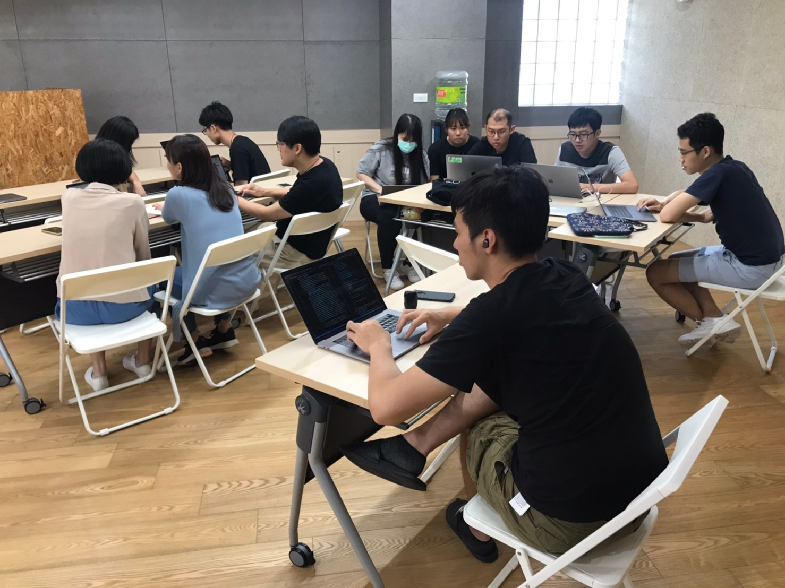

大家好，我是 LINE Tech Evangelist - Evan Lin 。LINE 很重視員工們的自主創新與團隊合作，所以各地都會舉辦 LINE Internal Hackathon 。 在 LINE 台灣這已經是第二屆的內部黑客松競賽，也期待能夠看到不同團隊激盪後滿滿的創意。

第一屆內部舉辦的時候，受到許多的迴響。不少非工程團隊也希望能夠一起參與，所以今年特定修改參賽方式，第二屆的 LINE 內部黑客松競賽的主題就是 「Team up for A+」 ，目標希望同仁們能團隊合作，共同優化與創新出更令人驚豔（WOW) 的產品服務。

## 第一屆回顧

第一屆的 LINE Taiwan Internal Hackathon 主旨為 「AI is new Attitude」，由於 LINE 是一家注重 AI 的公司，我們也希望每一位員工都能透過機器學習為出發點，來反思每一個服務，一些內部應用是否可以透過機器學習與人工智慧的方式來優化。

## 今年新增

## Hacking Space

## 總決賽

## 猜謎小活動

## 活動小結

立即加入「LINE開發者官方社群」官方帳號，就能收到第一手Meetup活動，或與開發者計畫有關的最新消息的推播通知。▼

「LINE開發者官方社群」官方帳號ID：[@line_tw_dev](https://lin.ee/s5RsZHo)

## 關於「LINE開發社群計畫」

LINE今年年初在台灣啟動「LINE開發社群計畫」，將長期投入人力與資源在台灣舉辦對內對外、線上線下的開發者社群聚會、徵才日、開發者大會等，已經舉辦30場以上的活動。歡迎讀者們能夠持續回來察看最新的狀況。詳情請看:

- [2019 年LINE 開發社群計畫活動時程表](https://engineering.linecorp.com/zh-hant/blog/line-taiwan-developer-relations-2019-plan/)
- [LINE Taiwan Developer Relations 2019 回顧與 2019 開發社群計畫報告](https://engineering.linecorp.com/zh-hant/blog/line-taiwan-developer-relations-2019/)
- [2020 年LINE 開發社群計畫活動時程表](https://engineering.linecorp.com/zh-hant/blog/2020-line-tw-devrel/)

### 徵才訊息
《LINE 強力徵才中!》與我們一起 Close the Distance 串聯智慧新世界 >> [詳細職缺訊息](https://career.linecorp.com/linecorp/career/list?classId=&locationCd=TW)
