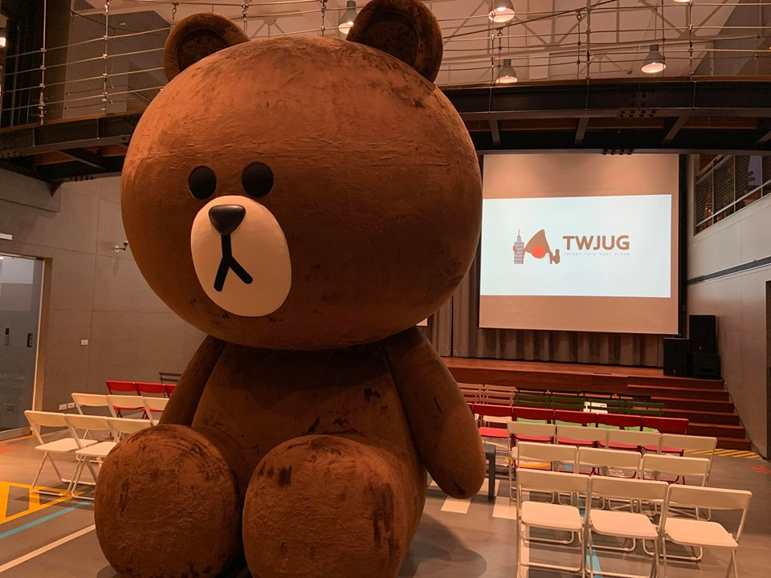

# 前提

大家好，我是 LINE Taiwan 的 Technical Evangelist - Evan Lin。在 2020/10/21 的晚上，很開心能夠再邀請 TWJUG 社群來到 LINE 台北辦公室來舉辦社群聚會。這次的講者是  。

**活動網址：** KKTIX: [https://twjug.kktix.cc/events/twjug202010](https://twjug.kktix.cc/events/twjug202010)

##  淺談 Spring Cloud Application 轉換至 Kubernetes 的心得 /Vincent Chou

- Spring cloud gateway
- 

##  LINE 實習經驗分享 / **Wayne Wu**

第二位上場的是來自於台大資工系大四同時也是目前在 LINE 實習的同學 Wayne Wu ，他來分享從七月到現在剛好滿三個月的實習心得。

## Migrating to JUnit 5 / **Joanna Hu**

## 

## Introduction to AssertJ / **Andy Chen**

## 

## 活動小結

立即加入「LINE開發者官方社群」官方帳號，就能收到第一手Meetup活動，或與開發者計畫有關的最新消息的推播通知。▼

「LINE開發者官方社群」官方帳號ID：[@line_tw_dev](https://lin.ee/s5RsZHo)

## 關於「LINE開發社群計畫」

LINE今年年初在台灣啟動「LINE開發社群計畫」，將長期投入人力與資源在台灣舉辦對內對外、線上線下的開發者社群聚會、徵才日、開發者大會等，已經舉辦30場以上的活動。歡迎讀者們能夠持續回來察看最新的狀況。詳情請看:

- [2019 年LINE 開發社群計畫活動時程表](https://engineering.linecorp.com/zh-hant/blog/line-taiwan-developer-relations-2019-plan/)
- [LINE Taiwan Developer Relations 2019 回顧與 2019 開發社群計畫報告](https://engineering.linecorp.com/zh-hant/blog/line-taiwan-developer-relations-2019/)
- [2020 年LINE 開發社群計畫活動時程表](https://engineering.linecorp.com/zh-hant/blog/2020-line-tw-devrel/)