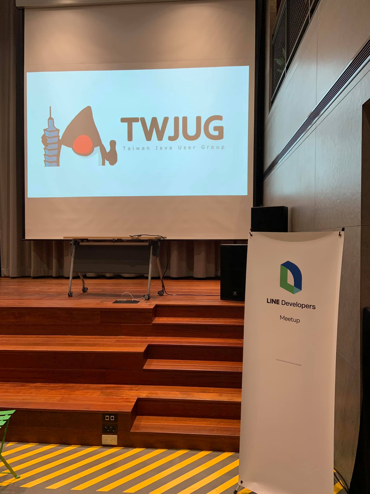
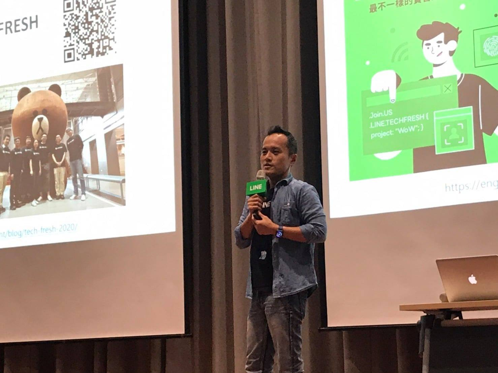

# 前提

大家好，我是 LINE Taiwan 的 Technical Evangelist - Evan Lin。在 2020/10/21 的晚上，很開心能夠再邀請 TWJUG 社群來到 LINE 台北辦公室來舉辦社群聚會。這次的講者是  。

**活動網址：** KKTIX: [https://twjug.kktix.cc/events/twjug202010](https://twjug.kktix.cc/events/twjug202010)

## 開場 LINE TECHFRESH 介紹

LINE 台灣工程團隊每年透過 LINE TECH FRESH – 技術新星人才計劃，招募資訊科技相關科系，或對此領域有所涉略的大學生 / 研究生加入 LINE 團隊進行長期實習 (一年期)，讓同學們能在國際級科技公司中觀摩學習。

更多內容，可以參考這篇文章： [LINE TECH FRESH – 技術新星人才計劃，實習經驗大公開](https://engineering.linecorp.com/zh-hant/blog/tech-fresh-2020/)

每一位實習同學都會分配到不同的團隊中，擔任著團隊裡面的種子工程師。經過一些內部與訓練型專案的指導，讓每一位參與的同學能夠了解跨國產品的開發流程與大公司的軟體工程技巧。

接下來由各個不同團隊來分享不論是擔任 TECH FRESH 的心得，或是許多有 TECH FRESH 的用人主管來分享他們專案的訓練方式與負責的業務範圍。

##  LINE 實習經驗分享 / **Wayne Wu**

第二位上場的是來自於台大資工系大四同時也是目前在 LINE 實習的同學 Wayne Wu ，他來分享從七月到現在剛好滿三個月的實習心得。 首先身為學生，在專題分工的習慣上常常有「責任歸屬」不均的狀況，「溝通」不順暢與「流程」不清楚的問題。但是來 LINE 實習的時候往往不會有這樣問題，透過有經驗的 Mentor 細心的帶領，並且在實習一個月後有了處理新專案的機會，讓講者在學習上更有自主性與積極性。

同時間講者也分享了，在 LINE 實習的時候感受到團隊內對於文件的高度要求。清楚的文件帶領的新手快速入門，並且 Mentor 也會要求處理過的同學試著紀錄下所有的經驗的學習機會。透過了定期內部讀書會，提高了學習的動力與技術力，並且透過經常性的溝通確保團隊內的同仁都是在共識下將專案積極推進。

跨國合作上，講者也分享了與越南工作同仁的小趣事。彼此在溝通上雖然都是透過文字，但是也讓語言能力與表達能力能不斷的提升。

最後這位同學也分享了他平時就是常常在懶骨頭上工作，可以更專注地處理手上的問題。風氣很自由並且工作彈性高，讓工作就像是另一場有趣的學習。

## Migrating to JUnit 5 / **Joanna Hu**

## Introduction to AssertJ / **Andy Chen**

## 

## 活動小結

立即加入「LINE開發者官方社群」官方帳號，就能收到第一手Meetup活動，或與開發者計畫有關的最新消息的推播通知。▼

「LINE開發者官方社群」官方帳號ID：[@line_tw_dev](https://lin.ee/s5RsZHo)

## 關於「LINE開發社群計畫」

LINE今年年初在台灣啟動「LINE開發社群計畫」，將長期投入人力與資源在台灣舉辦對內對外、線上線下的開發者社群聚會、徵才日、開發者大會等，已經舉辦30場以上的活動。歡迎讀者們能夠持續回來察看最新的狀況。詳情請看:

- [2019 年LINE 開發社群計畫活動時程表](https://engineering.linecorp.com/zh-hant/blog/line-taiwan-developer-relations-2019-plan/)
- [LINE Taiwan Developer Relations 2019 回顧與 2019 開發社群計畫報告](https://engineering.linecorp.com/zh-hant/blog/line-taiwan-developer-relations-2019/)
- [2020 年LINE 開發社群計畫活動時程表](https://engineering.linecorp.com/zh-hant/blog/2020-line-tw-devrel/)