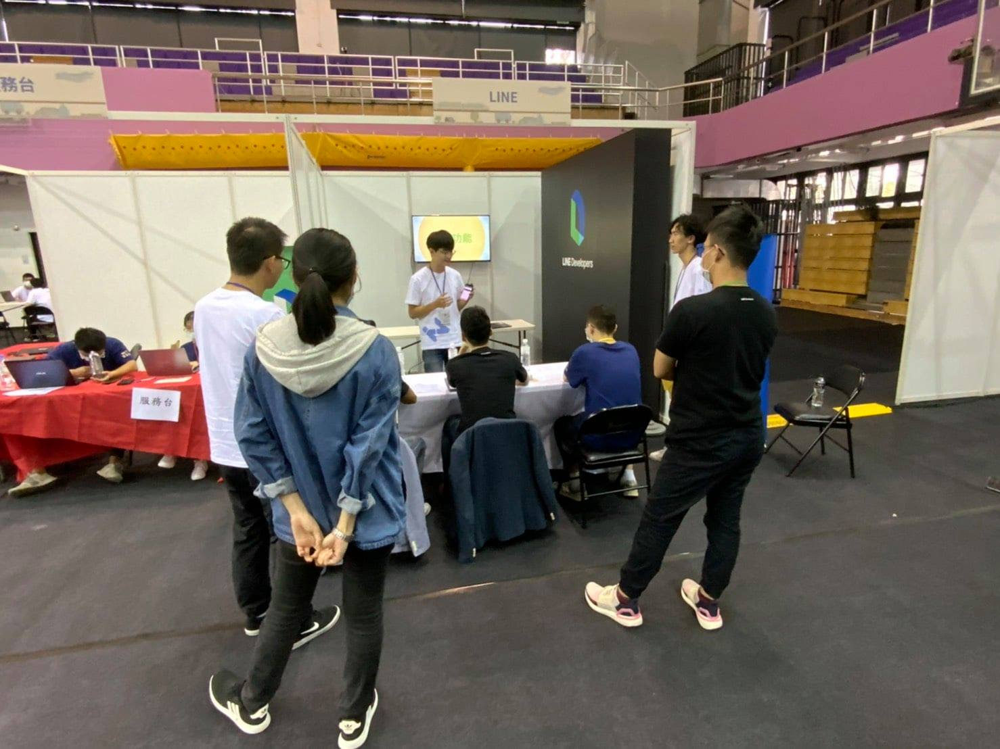

(照片來源： [梅竹黑客松官方粉絲團](https://www.facebook.com/HackMeiChu))

## 寫在前面：

大家好，我是 LINE Tech Evangelist - Evan Lin 。LINE 很重視員工們的自主創新與團隊合作，所以各地都會舉辦 LINE Internal Hackathon 。 並且在[日前也舉辦了 在 LINE 台灣這已經是第二屆的內部黑客松競賽](https://engineering.linecorp.com/zh-hant/blog/line-taiwan-internal-hackathon-2020/)，而這次很開心跟新竹市政府與梅竹黑客松主辦單位一同支持學生們創新的 Hacking 精神，一起舉辦了 [「新竹 x 梅竹黑客松」](https://www.facebook.com/HackMeiChu) LINE 的競賽組別。

在決賽前一週， LINE 的開發工程師也應邀出席了企業工作坊透過教導同學們 LIFF 與 LIFF Share Target Picker 來讓每一個參賽的同學能夠了解。 （詳情請看： [梅竹黑客松賽前企業工作坊 – LIFF shareTargetPicker](https://engineering.linecorp.com/zh-hant/blog/meichu-liff-share-target-picker-workshop/) )

## 活動擺攤

## 決賽第一天

## 決賽報告

### 前三名頒獎

## 活動總結

立即加入「LINE開發者官方社群」官方帳號，就能收到第一手Meetup活動，或與開發者計畫有關的最新消息的推播通知。▼

「LINE開發者官方社群」官方帳號ID：[@line_tw_dev](https://lin.ee/s5RsZHo)

## 關於「LINE開發社群計畫」

LINE今年年初在台灣啟動「LINE開發社群計畫」，將長期投入人力與資源在台灣舉辦對內對外、線上線下的開發者社群聚會、徵才日、開發者大會等，已經舉辦30場以上的活動。歡迎讀者們能夠持續回來察看最新的狀況。詳情請看:

- [2019 年LINE 開發社群計畫活動時程表](https://engineering.linecorp.com/zh-hant/blog/line-taiwan-developer-relations-2019-plan/)
- [LINE Taiwan Developer Relations 2019 回顧與 2019 開發社群計畫報告](https://engineering.linecorp.com/zh-hant/blog/line-taiwan-developer-relations-2019/)
- [2020 年LINE 開發社群計畫活動時程表](https://engineering.linecorp.com/zh-hant/blog/2020-line-tw-devrel/)

### 徵才訊息
《LINE 強力徵才中!》與我們一起 Close the Distance 串聯智慧新世界 >> [詳細職缺訊息](https://career.linecorp.com/linecorp/career/list?classId=&locationCd=TW)
