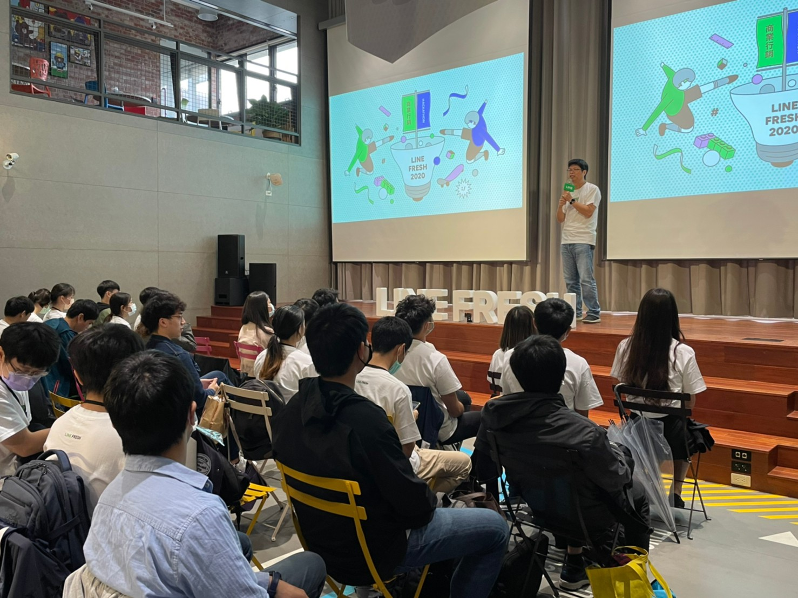
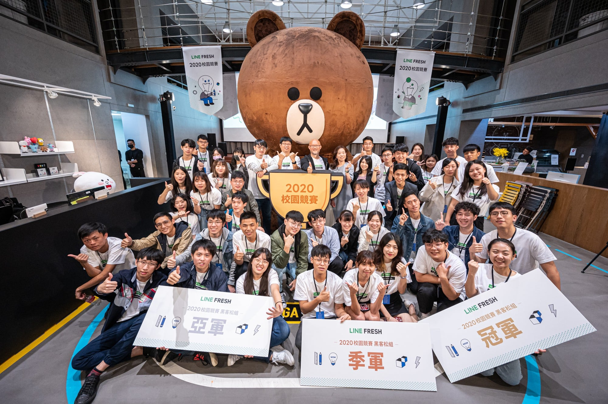

大家好，我是 LINE Tech Evangelist - Evan Lin 。**LINE FRESH** 代表著 LINE 台灣與學生之間的深度連結，而「LINE FRESH 實習計畫」已連續舉辦6年，不僅藉此發掘校園中的各領域優秀人才，同時也有不少年輕學子由此作為職涯起點。

於是LINE台灣團隊決定，在今年這個特別的時刻，我們舉辦第一屆的校園競賽，期望透過競賽的形式，廣邀校園中的優秀好手發揮創意，運用LINE旗下多元服務或開放的平台技術，為台灣產業創造更多商業可能性、為台灣用戶提供更全面的便利生活體驗。

<iframe width="560" height="315" src="https://www.youtube.com/embed/XHEOxyTvuJo" frameborder="0" allow="accelerometer; autoplay; clipboard-write; encrypted-media; gyroscope; picture-in-picture" allowfullscreen></iframe>

## 競賽主題

而「黑客松」組的競賽主題如下: LINE 一直致力透過「生活方式的革新」，打破線上、線下隔閡，發展出更實用、更便利的平台與服務，提供用戶全方位的使用體驗。 請發揮想像力與創造力，打造一個實用及趣味兼具的全新LINE服務項目或應用方案，抑或者提出對現有LINE服務的優化建議範本。

詳細規則與辦法可以參考以下由筆者一同拍攝的影片（羞

<iframe width="560" height="315" src="https://www.youtube.com/embed/FB3xLfGRln8" frameborder="0" allow="accelerometer; autoplay; clipboard-write; encrypted-media; gyroscope; picture-in-picture" allowfullscreen></iframe>

## 活動流程

在此也將本次競賽流程記錄在此：

- 07/15 報名活動開始
- 09/30 初賽報名截止
- 10/21 決賽隊伍公布
- 10/31 決賽導師會談
- 11/14 決賽與頒獎典禮

## 導師會談

其導師會談活動內容為，決賽的參賽隊伍當天到 LINE 辦公室接受資深 LINE 的導師們指導。透過開發層面，開發經驗與相關技術的討論與咨詢。當天也透過資深的業界導師們的指導，讓學生們對於整體產品的概念更加的熟悉，並且知道如何發揮自己產品的優點，一同打造出更令使用者驚艷的產品服務。

## 決賽當天

決賽當天的活動流程如下:

- 09:00 ~ 09:15: 開幕典禮與技術長致詞
- 09:15 ~ 12:30 Hacking
- 12:30 ~ 13:30 Lunch
- 13:30 ~ 14:00 Guess and Game
- 14:00 ~ 14:30 Preparing
- 14:30 ~ 15:30 Presentation
- 15:30 ~ 18:00 Break
- 18:00 ~ 18:30 Award

## 開幕主持

## 技術長致詞

## 猜謎小活動 (Quiz Game)

## 獲獎隊伍簡介:

### 第三名： 隊名： 春芽冷露加珍珠   作品： InsurTech+ 智能保險導購平台

#### 成員： 

#### 作品簡介：

台灣民眾對於寵物飼養意願日漸提高，不過觀察飼主為寵物投保的意識較低，提案為現行保險業開拓智慧數位通路，以AI提供貼近顧客需求的保險服務，也讓寵物獲得保障。

 ### 第二名： 隊名： 哥老的愛 作品： Crown Eye

#### 成員:

#### 作品簡介：

視障者對於周遭環境感到陌生，或在戶外需要他人協助時，可透過LINE解決當下所遇到的問題，並降低對周圍環境的不安全感。

### 第一名： 隊名:  LINE Premium 作品： LINE Medi

#### 成員:

#### 作品簡介：

打造全新服務「LINE Medi」，目標透過此服務讓用戶建立個人的健康資訊，並為LINE建構一個健康管理的平台。

## 活動小結

## 關於 LINE TECH FRESH「技術新星」計畫

LINE 台灣工程團隊每年透過 [LINE TECH FRESH – 技術新星人才計劃](https://career.linecorp.com/linecorp/career/detail/20000111/704/5570?classId=&locationCd=TW&page=)，招募資訊科技相關科系，或對此領域有所涉略的大學生 / 研究生加入 LINE 團隊進行長期實習 (一年期)，讓同學們能在國際級科技公司中觀摩學習。LINE TECH FRESH 由兩位經驗豐富的技術專案經理帶領團隊，接觸多元化的專案與產品開發，學習業界實際的軟體專案分工，並體驗跨國團隊合作。往年工作內容包含 server、web、mobile app、chatbot、IoT、data、DevOps 等領域，並透過實習熟悉 LINE 平台系統、SDK、API 等。值得一提的是，LINE TECH FRESH 是有給薪的實習機會，對於軟體開發有熱情、有想法的同學們，千萬別錯過這個揮灑創意與衝勁的機會！

### 相關文章

- [LINE TECH FRESH – 技術新星人才計劃，實習經驗大公開](https://engineering.linecorp.com/zh-hant/blog/tech-fresh-2020/)

- [Life in LINE – 你不知道的 LINE TECH FRESH 實習日常](https://engineering.linecorp.com/zh-hant/blog/line-tech-fresh-2021/)

## 加入官方開發社群

立即加入「LINE開發者官方社群」官方帳號，就能收到第一手Meetup活動，或與開發者計畫有關的最新消息的推播通知。▼

「LINE開發者官方社群」官方帳號ID：[@line_tw_dev](https://lin.ee/s5RsZHo)

## 關於「LINE開發社群計畫」

LINE今年年初在台灣啟動「LINE開發社群計畫」，將長期投入人力與資源在台灣舉辦對內對外、線上線下的開發者社群聚會、徵才日、開發者大會等，已經舉辦30場以上的活動。歡迎讀者們能夠持續回來察看最新的狀況。詳情請看:

- [2019 年LINE 開發社群計畫活動時程表](https://engineering.linecorp.com/zh-hant/blog/line-taiwan-developer-relations-2019-plan/)
- [LINE Taiwan Developer Relations 2019 回顧與 2019 開發社群計畫報告](https://engineering.linecorp.com/zh-hant/blog/line-taiwan-developer-relations-2019/)
- [2020 年LINE 開發社群計畫活動時程表](https://engineering.linecorp.com/zh-hant/blog/2020-line-tw-devrel/)

### 徵才訊息
《LINE 強力徵才中!》與我們一起 Close the Distance 串聯智慧新世界 >> [詳細職缺訊息](https://career.linecorp.com/linecorp/career/list?classId=&locationCd=TW)
