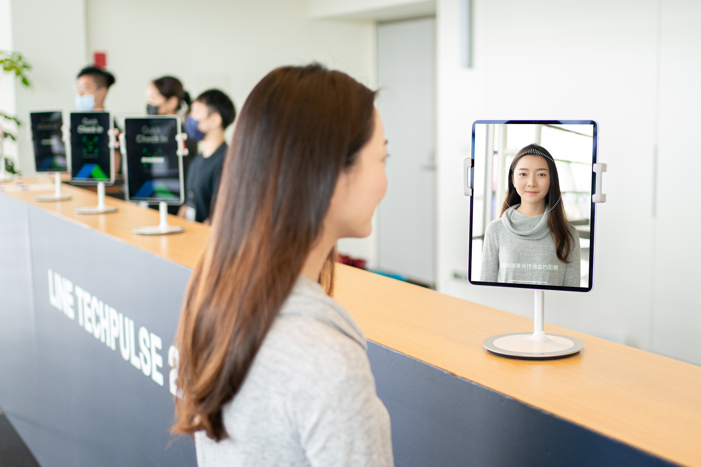

# 前言

大家好，我是 LINE Developer Relations 團隊的資深開發技術推廣工程師 - Evan Lin 。主要的工作項目就是平台技術推廣與技術品牌的建立與溝通。 LINE TAIWAN TECHPULSE 2020 已經在 2020/12/18 在南港展覽館二館舉辦了，不知道今年各位有沒有參與到這一場精心安排的盛會。 身為主辦單位其中一員，總是希望每一個點子與想法都能夠分享給每一位來賓，希望透過這一篇文章，不論你有沒有親臨現場都能夠感受到團隊們的用心。

這是第一次在南港展覽館二館舉辦，擁有像是飛機場走廊的背景。寬廣的腹地讓每一個參與民眾可以在保持安全距離的限制下，盡情的與工程師們相互的討論。 並且提供廣大的腹地，可以讓更多的開發者們聆聽到 LINE 工程團隊的分享與討論。

今年除了是新的場地外，工作團隊也精心準備了以下數個項目歡迎大家來詳細了解：

- LINE CLOVA 會場體驗
- 首次雙軌議程，技術與商業應用的完美結合
- 互動攤位:  讓你了解大神的機會
- 展示架(Poster) :  跟 LINE 台灣服務工程師面對面討論架構

接下來本篇文章將針對這些精心準備的項目來詳細敘述，歡迎各位來好好的了解。

# LINE CLOVA 會場體驗 

## 刷臉入場 - 快速的 CLOVA Face Sign 入場機制

相信每一個有參與的參加者都有感受到，今年在活動開始前兩天。活動的官方帳號有發訊息要每一位參加者上傳臉部的照片，作為活動當天的臉部辨識入場的依據。 活動當天只要透過會場前面的平板電腦就可以馬上刷臉入場，不會有任何資訊檢查與驗證的問題。 也可以快速地減少每一位參與者的入場時間。 今年的入場狀況也縮短了許多，讓整個活動的進行變得相當的順暢。

對於開發流程有興趣的開發者，可以參考一下這篇投影片的開發經過。 之後 LINE CLOVA 在台正式開放後，歡迎每一位開發者來申請。

## 透過CLOVA OCR 來達到文字辨識攤位集點贈品

今年在攤位活動上，主辦單位也有了新的巧思。 透過每個攤位的活動集點，可以讓每一個參與者去每一個攤位了解更多資訊。 當通過每個攤位活動的時候，每一個參與者將使用照片上傳的方式，讓背板上的錦旗可以上傳到伺服器辨識出特定文字後才能通過集點任務。 這個部分也是透過了 CLOVA OCR 的光學文字辨識的技術，並且可以快速掃描各種制式表單上的文字，而不會有任何文字上面的問題。 也可以透過制式表單的定義後，自動掃瞄出相關的欄位資料。 讓開發者更加的方便。

## 更進化的相片牆：刷臉分享出你今天公開的貼文串照片。

# 首次雙軌議程，技術與商業應用的完美結合

今年首次在 TECHPULSE 採取雙軌議程，早上的議程維持的單軌的大場地。讓每一位來賓能夠聽到完整的 Keynote 議程，不論是由 LINE 技術長帶來的主題演講外，更有 LINE CLOVA 的介紹， API 平台的更新最後則是由資料工程團隊所帶來的 MLOps 的相關分享。 早上的兩個議程合併的場地，除了帶給聽眾足夠安全的社交距離空間外，更讓大家都可以第一首聽到與看到相關的相關的介紹。

而中午得時間，場地則一分為二分別為：

- LINE 平台推廣講座
- LINE 技術分享講座

讓不同取向的聽眾，可以挑選自己有興趣的議程來了解與講者互動。

## A廳: LINE平台推廣講座

首先介紹的就是下午的 LINE 平台推廣講座，主要的目的是希望透過外部講者來分享如何使用 LINE API 平台的技術應用，並且讓開發者們來了解其他開發者是如何應用這些功能。 也希望透過這個講座可以讓更多開發者能知道一些進階的功能 Tech-Partner API 與問題詢問上要找哪一些大神（LAE)。最後也會分享 LINE 新星計畫 (PROTOSTAR) 透過許多新創公司的分享，了解 LINE 平台技術的應用與新星計畫的細節。

其中有三個大的主要議程：

#### LINE API Expert Sharing - Evan Lin

由筆者所帶來的議程，裡面除了介紹什麼是 LINE API Expert 之外，也請到了LAE Richard Lee 跟董大偉來分享。 如果想要瞭解更多關於 LAE 的相關資訊，可以參考以下資訊：

- [LINE API Expert List](https://www.line-community.me/en/apiexpert)

- [Announcing the LINE API Experts for 2019](https://engineering.linecorp.com/en/blog/line-api-expert-v3/)

- [Announcing the LINE API experts 2018 Q1](https://engineering.linecorp.com/en/blog/announcing-the-line-api-experts-2018-q1/)

#### **LINE Official Account Tech Partner and Module Channel Sharing - Jeremy Hsu**

由 LINE Corporation Business 團隊的 Jeremy 所帶來的關於技術合作夥伴 (Tech-Partner) 的介紹，並且也透過漸強實驗室的 Chris 來分享了解到關於 LINE Beacon 的應用案例，了解更多關於 Partner 才能使用的專屬功能：

- LINE Beacon - Stay event
- Notification Message

更多資訊可以參考投影片的內容，我們也將準備更多詳細的文件說明，敬請期待。

#### **LINE Protostar Program Introduction & Startup Demo - Kevin Chen**

平台技術推廣講座的最後，則是由 LINE 新星計畫團隊 Kevin 帶來的關於 LINE PROTOSTAR 的介紹，並且帶出今年入選新星計畫的十個團隊。 這邊也提供相關廠商的資料與投影片如下：

- [健康好朋友(ASKin)](https://drive.google.com/file/d/1oZ7ZE6ln1u_cGCElfI0y-QazUzsGaEEq/view?usp=sharing)  ([影片](https://www.youtube.com/watch?v=urBbl_UUY7g))
- [Home心](https://drive.google.com/file/d/1Kjm9lbVZ_7wydY77NL8LeQYfF1SAsq6R/view?usp=sharing) ([影片](https://www.youtube.com/watch?v=-Ks7Btc21fo))
- [LINE買房吧](https://drive.google.com/file/d/1hFSMBw4KMpTdu5RqF5VdlWxU6qQu8oxE/view?usp=sharing) ([影片](https://www.youtube.com/watch?v=vSezmDh_Fc0))
- [MEMOPRESSO](https://drive.google.com/file/d/1rPeknygP-DIbCy1xlCZCJaUqUngp2Ryc/view?usp=sharing) ([影片](https://www.youtube.com/watch?v=DpTHTN1MegM))
- [悠由金錢報](https://drive.google.com/file/d/1awjr-AKvWModqNLU7hDjxY2dDuY1mNXb/view?usp=sharing) ([影片](https://www.youtube.com/watch?v=jg4wHEqxytU))
- [ACCUPASS](https://drive.google.com/file/d/15oDjWm5kSVRQC6LW6dPT_SRCy9ZnmKYE/view?usp=sharing) ([影片](https://www.youtube.com/watch?v=t2UMDqiY6_c))
- [Nidin 你訂](https://drive.google.com/file/d/1PZUZNEqV7Kigh2JDMDKpY6HRPBFzB7X8/view?usp=sharing) ([影片](https://www.youtube.com/watch?v=POX-N437l-g))
- [GOLFOURIT](https://drive.google.com/file/d/1w_95CzOZ5j_YLOObgEgorfT0ntKTy9iL/view?usp=sharing) ([影片](https://www.youtube.com/watch?v=LzaSL1l7HiA))
- [PAMO](https://drive.google.com/file/d/1uePpZ4C7eJnvRG_aZeu52XtNWaNj7lMd/view?usp=sharing) ([影片](https://www.youtube.com/watch?v=_bDh21x8SzE))
- [CHARGE SPOT](https://drive.google.com/file/d/1JK991LlZdEH4vKpNSORe9i2h7gJ6lIUF/view?usp=sharing) ([影片](https://www.youtube.com/watch?v=urBbl_UUY7g))

## B廳: LINE技術分享講座

在「LINE 技術分享講座」則是有 LINE 台灣的工程團隊帶來的滿滿的乾貨，不論是由 LINE Pay 帶來的新服務 My Card 關於開發的介紹，還是由 SRE (Site-Reliability Engineering)團隊所帶來的 GitOps 在 Kubernetes 上面的分享，還是許多台灣服務的開發工程團隊帶來的閃電秀內容。 滿滿的內容，希望每一位在資訊業界的開發朋友可以來相互交流，來了解工程團隊如何打造一個千萬人使用等級的服務，必且在大流量的衝擊下應該要注意到哪些事項讓服務的交付上能夠更加的穩定。 

更多的內容將在文章下方的鏈結，歡迎大家直接看投影片來了解。

# 互動攤位:  讓你了解大神的機會

首先問了讓每個參與的人都有機會可以跟講者們面對面討論的機會，主辦單位這次提供了互動攤位。並且有四大主題攤位：

### LINE Pay: 

行動支付已經是一大風潮，想要透過 LINE 官方帳號來創業的夥伴們，都希望可以快速的了解如何串接 LINE Pay ，這個攤位給你一個面對面的討論機會。 今年更有新的服務開發說明 LINE Pay - My Card ，大家也可以拿著會場客製化版本的 TECHPULSE 會員卡，來攤位領取限量贈品。詳細說明如何串接服務大家也可以參考這篇新聞。

#### 參考新聞:

- [LINE Pay數位錢包最後一哩，My Card新服務年底登場可整合各種實體會員卡](https://www.ithome.com.tw/news/141757)
- [LINE Developer Recruitment Day 2020 - LINE Pay 團隊介紹](https://www.youtube.com/watch?v=sM-0rGF8oMI)

### LAE (LINE API Expert) 互動攤位：

[LAE (LINE API Expert) 自從在 2018 Q1 宣佈以來](https://engineering.linecorp.com/en/blog/announcing-the-line-api-experts-2018-q1/)，台灣目前也有十一位 LAE (可以去[以下網址](https://www.line-community.me/contributors)查詢所有的 LAE )。 經常大家都是遠遠地知道有這些 LAE 的存在，卻一直苦無機會能跟他們面對面的交流。 所以這次趁著 LINE TECHPULSE 的機會，也邀請了 LAE 一起來共襄盛舉。   有看到一個有趣的扭蛋機嗎？ 可以看一下由 LAE 陳佳新帶來的文章。

#### 參考文章

-  [在 LINE TECHPULSE 2020 的 LAE 攤位展示自動扭蛋機](https://chibupapa.com/2021/01/05/line-techpulse-2020-auto-capsule-machine/)
-  [來自 LAE 卡米哥的文章： LINE TECHPULSE 2020 心得](https://etrexkuo.medium.com/line-techpulse-2020-%E5%BF%83%E5%BE%97-e48f483e748b)

### LINE PROTOSTAR 互動攤位:

本屆 TECHPUSLE 也邀請到運用 LINE 平台打造應用的10家新創團隊，命題都非常實用有趣，可分為生活助手、娛樂、教育，與金融科技相關的應用。 這邊可以讓各位去一個一個了解每一個新創團隊如何透過 LINE 平台與聊天機器人來發展自己的事業，並且如何透過一些 Messaging API 來讓自己的相關事業能更加活躍。

#### 相關資訊

- [LINE PROTOSTAR 新星計劃歡慶五週年 加碼行銷資源挺新創](https://linecorp.com/zh-hant/pr/news/zh-hant/2020/3536)

- [LINE Protostar 新星計劃 - 挺你成為下個行動應用新星 12月16日計劃申請說明會即刻報名](http://official-blog.line.me/tw/archives/49754551.html)

- [【LINE PROTOSTAR】新星計劃五週年影片](https://www.youtube.com/watch?v=5yWacDdAjdA)

### LINE TECH FRESH 互動攤位:

LINE 台灣工程團隊每年透過 [LINE TECH FRESH – 技術新星人才計劃](https://career.linecorp.com/linecorp/career/detail/20000111/704/5570?classId=&locationCd=TW&page=)，招募資訊科技相關科系，或對此領域有所涉略的大學生 / 研究生加入 LINE 團隊進行長期實習 (一年期)，讓同學們能在國際級科技公司中觀摩學習。LINE TECH FRESH 由經驗豐富的技術專案經理帶領團隊，接觸多元化的專案與產品開發，學習業界實際的軟體專案分工，並體驗跨國團隊合作。往年工作內容包含 server、web、mobile app、chatbot、IoT、data、DevOps 等領域，並透過實習熟悉 LINE 平台系統、SDK、API 等。值得一提的是，LINE TECH FRESH 是有給薪的實習機會，對於軟體開發有熱情、有想法的同學們，千萬別錯過這個揮灑創意與衝勁的機會！

今年除了有三位實習生站上大舞台來分享之外，同學們也有在攤位上面分享他們的實習經驗。讓有興趣了解的同學們也可以一起討論。

#### 相關文章：

- [LINE TECH FRESH – 技術新星人才計劃，實習經驗大公開](https://engineering.linecorp.com/zh-hant/blog/tech-fresh-2020/)

- [Life in LINE – 你不知道的 LINE TECH FRESH 實習日常](https://engineering.linecorp.com/zh-hant/blog/line-tech-fresh-2021/)

- [TECHPULSE 2020 青春主場 – TECH FRESH 議程與攤位介紹](https://engineering.linecorp.com/zh-hant/blog/techpulse-2020-tech-fresh-session/)

## 展示架(Poster) :  跟 LINE 台灣服務工程師面對面討論架構

此外，今年一共舉辦了三次的 [LINE Developer Meetup](https://linegroup.kktix.cc/) ，並且有許多次的社群活動邀請到 LINE 台灣產品與工程團隊的開發夥伴來分享。 這些活動之中，也能感受到開發者們對於 LINE 的工程團隊其實充滿著好奇心，想要了解更多，不論是產品服務的架構，還是使用到的相關技術，或是團隊需要的相關技能。

所以我們這次也特定請到工程團隊們製作相關的服務架構或是團隊組成的相關展示架，並且歡迎大家來展示架攤位這裡直接跟工程團隊討論。 

這次一共有九個展示架，其中有五個是產品團隊如下，其中有相關的文章可以參考：

- **LINE 熱點** 
  - 本年相關介紹與技術分享: 
    - https://engineering.linecorp.com/zh-hant/blog/serving-location-based-data/
    - 影片 https://www.youtube.com/watch?v=7dNvssRRGBo
- **LINE MUSIC**
  - 本年相關介紹與技術分享: 
    - https://engineering.linecorp.com/zh-hant/blog/20200923-golangtw/
- **LINE 旅遊**
  - 本年相關介紹與技術分享: 
    - https://speakerdeck.com/line_developers_tw/20201119-line-travel-introduction
- **LINE 購物**
  - 本年相關介紹與技術分享:
    - https://engineering.linecorp.com/zh-hant/blog/line-shopping-app-with-flutter/
    - https://engineering.linecorp.com/zh-hant/blog/line-jcconf-2020/
- **LINE TODAY**
  - 本年度相關介紹 ：
    - (YouTube) https://www.youtube.com/watch?v=zO9E3qcg99I	
    - https://speakerdeck.com/line_developers_tw/20201119-line-today-introduction

另外有四個是工程團隊與組織：

- **LINE QA team**
  - 本年度相關介紹 (YouTube)：
    - https://www.youtube.com/watch?v=OzL9WTgD1V8
    - https://www.youtube.com/watch?v=kLN1CXhxN70
- **LINE Data Dev team**
  - 本年度相關介紹：
    -  (YouTube) https://www.youtube.com/watch?v=22MUda6g7Xk
    -  (YouTube) https://www.youtube.com/watch?v=MOkqCYNZZSU
    - https://engineering.linecorp.com/zh-hant/blog/line-developer-meetup-11/
- **LINE UIT team**
  - 本年度相關介紹 (YouTube)：
    - https://www.youtube.com/watch?v=GYDa4wNUyB0
    - https://www.youtube.com/watch?v=PLkTwf_zQmE (英文說明)
- **LINE Client team**
  - 本年相關介紹與技術分享:
    - https://engineering.linecorp.com/zh-hant/blog/line-shopping-app-with-flutter/

希望這參與的朋友都當初都有好好的來了解每個團隊，並且也透過跟工程團隊的互動可以有更多的理解。

## 投影片集錦:

### Talks 投影片集錦：

最後，大家對於今年的 LINE TECHPULSE 2020 是否意猶未盡？

快來看看相關的投影片，溫習一下許多嶄新的功能吧。

以下先分享主要 Talk 的部分：

#### 上午議程:

1. Keynote by Marco Chen https://speakerdeck.com/line_developers_tw/line-techpulse-2020-keynote
2. Life on LINE CLOVA by Aaron Wu https://speakerdeck.com/line_developers_tw/line-techpulse-2020-life-on-line-clova
3. Platform API Update by Evan Lin https://speakerdeck.com/line_developers_tw/line-techpulse-2020-platform-api-update
4. Scaling Machine Learning at LINE by Shawn Tsai and Penny Sun https://speakerdeck.com/line_developers_tw/line-techpulse-2020-scaling-machine-learning-at-line

#### 下午議程 - LINE技術分享講座:

1. LINE Pay New Service My Card by Hugo Huang https://speakerdeck.com/line_developers_tw2/line-techpulse-2020-line-pay-new-service-my-card
2. How GitOps Helps
Kubernetes Adoption by Denny Tsai https://speakerdeck.com/line_developers_tw/line-techpulse-2020-how-gitops-helps-kubernetes-adoption
3. Improve Automated Acceptance Tests through Test Isolations by Bryan Liu https://speakerdeck.com/line_developers_tw/line-techpulse-2020-improve-automated-acceptance-tests-through-test-isolations

更多資訊： https://techpulse.line.me/   

### 閃電秀 (Lightning Talks) 投影片集錦：

閃電秀 (Lightning Talk) 一直以來都是技術研討會最精彩的部分之一。

不光是可以在很多的時間內聽到許多有趣的分享，更可以聽到許多精闢的技術分享與摘要。

這次要分享的就是 LINE TECHPULSE 2019 的閃電秀的部分，本次閃電秀分成三大主題，相關投影片依序如下：

1. Lightning Talk 1- Agile, frontend and data.
   1. LDS - Sharing UI Components Between LINE Projects by Petr Mareš  https://speakerdeck.com/line_developers_tw2/line-techpulse-2020-lds-sharing-ui-components-between-line-projects
   2. Large Scale Scrum (LeSS) Road, Where does it leads? by William Fu https://speakerdeck.com/line_developers_tw2/line-techpulse-2020-large-scale-scrum-less-road-where-does-it-leads
   3. SmartPOI by Johnson Wu https://speakerdeck.com/line_developers_tw/line-techpulse-2020-smartpoi
2. Lightning Talk 2- Client Development
   1. LINE LINE SHOPPING App with Flutter by Chia-Cheng Chu (Aaron)  https://speakerdeck.com/line_developers_tw/line-techpulse-2020-line-line-shopping-app-with-flutter
   2. Efficient Event Tracking Mechanism with Flutter by Kuan Wei Lin https://speakerdeck.com/line_developers_tw/line-techpulse-2020-efficient-event-tracking-mechanism-with-flutter
   3. Android Message Capturing by Jerry Che https://speakerdeck.com/line_developers_tw/line-techpulse-2020-android-message-capturing
3. LINE TECH FRESH Program
   1. Life as FRESH LINER  by Mandy Chang https://speakerdeck.com/line_developers_tw2/line-techpulse-2020-life-as-fresh-liner
   2. My Life in LINE : As a Junior LINER, Senior TECH FRESH by Carolyn Chen https://speakerdeck.com/line_developers_tw2/line-techpulse-2020-my-life-in-line-as-a-junior-liner-senior-tech-fresh
   3. From Classroom Assignment to Realistic Problem in LINE by Troy Chiu https://speakerdeck.com/line_developers_tw2/line-techpulse-2020-from-classroom-assignment-to-realistic-problem-in-line

更多資訊： https://techpulse.line.me/   

## 活動小結

每一年的活動籌辦，都是希望每一個參與的來賓能夠有滿滿的收穫。雖然今年由於疫情的原因，許多線下活動受到許多的限制。但是主辦單位的我們，也是戰戰兢兢希望能提供最舒適與安全的環境下，讓每一位來賓都能了解到 LINE 平台的最新發展， LINE 工程團隊的努力與如何一起加入我們開發的大家族。 

立即加入「LINE開發者官方社群」官方帳號，就能收到第一手Meetup活動，或與開發者計畫有關的最新消息的推播通知。▼

「LINE開發者官方社群」官方帳號ID：[@line_tw_dev](https://lin.ee/s5RsZHo)

## 關於「LINE開發社群計畫」

LINE今年年初在台灣啟動「LINE開發社群計畫」，將長期投入人力與資源在台灣舉辦對內對外、線上線下的開發者社群聚會、徵才日、開發者大會等，已經舉辦30場以上的活動。歡迎讀者們能夠持續回來察看最新的狀況。詳情請看:

- [2019 年LINE 開發社群計畫活動時程表](https://engineering.linecorp.com/zh-hant/blog/line-taiwan-developer-relations-2019-plan/)
- [LINE Taiwan Developer Relations 2019 回顧與 2019 開發社群計畫報告](https://engineering.linecorp.com/zh-hant/blog/line-taiwan-developer-relations-2019/)
- [2020 年LINE 開發社群計畫活動時程表](https://engineering.linecorp.com/zh-hant/blog/2020-line-tw-devrel/)

