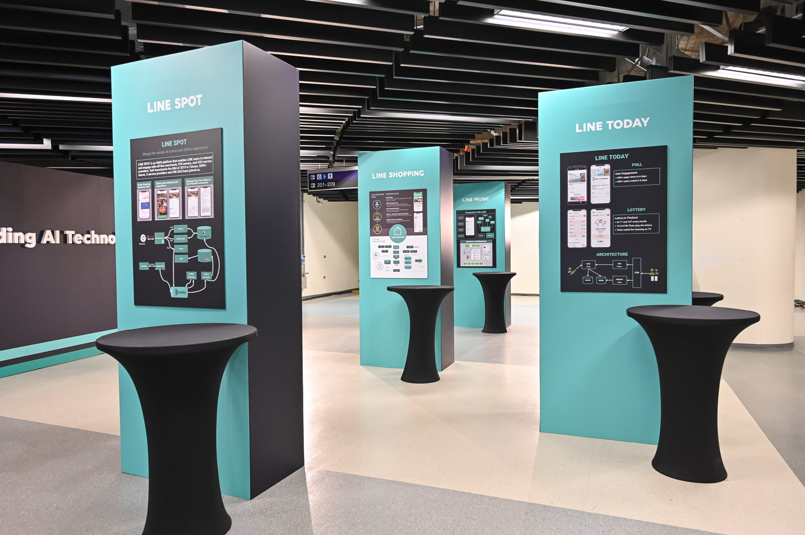

# 前言

大家好，我是 LINE Developer Relations 團隊的資深開發技術推廣工程師 - Evan Lin 。主要的工作項目就是平台技術推廣與技術品牌的建立與溝通。 LINE TAIWAN TECHPULSE 2020 已經在 2020/12/18 在南港展覽館二館舉辦了，不知道今年各位有沒有參與到這一場精心安排的盛會。 身為主辦單位其中一員，總是希望每一個點子與想法都能夠分享給每一位來賓，希望透過這一篇文章，不論你有沒有親臨現場都能夠感受到團隊們的用心。 關於 TECHPULSE 2019 的活動安排文章，可以參考去年的這篇文章： [LINE TAIWAN TECHPULSE 2019 活動安排幕後秘辛](https://engineering.linecorp.com/zh-hant/blog/line-taiwan-techpulse-2019-arrangement/)。

這是第一次在南港展覽館二館舉辦，擁有像是飛機場走廊的背景。寬廣的腹地讓每一個參與民眾可以在保持安全距離的限制下，盡情的與工程師們相互的討論。 並且

# LINE CLOVA 會場體驗 

# 首次雙軌議程，技術與商業應用的完美結合

## A廳: LINE平台推廣講座

## B廳: LINE技術分享講座

# 互動攤位:  讓你了解大神的機會

首先問了讓每個參與的人都有機會可以跟講者們面對面討論的機會，主辦單位這次提供了互動攤位。並且有五大主題攤位：

### Ask LINER: 

讓你跟講者，來自日本的 LINE 工程師面對面的交流與討論。台上聽不懂的，台下讓你問。 面板上面還清清楚楚地有著所有講者會待在攤位的時間，千萬不要錯過跟講者面對面的機會。

並且在中午時段還有來自於日本 Developer Relations 團隊的 Shoko Sato 與 Tachibana Sho 來分享日本 Developer Relations 的活動與一些有趣的日本服務。

### LINE Pay: 

行動支付已經是一大風潮，想要透過 LINE 官方帳號來創業的夥伴們，都希望可以快速的了解如何串接 LINE Pay ，這個攤位給你一個面對面的討論機會。

### LAE (LINE API Expert) 互動攤位：

[LAE (LINE API Expert) 自從在 2018 Q1 宣佈以來](https://engineering.linecorp.com/en/blog/announcing-the-line-api-experts-2018-q1/)，台灣目前也有九位 LAE (可以去[以下網址](https://www.line-community.me/contributors)查詢所有的 LAE )。 經常大家都是遠遠地知道有這些 LAE 的存在，卻一直苦無機會能跟他們面對面的交流。 所以這次趁著 LINE TECHPULSE 的機會，也邀請了 LAE 一起來共襄盛舉。  

### LINE PROTOSTAR 互動攤位:

本屆 TECHPUSLE 也邀請到運用 LINE 平台打造應用的10家新創團隊，命題都非常實用有趣，可分為生活助手、娛樂、教育，與金融科技相關的應用。 這邊可以讓各位去一個一個了解每一個新創團隊如何透過 LINE 平台與聊天機器人來發展自己的事業，並且如何透過一些 Messaging API 來讓自己的相關事業能更加活躍。

## 展示架(Poster) :  跟 LINE 台灣服務工程師討論架構

此外，今年一共舉辦了四次的 [LINE Developer Meetup](https://linegroup.kktix.cc/) ，並且有許多次的社群活動邀請到 LINE 台灣產品與工程團隊的開發夥伴來分享。 這些活動之中，也能感受到開發者們對於 LINE 的工程團隊其實充滿著好奇心，想要了解更多，不論是產品服務的架構，還是使用到的相關技術，或是團隊需要的相關技能。

所以我們這次也特定請到工程團隊們製作相關的服務架構或是團隊組成的相關展示架，並且歡迎大家來展示架攤位這裡直接跟工程團隊討論。 

這次一共有十個展示架，其中有五個是產品團隊如下：

- LINE SPOT 
- LINE MUSIC
- LINE Travel
- LINE Shopping
- LINE Today

另外有五個是工程團隊與組織：

- LINE Bank
- LINE QA team
- LINE Data Dev team
- LINE UIT team
- LINE Client team

希望這參與的朋友都當初都有好好的來了解每個團隊，並且也透過跟工程團隊的互動可以有更多的理解。

## 相片牆(PhotoWall):  一起留下美好的回憶

#### 「參與研討會最重要的不一定是議程本身，而是一起參與的開發者」

## 贈品與相關限量物品： 讓工程師更潮

### LINE Developer Meetup #10：獨特招募場次 

#### 活動網址: https://linegroup.kktix.cc/events/20191204-10

每次的開發者小聚( LINE Developer Meetup ) 經常都會有一個狀況是許多的開發者包圍著 LINE 的工作團隊，想要了解開發團隊裡面所使用的工具，工作狀況，或是面臨的問題。這也是因為許多外部的開發者其實對於參與著 LINE 的工作團隊有著極大的興趣。 所以這次活動裡面，我們舉行了第二次的招募說明會，內容參考了 [「2019 LINE Taiwan Developers Recruitment Day」](https://engineering.linecorp.com/zh-hant/blog/2019-line-taiwan-technical-recruitment-day/)。

這場活動採分開討論與清場，讓每一個參與者可以去深入瞭解自己有興趣的工作團隊內容，並且可以面對面的跟可能是參與的面試主管們討論。

## 投影片集錦:

### Talks 投影片集錦：

最後，大家對於今年的 LINE TECHPULSE 2019 是否意猶未盡？

快來看看相關的投影片，溫習一下許多嶄新的功能吧。

以下先分享主要 Talk 的部分：

#### 上午議程:

1. Keynote by Marco Chen https://speakerdeck.com/line_developers_tw/line-techpulse-2020-keynote
2. Life on LINE CLOVA by Aaron Wu https://speakerdeck.com/line_developers_tw/line-techpulse-2020-life-on-line-clova
3. Platform API Update by Evan Lin https://speakerdeck.com/line_developers_tw/line-techpulse-2020-platform-api-update
4. Scaling Machine Learning at LINE by Shawn Tsai and Penny Sun https://speakerdeck.com/line_developers_tw/line-techpulse-2020-scaling-machine-learning-at-line

#### 下午議程:

1. LINE Pay New Service My Card by Hugo Huang https://speakerdeck.com/line_developers_tw2/line-techpulse-2020-line-pay-new-service-my-card
2. How GitOps Helps
Kubernetes Adoption by Denny Tsai https://speakerdeck.com/line_developers_tw/line-techpulse-2020-how-gitops-helps-kubernetes-adoption
3. Improve Automated Acceptance Tests through Test Isolations by Bryan Liu https://speakerdeck.com/line_developers_tw/line-techpulse-2020-improve-automated-acceptance-tests-through-test-isolations

更多資訊： https://techpulse.line.me/   

### 閃電秀 (Lightning Talks) 投影片集錦：

閃電秀 (Lightning Talk) 一直以來都是技術研討會最精彩的部分之一。

不光是可以在很多的時間內聽到許多有趣的分享，更可以聽到許多精闢的技術分享與摘要。

這次要分享的就是 LINE TECHPULSE 2019 的閃電秀的部分，本次閃電秀分成三大主題，相關投影片依序如下：

1. Lightning Talk 1- Agile, frontend and data.
   1. LDS - Sharing UI Components Between LINE Projects by Petr Mareš  https://speakerdeck.com/line_developers_tw2/line-techpulse-2020-lds-sharing-ui-components-between-line-projects
   2. Large Scale Scrum (LeSS) Road, Where does it leads? by William Fu https://speakerdeck.com/line_developers_tw2/line-techpulse-2020-large-scale-scrum-less-road-where-does-it-leads
   3. SmartPOI by Johnson Wu https://speakerdeck.com/line_developers_tw/line-techpulse-2020-smartpoi
2. Lightning Talk 2- Client Development
   1. LINE LINE SHOPPING App with Flutter by Chia-Cheng Chu (Aaron)  https://speakerdeck.com/line_developers_tw/line-techpulse-2020-line-line-shopping-app-with-flutter
   2. Efficient Event Tracking Mechanism with Flutter by Kuan Wei Lin https://speakerdeck.com/line_developers_tw/line-techpulse-2020-efficient-event-tracking-mechanism-with-flutter
   3. Android Message Capturing by Jerry Che https://speakerdeck.com/line_developers_tw/line-techpulse-2020-android-message-capturing
3. LINE TECH FRESH Program
   1. Life as FRESH LINER  by Mandy Chang https://speakerdeck.com/line_developers_tw2/line-techpulse-2020-life-as-fresh-liner
   2. My Life in LINE : As a Junior LINER, Senior TECH FRESH by Carolyn Chen https://speakerdeck.com/line_developers_tw2/line-techpulse-2020-my-life-in-line-as-a-junior-liner-senior-tech-fresh
   3. From Classroom Assignment to Realistic Problem in LINE by Troy Chiu https://speakerdeck.com/line_developers_tw2/line-techpulse-2020-from-classroom-assignment-to-realistic-problem-in-line

更多資訊： https://techpulse.line.me/   

## 活動小結

立即加入「LINE開發者官方社群」官方帳號，就能收到第一手Meetup活動，或與開發者計畫有關的最新消息的推播通知。▼

「LINE開發者官方社群」官方帳號ID：[@line_tw_dev](https://lin.ee/s5RsZHo)

## 關於「LINE開發社群計畫」

LINE今年年初在台灣啟動「LINE開發社群計畫」，將長期投入人力與資源在台灣舉辦對內對外、線上線下的開發者社群聚會、徵才日、開發者大會等，已經舉辦30場以上的活動。歡迎讀者們能夠持續回來察看最新的狀況。詳情請看:

- [2019 年LINE 開發社群計畫活動時程表](https://engineering.linecorp.com/zh-hant/blog/line-taiwan-developer-relations-2019-plan/)
- [LINE Taiwan Developer Relations 2019 回顧與 2019 開發社群計畫報告](https://engineering.linecorp.com/zh-hant/blog/line-taiwan-developer-relations-2019/)
- [2020 年LINE 開發社群計畫活動時程表](https://engineering.linecorp.com/zh-hant/blog/2020-line-tw-devrel/)

