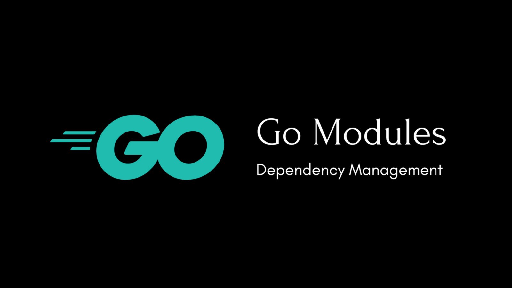
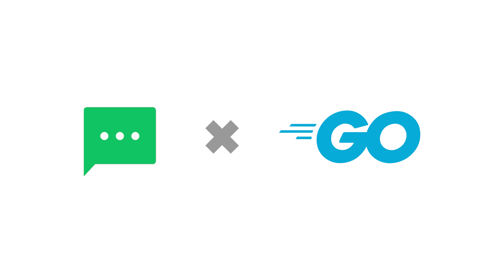

## 前言:

各位好， LINE Bot Go SDK 是一個經營超過了五年的專案，並且版本號碼也早就已經到了 v7.8.0 。

而本月月初 (2021/April) LINE Bot Go SDK 又有新的版本更新了，這次有支援到三月平台所提供新的功能，還有將去年公開的 FLEX Msg 的 update 2 更新了。歡迎大家使用。

這個套件已經更新到 v7 版本，才支援 Modules 。 結果一開啓就踩到雷，感謝台灣的網友 wys1203 送了 PR 修復。  我也整理一下相關心得，跟大家分享一下。


## TL;DR 

本篇文將要介紹以下一些的部分：

- <a href="#legacy-support-go-modules">如何將舊的開源專案支援 Go Modules </a>
- <a href="#problems">發生問題了 </a>
  - <a href="#not-update-by-go-get">無法更新版本  (Cannot update version by "go get")</a>
  - <a href="#go-dev-out-of-date"> pkg.go.dev  上面版本是舊的 </a>
- <a href="#go-module-v2"> Go Modules 對於 v2 之後的支援方式  </a>
- <a href="#summary">結論</a>
- <a href="#refer">參考文章</a>
  


## 如何將舊的開源專案支援 Go Modules 

<a id="legacy-support-go-modules"></a>



LINE-BOT-SDK-GO 是 LINE 開源出來的對於 LINE Messanging API 所釋放出的開源套件，並且支援多個語言版本（Go., PHP, Java, Python) 。 

原本這個 https://github.com/line/line-bot-sdk-go 的版本已經超過 v7 ，但是遲遲沒有支援 go modules 。 也就是並沒有 `go.mod` 在該專案的檔案下面。所以需要透過以下方式來啟動 Go Modules (Enable Go Modules)

```
- go mod init
- go mod tidy
- go mod vendor
```
原本 PR 看起來也沒有太多的問題，於是就將新版本發佈出來。 (v7.9.0)

## 發生問題了

<a id="problems"></a>

原本版本更新後，看起來也沒有太多問題。但是版本更新後卻發生了以下兩個問題：

### 無法更新版本  (Cannot update version by "go get")

<a id="not-update-by-go-get"></a>

這時候我試著去更新一個本來有使用到 https://github.com/line/line-bot-sdk-go 的套件，正常的更新流程如下：

```
>> go mod tidy                                                           
go: finding module for package github.com/line/line-bot-sdk-go/linebot
go: found github.com/line/line-bot-sdk-go/linebot in github.com/line/line-bot-sdk-go v7.8.0+incompatible
```

問題出來了，我明明有更新版本到 `v7.9.0` 但是卻無法抓到最新的版本？ 

於是我拿了一個新的專案，重頭試試看。

1. Copy https://github.com/line/line-bot-sdk-go/tree/master/examples/echo_bot to your go path
2. `go mod init`
3. `go mod tidy`

結果一樣是出現：

```
>> go mod init                                                                       
go: creating new go.mod: module github.com/kkdai/echo_bot 
go: to add module requirements and sums:
	go mod tidy
 
>> go mod tidy                                                                            
go: finding module for package github.com/line/line-bot-sdk-go/linebot
go: found github.com/line/line-bot-sdk-go/linebot in github.com/line/line-bot-sdk-go v7.8.0+incompatible
```
大家可以參考這個 [issue](https://github.com/line/line-bot-sdk-go/issues/274) 。 不論使用 `go get` 還是使用 `go mod tidy` 都無法順利將版號更新的最新的版本。  這個問題，讓我困擾了一陣子。 


### pkg.go.dev  上面版本是舊的 

<a id="go-dev-out-of-date""></a>

先來稍微解釋一下 https://pkg.go.dev 是一個 Golang 社群的套件說明網站。開發者可以透過關鍵字搜尋套件，並且可以查看相關的說明（所有內容都是根據 github.com 上面的資訊）。

而透過  https://pkg.go.dev  也可以很輕鬆的查許多專案版本方面的資訊，比如說 https://pkg.go.dev/github.com/appleboy/gofight 可以看到有最新版本 `v2` - https://pkg.go.dev/github.com/appleboy/gofight/v2 

雖然  https://github.com/line/line-bot-sdk-go 已經加上了 `go.mod` 的檔案，但是卻無法找到 https://pkg.go.dev/github.com/github.com/line/line-bot-sdk-go/v7 這個資料夾。

這時候感謝台灣網友提供的 Pull Request 提供給我相關的想法。 

## Go Modules 對於 v2 之後的支援方式
<a id="go-module-v2"></a>

根據官方的文件 - [Golang-Blog Publishing v2 and beyond](https://blog.golang.org/v2-go-modules) 上面有提到，如果需要發布 v2 之後的版本由於是具有不向後兼容的方式。 所以在發布得時候，官方建議有兩個方式：

- 建立一個新的資料夾 `v2` 並且把東西全部更新到該資料夾上面。並且更改 `go.mod` 將版本號碼改成 `v2` 。
- 或是直接更改目前資料夾的 `go.mod` 將版本號碼改成 `v2` 。

#### 修改 go.mod 檔案到 v2 (或是之後)的方式

```
$ go mod edit -module github.com/YOU/YOUR_PROJECT/v2 go.mod
```

  這邊要注意，因爲 `go mod init` 並不會自動幫你加上相關的版本（如果超過 v2），只得自行加上。所以需要「手動」加上相關的版號，也就是說如果你的套件可能已經超過了 `v2` 以上，但是一直沒有啟動過 go modules 那麼你可能就會踩到這個雷。

關於  https://github.com/line/line-bot-sdk-go 的修復方式，大家可以參考這個 [pull request](https://github.com/line/line-bot-sdk-go/pull/273) 。

  

## 結論：

<a id="summary"></a>

因為 Go Modules 其實是兩年前的 1.11 才開始使用，但是許多專案其實也沒有馬上啟動。 如果沒有啟動 Go Modules 其實版本更新也不會出錯。 但是只要一啟動 Go Modules 的話，就要小心本篇文章所提供的相關案例。  

其實啟動 Go Modules 是相當方便的，也應該要提早準備好相關的修正。希望每一個套件管理者能儘早的準備升級到  Go Modules 的套件支援。


## 相關文章：
<a id="refer"></a>

- [Go Modules: v2 and Beyond](https://blog.golang.org/v2-go-modules)
- [Module release and versioning workflow](https://golang.org/doc/modules/release-workflow)
- [Go Module 如何發佈 v2 以上版本](https://blog.wu-boy.com/2019/06/how-to-release-the-v2-or-higher-version-in-go-module/)
- [line-bot-sdk-go #273 upgrade major version to v7 for meets the specification of go module](https://github.com/line/line-bot-sdk-go/pull/273)
- [line-bot-sdk-go #274 Bug Report - Could not update to latest version v7.9.0](https://github.com/line/line-bot-sdk-go/issues/274)
- [Golang-Blog Publishing v2 and beyond](https://blog.golang.org/v2-go-modules)
- [Go Doc:  Publishing breaking API changes](https://golang.org/doc/modules/release-workflow#breaking)
