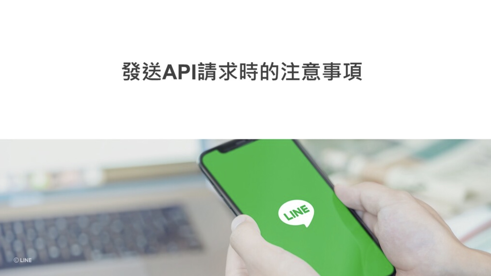

## 前言:

各位好， 我是 LINE Taiwan 資深開發技術推廣工程師 – Evan Lin。 今天這篇文章為各位詳細解釋 「 LINE Bot 開發指南」這一份投影片文件。這一份文件是來自於 [Development guidelines](https://developers.line.biz/en/docs/partner-docs/development-guidelines/) 的投影片，考量到在台灣還沒有正式的公布與中文化。這一次跟總部共同合作準備中文版本之外，並且特定用這一系列文章加以解釋，希望可以讓更多開發者有更多的了解。  [Development guidelines](https://developers.line.biz/en/docs/partner-docs/development-guidelines/)  文件內容很多，本份投影片也將以五篇文章的篇幅來加以解釋。本篇文章為第二篇文章，主要講解的會是關於設定 LINE Bot Webhook 相關注意事項。

## 文章索引:

#### 完整投影片鏈結： <https://speakerdeck.com/line_developers_tw2/line-bot-developer-guideline-chinese>

希望各位可以持續關注：

1. [關於LINE Bot ](https://www.evanlin.com/2021-05-25-line-bot-guide-1/)
2. [使用Webhook URL接收請求時的注意事項](https://www.evanlin.com/line-bot-guide-2/)
3. [發送 API 請求時的注意事項(本篇文章)](http://www.evanlin.com/line-bot-guide-3/)
4. LINE Login
5.  其他相關功能

本篇文章將專注在第一個段落，也就是 Page 20 ~ Page 30 的部分。

##  發送 API 請求時的注意事項

本篇注意事項中，將會帶出以下的相關項目。

- A. Channel Access Token 的發行

- B. Channel Access Token 自動更新
- C. Channel Access Token 有效上限數量
- D. 訊息發送完成後接收回應
- E. API 請求重試
- F. 請求的相關限制
- G. 回應 ( reply ) 訊息與推播( push )訊息
- H. HTTPS 內容的使用

以下開始將會逐一針對每一個頁面詳細解釋：

## A. Channel Access Token 的發行

Channel Access Token 是整個 Channel 最重要的憑證，透過該憑證可以有許多權限可以修改該 LINE Bot 的設定。所以在授權上要務必小心。 這邊也提供一些小訣竅：

- 建議不要使用沒有時效性的 Channel Access Token ，建議使用 API 來要求。
- 使用 API 來申請 Channel Access Token 建議使用 v2.1 的方式來發出需求。 

如此一來除了可以確保整個頻道(channel) 憑證的安全性，必要時也可以將有暴露考量的 token 撤銷掉。

#### 參考文章:

- [LINE Dev Doc: Issue channel access tokens v2.1](https://developers.line.biz/en/docs/messaging-api/generate-json-web-token/)

## B. Channel Access Token 自動更新

接續前一頁，針對 Channel Access Token 的管理上，

## C. Channel Access Token 有效上限數量

## D. 訊息發送完成後接收回應

## E. API 請求重試

## F. 請求的相關限制

## G. 回應 ( reply ) 訊息與推播( push )訊息

## H. HTTPS 內容的使用

## 結論：

以上就是「LINE Bot 開發指南」第三部分的補充與分享，想要知道更多內容可以查看完整投影片，或是找到其他篇的文章來了解。 

想了解更多開發者的活動？  立即加入「LINE 開發者官方社群」官方帳號，就能收到第一手 Meetup 活動，或與開發者計畫有關的最新消息的推播通知。▼

「LINE 開發者官方社群」官方帳號 ID：@line_tw_dev

