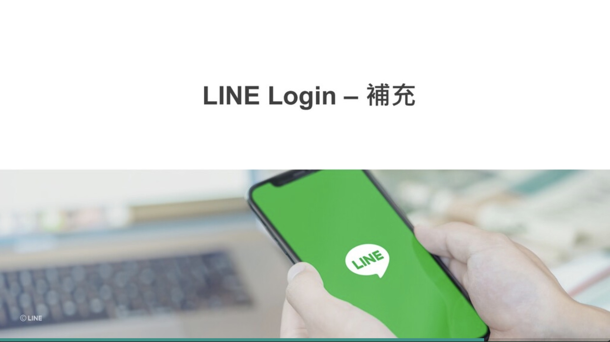

## 前言:

各位好， 我是 LINE Taiwan 資深開發技術推廣工程師 – Evan Lin。 今天這篇文章為各位詳細解釋 「 LINE Bot 開發指南」這一份投影片文件。這一份文件是來自於 [Development guidelines](https://developers.line.biz/en/docs/partner-docs/development-guidelines/) 的投影片，考量到在台灣還沒有正式的公布與中文化。這一次跟總部共同合作準備中文版本之外，並且特定用這一系列文章加以解釋，希望可以讓更多開發者有更多的了解。  [Development guidelines](https://developers.line.biz/en/docs/partner-docs/development-guidelines/)  文件內容很多，本份投影片也將以五篇文章的篇幅來加以解釋。本篇文章為第四篇文章，主要講解的會是關於 LINE Login 與開發時候需要注意的事項。

## 文章索引:

#### 完整投影片鏈結： <https://speakerdeck.com/line_developers_tw2/line-bot-developer-guideline-chinese>

希望各位可以持續關注：

1. [關於LINE Bot ](https://www.evanlin.com/2021-05-25-line-bot-guide-1/)
2. [使用Webhook URL接收請求時的注意事項](https://www.evanlin.com/line-bot-guide-2/)
3. [發送 API 請求時的注意事項](http://www.evanlin.com/line-bot-guide-3/)
4. [LINE Login (本篇文章)](http://www.evanlin.com/line-bot-guide-4/)
5. [LINE Login (補充）(本篇文章)](http://www.evanlin.com/line-bot-guide-5/)
5.  其他相關功能

本篇文章將專注在第一個段落，也就是 Page 47 ~ Page 30 的部分。

##  LINE Login (補充)

本篇注意事項中，將會帶出以下的相關項目。

- 關於防止以 state 不法使用的對策

- 依照不同流程 OS 進行 LINE Login 的用戶流程範例 (iOS)
- 依照不同流程 OS 進行 LINE Login 的用戶流程範例 (Android)
- 外部瀏覽器的登入流程（示意圖）
- 關於轉換目標端瀏覽器的設定方法

以下開始將會逐一針對每一個頁面詳細解釋：

## 關於防止以 state 不法使用的對策

這邊主要是提到 state 參數的使用方式， 詳細的步驟可以參考教學部落格 [如何透過 Golang 開發 OAuth2 的 PKCE – 以 LINE Login 為例](https://engineering.linecorp.com/zh-hant/blog/pkce-line-login/) 。這邊也有列出在官方文章中的使用流程說明：

有兩張圖來對照可以看得更清楚，由於 `state` 是網站（或是 App) 開發商所隨機產生出來的一串文字。可以做為檢查之用，避免 Open ID 的需求被中間人攻擊後發送奇怪的訊息。這邊也提供一些作為 `state` 的開發指南：

- `state` 文字本身應該是沒有任何意義的，無法被其他人所猜透。
- `state` 文字每一次的認證請求應該都需要不同，才能做到保護。

#### 參考文章:

-  [如何透過 Golang 開發 OAuth2 的 PKCE – 以 LINE Login 為例](https://engineering.linecorp.com/zh-hant/blog/pkce-line-login/) 
- [開發LINE聊天機器人不可不知的十件事](https://engineering.linecorp.com/zh-hant/blog/line-device-10/) 

## 依照不同流程 OS 進行 LINE Login 的用戶流程範例 (iOS)

以下兩個是根據不同的 OS 進行 LINE Login 的時候產生的使用者流程的範例，因為 iOS 跟 Android 兩者有些許的差異，特地使用兩張投影片來解釋。首先在這張 iOS 的投影片裡面有敘述在 LINE 裡面跟外部瀏覽器（Safari, Chrome) 使用 LINE Login 的流程：

- **應用程式內瀏覽器 (LINE)** ：
  - 開啟 LINE App -> 同意畫面（僅第一次） -> 開啟應用程式內瀏覽器（IAP: In-App-Browser) 的網站。
- **外部瀏覽器登入 (Safari, Chrome):**
  - 自動開啟 LINE App ->  同意畫面（僅第一次） -> 開啟自動登入畫面 ->  開啟應用程式內瀏覽器（IAP: In-App-Browser) 的網站。

## 依照不同流程 OS 進行 LINE Login 的用戶流程範例 (Android)

可以發現 Android 開啟上跟 iOS 差別就是使用外部瀏覽器開啟網址的時候，唯一的差異就是開啟 LINE App 會有相關的詢問。以下詳細敘述如下:

- **外部瀏覽器登入 (Safari, Chrome):**
  - **詢問是否要開啟 LINE App** -> 自動開啟 LINE App ->  同意畫面（僅第一次） -> 開啟自動登入畫面 ->  開啟應用程式內瀏覽器（IAP: In-App-Browser) 的網站。

#### 相關文件：

-  

## 外部瀏覽器的登入流程（示意圖）

#### 相關文件：

-  

## 關於轉換目標端瀏覽器的設定方法

#### 相關文件

- 

## 結論：

以上就是「LINE Bot 開發指南」第四部分的補充與分享，想要知道更多內容可以查看完整投影片，或是找到其他篇的文章來了解。 

想了解更多開發者的活動？  立即加入「LINE 開發者官方社群」官方帳號，就能收到第一手 Meetup 活動，或與開發者計畫有關的最新消息的推播通知。▼

「LINE 開發者官方社群」官方帳號 ID：@line_tw_dev

