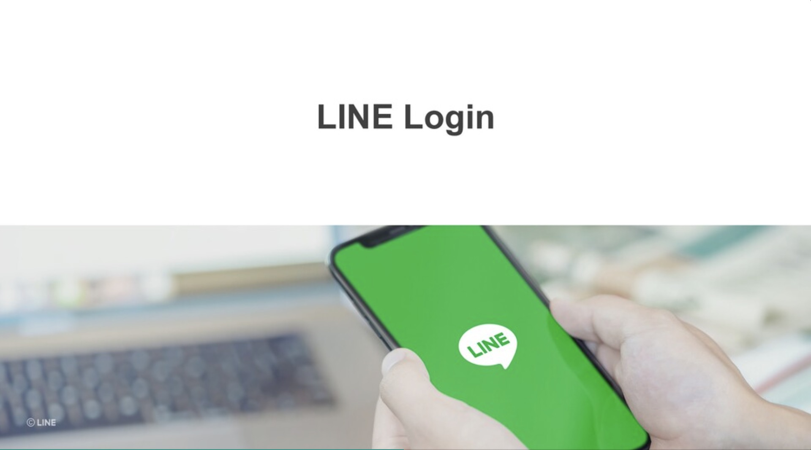

## 前言:

各位好， 我是 LINE Taiwan 資深開發技術推廣工程師 – Evan Lin。 今天這篇文章為各位詳細解釋 「 LINE Bot 開發指南」這一份投影片文件。這一份文件是來自於 [Development guidelines](https://developers.line.biz/en/docs/partner-docs/development-guidelines/) 的投影片，考量到在台灣還沒有正式的公布與中文化。這一次跟總部共同合作準備中文版本之外，並且特定用這一系列文章加以解釋，希望可以讓更多開發者有更多的了解。  [Development guidelines](https://developers.line.biz/en/docs/partner-docs/development-guidelines/)  文件內容很多，本份投影片也將以五篇文章的篇幅來加以解釋。本篇文章為第四篇文章，主要講解的會是關於 LINE Login 與開發時候需要注意的事項。

## 文章索引:

#### 完整投影片鏈結： <https://speakerdeck.com/line_developers_tw2/line-bot-developer-guideline-chinese>

希望各位可以持續關注：

1. [關於LINE Bot ](https://www.evanlin.com/2021-05-25-line-bot-guide-1/)
2. [使用Webhook URL接收請求時的注意事項](https://www.evanlin.com/line-bot-guide-2/)
3. [發送 API 請求時的注意事項](http://www.evanlin.com/line-bot-guide-3/)
4. [LINE Login (本篇文章)](http://www.evanlin.com/line-bot-guide-4/)
5. LINE Login (補充）
5. 其他相關功能

本篇文章將專注在第一個段落，也就是 Page 30 ~ Page 46 的部分。

##  LINE Login

本篇注意事項中，將會帶出以下的相關項目。

- LINE Login 介紹
- LINE Login authentication
- (1) Callback URL 的設定 
- (2) 驗證與授權
- (3) 重新導向
- (4) 取得 access token API 
- (5) 取得 ID Token
- (6) 取得用戶資料
- LINE Login 處理流程
- 透過 LINE Login 建立帳號關聯性的機制
- 自動加好友功能 (1)
- 自動加好友功能 (2)
- 自動加好友功能 (3)
- 自動加好友功能 (4)
- 好友狀態檢查 API 

以下開始將會逐一針對每一個頁面詳細解釋：

## LINE Login 介紹

這一個頁面主要是介紹關於 LINE Login ，關於更詳細的 LINE Login 的簡介部分，可以透過以下的文章來了解：

許多的商業服務都會透過會員機制來提供許多專屬的優惠或是獎勵活動，但是會員的註冊與登入流程常常讓許多使用者覺得為難。除了要填寫許多的資料外，使用者還需要額外記住另外一組的帳號密碼。 LINE 在台灣的佔有率相當的高，並且幾乎每個使用者都有 LINE 的帳戶的狀況下，這時候如果能夠直接使用 LINE 帳戶來註冊與登入網站服務的話是不是相當的方便？

LINE Login 除了提供一個方式來登入之外，也可以提供使用者名稱，大頭照的相關資訊。並且透過 LINE Login 也可以同時讓使用者加入商業服務的 LINE官方帳號，讓使用者更無時無可都可以使用到相關的服務。

#### 相關文章
-[如何透過 Golang 開發 OAuth2 的 PKCE – 以 LINE Login 為例](https://engineering.linecorp.com/zh-hant/blog/pkce-line-login/)

## LINE Login authentication

而在提到關於 LINE Login 的認證流程上

#### 相關文章
-[如何透過 Golang 開發 OAuth2 的 PKCE – 以 LINE Login 為例](https://engineering.linecorp.com/zh-hant/blog/pkce-line-login/)

## (1) Callback URL 的設定 

## (2) 驗證與授權

## (3) 重新導向

## (4) 取得 access token API 

## (5) 取得 ID Token

## (6) 取得用戶資料

## LINE Login 處理流程

## 透過 LINE Login 建立帳號關聯性的機制

## 自動加好友功能 (1)

## 自動加好友功能 (2)

## 自動加好友功能 (3)

## 自動加好友功能 (4)

## 好友狀態檢查 API 

## 結論：

以上就是「LINE Bot 開發指南」第四部分的補充與分享，想要知道更多內容可以查看完整投影片，或是找到其他篇的文章來了解。 

想了解更多開發者的活動？  立即加入「LINE 開發者官方社群」官方帳號，就能收到第一手 Meetup 活動，或與開發者計畫有關的最新消息的推播通知。▼

「LINE 開發者官方社群」官方帳號 ID：@line_tw_dev

