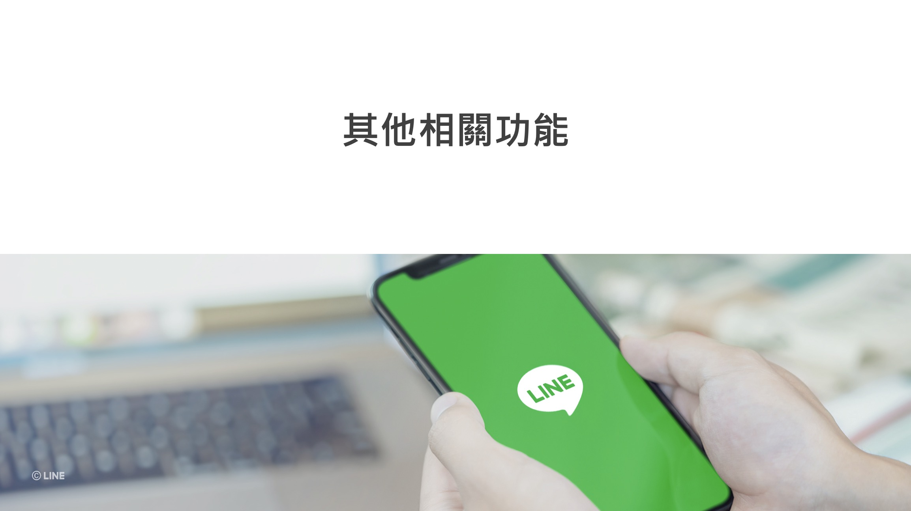

## 前言:

各位好， 我是 LINE Taiwan 資深開發技術推廣工程師 – Evan Lin。 今天這篇文章為各位詳細解釋 「 LINE Bot 開發指南」這一份投影片文件。這一份文件是來自於 [Development guidelines](https://developers.line.biz/en/docs/partner-docs/development-guidelines/) 的投影片，考量到在台灣還沒有正式的公布與中文化。這一次跟總部共同合作準備中文版本之外，並且特定用這一系列文章加以解釋，希望可以讓更多開發者有更多的了解。  [Development guidelines](https://developers.line.biz/en/docs/partner-docs/development-guidelines/)  文件內容很多，本份投影片也將以五篇文章的篇幅來加以解釋。本篇文章為第六篇文章，主要講解的會是關於其他相關功能所有需要注意的事項。

## 文章索引:

#### 完整投影片鏈結： <https://speakerdeck.com/line_developers_tw2/line-bot-developer-guideline-chinese>

希望各位可以持續關注：

1. [關於LINE Bot ](https://www.evanlin.com/2021-05-25-line-bot-guide-1/)
2. [使用Webhook URL接收請求時的注意事項](https://www.evanlin.com/line-bot-guide-2/)
3. [發送 API 請求時的注意事項](http://www.evanlin.com/line-bot-guide-3/)
4. [LINE Login (本篇文章)](http://www.evanlin.com/line-bot-guide-4/)
5. [LINE Login (補充)](http://www.evanlin.com/line-bot-guide-5/)
5.  [其他相關功能(本篇文章)](http://www.evanlin.com/line-bot-guide-6/)

本篇文章將專注在第一個段落，也就是 Page 47 ~ Page 30 的部分。

##  其他相關功能

本篇注意事項中，將會帶出以下的相關項目。

- LINE URL scheme

- LIFF (LINE Front-end Framework)
- 權限管理
- 貼圖的使用方法
- 關於Emoji的發送和接收

以下開始將會逐一針對每一個頁面詳細解釋：

## LINE URL scheme

經常收到許多開發者類似的詢問如下：

- 要怎麼讓使用者直接加 OA 好友？
- 如何直接開啟跟 OA 的聊天視窗？
- 如何讓使用者開啟分享地點的功能？
- 如何開啟上傳照片的選項？
- 如何快速到開啟設置畫面？可以讓使用者更好的調整一些選項？

這些問題都是很常被開發者們詢問到，或許大家都覺得這些功能都牽扯到跟 LINE 相關的設定或是選項的時候。其實也是有提供官方的方式來讓開發者跟使用者互動的。 那麼就是 URL Scheme ，透過以下方式就可以：

1. `https://line.me/R/oaMessage/{%40ACCOUNT_ID}/?{TEXT_MESSAGE}`

   點擊連結開啟官方帳號的聊天畫面，指定的文字訊息將出現在輸入欄內。如果該官方帳號尚未被加入好友，則聊天視窗會顯示加好友畫面。 如果要填寫的訊息包含多字節時，請使用UTF-8進行URL編碼。

   範例：[https://line.me/R/oaMessage/%40linejpen/?%e3%81%93%e3%82%93%e3%81%ab%e3%81%a1%e3%81%af](https://line.me/R/oaMessage/@linejpen/?こんにちは)

2. `https://line.me/R/ti/p/{%40ACCOUNT_ID}`

   點擊連結，以進入到任何官方帳號的加入好友畫面。如果從PC開啟頁面，將顯示QRCode。

   範例：[https://line.me/R/ti/p/%40linenews](https://line.me/R/ti/p/@linenews)

3. `https://line.me/R/msg/text/?{TEXT_MESSAGE}`

   `https://line.me/R/share?text={TEXT_MESSAGE}`

   開啟分享畫面，分享指定文字的訊息。如果要填寫的訊息包含多字節時，請使用UTF-8進行URL編碼。

   範例：[https://line.me/R/msg/text/?%e3%81%93%e3%82%93%e3%81%ab%e3%81%a1%e3%81%af](https://line.me/R/msg/text/?こんにちは)

4. `https://line.me/R/nv/location/`

   在與用戶聊天畫面上，將開啟分享位置資訊的畫面。
    此 LINE URLscheme 不支援 1-1 和 Bot 聊天以外的形式或 `LIFF Apps`。

#### 參考文章:

-  [Using LINE features with the LINE URL scheme](https://developers.line.biz/en/docs/line-login/using-line-url-scheme)

## LIFF (LINE Front-end Framework)

LIFF (LINE Frontend Framework) 除了有許多強大的功能外，更是讓網頁開發者可以快速結合許多 LINE 的功能的開發套件。尤其是 LIFF v2 可以在外部瀏覽器使用的功能跟 Share Target Picker 的相關功能，都有 蠻多相關文章跟可以使用的功能都建議大家參考一下：

#### 參考文章:

- [轉移你的 LIFF: 從 Replace 到 Concatenate 模式](https://engineering.linecorp.com/zh-hant/blog/liff-replace-to-concatenate/)

- [梅竹黑客松賽前企業工作坊 – LIFF shareTargetPicker](https://engineering.linecorp.com/zh-hant/blog/meichu-liff-share-target-picker-workshop/)

- [讓我們使用 Cypress 開始為 LIFF app 撰寫單元測試](https://engineering.linecorp.com/zh-hant/blog/cypress-liff-unit-test/)

- [開啟 LINE LIFF v2 的無限潛力 — liff.shareTargetPicker](https://engineering.linecorp.com/zh-hant/blog/start-liff-v2-sharetargetpicker-power/)

- [在 Vue3 中引入 LIFF 的 ShareTargetPicker 分享 FlexMessage 訊息給 LINE 好友](https://engineering.linecorp.com/zh-hant/blog/how-to-use-liff-in-vue3/)

- [使用 liff.isApiAvailable() 來讓舊的版本 LINE App 可以跑新的 LIFF 功能](https://engineering.linecorp.com/zh-hant/blog/liff-isapiavailable/)

- [Share Target Picker: LIFF（LINE Frontend Framework）中的新功能](https://engineering.linecorp.com/zh-hant/blog/share-target-picker-liff/)

- [Share Target Picker 已經公開，透過 LIFF 來分享訊息將更加的便利](https://engineering.linecorp.com/zh-hant/blog/liff-share-target-picker/)

## 權限管理

## 貼圖的使用方法

## 關於Emoji的發送和接收

## 結論：

以上就是「LINE Bot 開發指南」第六部分的補充與分享，想要知道更多內容可以查看完整投影片，或是找到其他篇的文章來了解。 

想了解更多開發者的活動？  立即加入「LINE 開發者官方社群」官方帳號，就能收到第一手 Meetup 活動，或與開發者計畫有關的最新消息的推播通知。▼

「LINE 開發者官方社群」官方帳號 ID：@line_tw_dev

