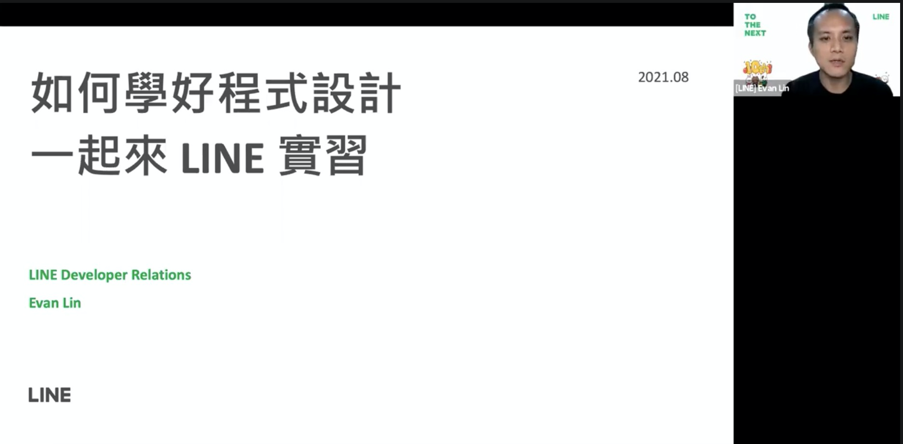

# 前言

大家好，我是 LINE Developer Relations 團隊的資深開發技術推廣工程師 - Evan Lin 。主要的工作項目就是平台技術推廣與技術品牌的建立與溝通。 這是很開心能跟 [APCSCamp 2021 (程式設計能力培訓營)](https://apcs.camp/#aboutapcs) 合作，很榮幸能代表公司跟同學們分享如何將程式設計學好，並且如何才能來 LINE 做實習生。

# 關於 APCSCamp 2021

## 何謂APCS

- APCS 為 Advanced Placement Computer Science 的英文縮寫，是指「大學程式設計先修檢測」。其檢測模式乃參考美國大學先修課程（Advanced Placement，AP），與各大學合作命題，並確定檢定用題目經過信效度考驗，以確保檢定結果之公信力。在台灣， APCS 是目前衡量國高中生程式能力最有公信力的一個指標：目前有 31 所大學， 38 個科系，設立了 APCS 組，將 APCS 納入入學的門檻。

## 緣起

- 近年來，隨著人工智慧崛起，資工系竄升成一大熱門科系，大家開始關注要進入資工系所需具備的能力，而 APCS 也因此備受家長關注。補教業者更積極把握機會，使 APCS 的補教課程如雨後春筍般設立。然而，我們發現補習班的課程教材品質參差不齊，且其中一些還有不少進步空間，有些題目的解答甚至是錯誤的。除此之外，我們也發現這些 APCS 的課程大多集中在大臺北地區等大都市。
- 為解決以上問題，我們決定利用我們的專業能力，在 2021 暑假舉辦一個針對初學者，以 APCS 考試大綱規劃課程內容的線上營隊。雖然線上營隊的舉辦較實體多了許多限制，但考量疫情趨勢與我們期望打破地理限制的初衷，我們仍決定線上舉行，期望讓全臺各地想精進程式能力的初學者都能參與。

（相關資訊來自於: [APCSCamp 官方網站](https://apcs.camp/#aboutapcs)）

這一次很開心能夠支持  [APCSCamp 2021 (程式設計能力培訓營)](https://apcs.camp/#aboutapcs) 並且透過廠商分享議程來跟同學們見面。

# 演講： 如何學好程式設計，一起來 LINE 實習

**投影片**： [投影片鏈結](https://speakerdeck.com/line_developers_tw/how-to-master-programming-and-get-an-internship-job-on-line)

### 參與同學

主要的參與同學為 APCSCamp 的學員（高中同學），主要有「語法班」與「算法班」兩個班級。並且也有工作團隊的一起共襄盛舉。

<script async class="speakerdeck-embed" data-slide="1" data-id="876e6320050b48b4a3b583149f6e918b" data-ratio="1.77777777777778" src="//speakerdeck.com/assets/embed.js"></script>

## 關於 LINE 服務的介紹

一開始先跟每一位同學介紹 LINE 服務的發展歷史，從 2011 年在日本啟動 LINE 的服務之後，到了今年( 2021) 也剛好十年了，十年來的成長從溝通的平台，轉變成每一個使用者的生活平台。 

<script async class="speakerdeck-embed" data-slide="6" data-id="876e6320050b48b4a3b583149f6e918b" data-ratio="1.77777777777778" src="//speakerdeck.com/assets/embed.js"></script>

### LINE TODAY

<iframe width="560" height="315" src="https://www.youtube.com/embed/DtUzXUrC7es" title="YouTube video player" frameborder="0" allow="accelerometer; autoplay; clipboard-write; encrypted-media; gyroscope; picture-in-picture" allowfullscreen></iframe>

作為大家天天會用的主流新聞平台，除了日常提供大家許多新聞相關題材外，其實裡面也含有許多不同的內容，如：**賽事直播**(近期很火紅的 NBA 季後賽也有轉播)、**電影訂票**、選情專區、泰國限定的樂透、電影…等等，擁有這麼多功能都是為了讓用戶可以在 LINE TODAY 中看到大家最新、最值得關注的內容。擁有這麼多功能的平台，同時也是一個跨國的產品，同時也提供給泰國、印尼以及香港。

更多資訊，大家可以參考 [LINE TODAY](https://today.line.me/) 。

### LINE 購物 / LINE SHOPPING 

<iframe width="560" height="315" src="https://www.youtube.com/embed/lcBTHEhJJxw" title="YouTube video player" frameborder="0" allow="accelerometer; autoplay; clipboard-write; encrypted-media; gyroscope; picture-in-picture" allowfullscreen></iframe>

電商已成為現代人不可或缺的一部份，在本次的議程中很詳細地透過不同的例子(母親節、送禮優惠…)來解釋在 LINE 電商服務中的不同使用情境，讓大家可以更快速的了解透過 LINE 來購買相關東西時的好處以及可用性。

更多資訊，大家可以參考 [LINE 購物](https://buy.line.me/)。

### LINE 熱點 / LINE SPOT 

<iframe width="560" height="315" src="https://www.youtube.com/embed/tVk7D1grKt8" title="YouTube video player" frameborder="0" allow="accelerometer; autoplay; clipboard-write; encrypted-media; gyroscope; picture-in-picture" allowfullscreen></iframe>

LINE SPOT 團隊是主要是開發 O2O (Online to Offline) 及活動相關的服務，LINE SPOT 是一個以您所在的位置為起點，讓您可以在上面看到各式店家的優惠資訊，把線下的資訊整合到線上的一個全新的服務。
更多資訊，大家可以參考 [LINE 熱點](https://spot.line.me/)。

## 如何學習好一門程式語言? （以 Golang 為例子)

<script async class="speakerdeck-embed" data-slide="18" data-id="876e6320050b48b4a3b583149f6e918b" data-ratio="1.77777777777778" src="//speakerdeck.com/assets/embed.js"></script>

因為參與演講的同學們都是高中同學，而且課程主要內容都是以 C++ 為主。 所以我透過學習一門新的程式語言 Golang 作為一個範例。來解釋如何學習一門新的程式語言。

在學習 Golang 程式語言的路途上，我建議每一位朋友都不要去了解太多關於 Golang 的設計理念，也不需要知道語言特色，更不要貿然去了解太多關於運作的原理。 建議很重要的事情就是：

```
先下去試著寫幾個應用
```

透過寫一兩個應用，你可以獲得相關的知識：

- 如何可以順利的完整編譯 (compile) 一次 Golang 的應用。
- 如何可以設定相關環境，當然有可能是透過 [Golang Playground](https://play.golang.org/) 
- 可以快速讓自己熟悉一些基礎的語法。


# 關於 LINE  開發者官方社群


立即加入「LINE開發者官方社群」官方帳號，就能收到第一手Meetup活動，或與開發者計畫有關的最新消息的推播通知。▼

「LINE開發者官方社群」官方帳號ID：[@line_tw_dev](https://lin.ee/s5RsZHo)


## 關於「LINE開發社群計畫」

LINE今年年初在台灣啟動「LINE開發社群計畫」，將長期投入人力與資源在台灣舉辦對內對外、線上線下的開發者社群聚會、徵才日、開發者大會等，已經舉辦30場以上的活動。歡迎讀者們能夠持續回來察看最新的狀況。詳情請看:

- [2019 年LINE 開發社群計畫活動時程表](https://engineering.linecorp.com/zh-hant/blog/line-taiwan-developer-relations-2019-plan/)
- [LINE Taiwan Developer Relations 2019 回顧與 2019 開發社群計畫報告](https://engineering.linecorp.com/zh-hant/blog/line-taiwan-developer-relations-2019/)
- [2020 年LINE 開發社群計畫活動時程表](https://engineering.linecorp.com/zh-hant/blog/2020-line-tw-devrel/)

