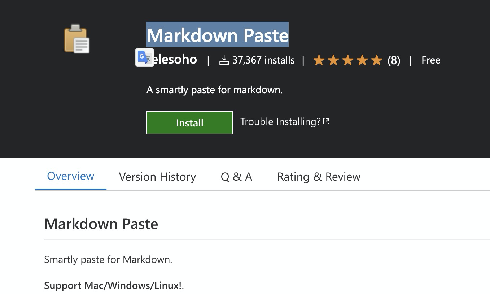

## VSCode Plugin - Markdown Paste :

*完整 Github*: [https://github.com/telesoho/vscode-markdown-paste-image](https://github.com/telesoho/vscode-markdown-paste-image)

你是用哪一套工具寫部落格？ 之前喜歡使用 Typora (這邊可以看我寫的[文章](https://www.evanlin.com/til-mdeditor-typora/)) 。 寫起來雖然很快，但是由於使用 github page 加上後台是 Jekyll 的原因，貼圖的時候總是相當的不方便。

最在查詢筆記軟體的時候，看到了這個 VSCode 的 [Plugin - Markdown Paste](https://marketplace.visualstudio.com/items?itemName=telesoho.vscode-markdown-paste-image) ，覺得相當好用。

有幾個大家一定會寫歡的功能：

### 直接貼上剪貼簿圖片

快速鍵：(MacOSX: Command + Option + V )

## 相關文章：

- [[TIL][markdown] 好用的編輯器 - typora](https://www.evanlin.com/til-mdeditor-typora/)
