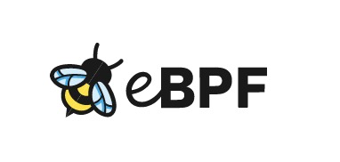

# 什麼是 eBPF (轉)

動態追蹤技術（dynamic tracing）是現代軟體的進階除錯和追蹤機制，讓工程師以非常低的成本，在非常短的時間內，克服一些不是顯而易見的問題。動態追蹤機制如果內建於作業系統，那麼使用者層級的程式即可隨時採集資訊，構建出一幅完整的軟體樣貌，從而有效地指導我們做一些很複雜的分析。這裡非常關鍵的一點是，它是非侵入式的。如果把軟體系統比作一個人，那我們顯然不想把一個活人開膛破肚，Berkeley Packet Filter (BPF) 最初的動機的確是封包過濾機制，但擴充為 eBPF (Extended BPF) 後，就變成 Linux 核心內建的內部行為分析工具包含以下:

- 動態追蹤 (dynamic tracing);
- 靜態追蹤 (static tracing);
- profiling events;

 (以上資訊摘自：[宅色夫](http://wiki.csie.ncku.edu.tw/User/jserv)  [Linux 核心設計](https://beta.hackfoldr.org/linux/): 透過 eBPF 觀察作業系統行為)

# eBPF Summit 2021 研討會資訊

- <https://ebpf.io/summit-2021>
- Day 1: <https://youtu.be/Kp3PHPuFkaA>
- Day 2: <https://youtu.be/ZNtVedFsD-k>

## eBPF Day 1 

這次的 keynote 也相當知名，第一位就是 [Thomas Graf](https://ebpf.io/summit-2021/#) 身為

# Reference

