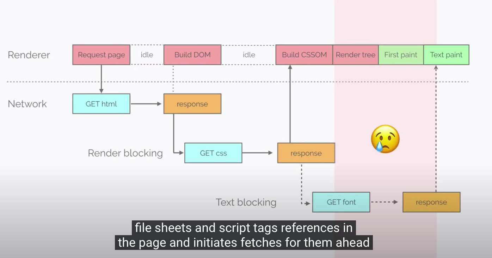
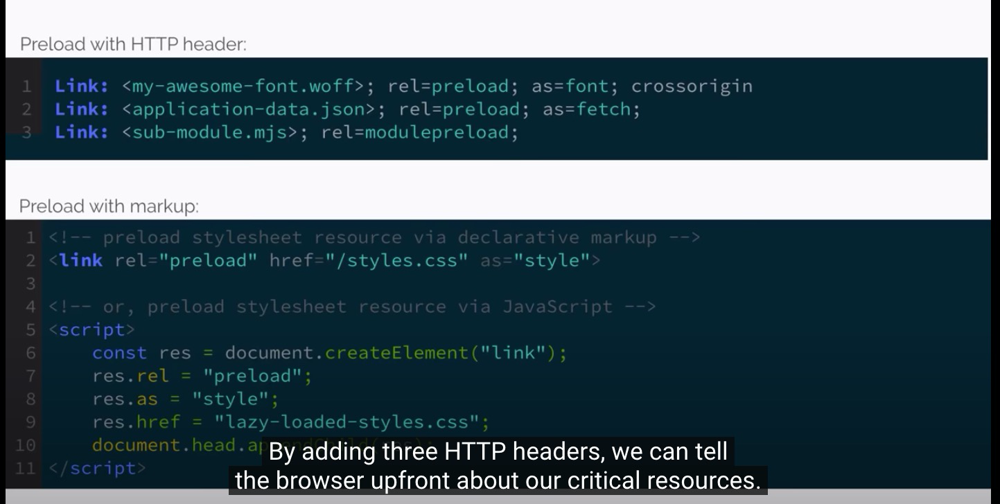

<iframe width="560" height="315" src="https://www.youtube.com/embed/cznVISavm-k" title="YouTube video player" frameborder="0" allow="accelerometer; autoplay; clipboard-write; encrypted-media; gyroscope; picture-in-picture" allowfullscreen></iframe>

# 前提

# Critical Request

- 顯示出使用者最在意的資料。

# Original HTTPS

- CSS could not be pared incrementally 
- DOM need to be combination to final result

## Critical Hidden Resource

- 透過三行 Header  可以告訴 browser 哪些資源最重要。

### 在 Apply 之前

相關的 Font 是最後才下載

### Apply 之後

Font 變成是同步下載，可以讓相關資料顯示的正確且美觀。

## 其他公司透過 Pre-load FONT 達成的結果

Shopify 透過 Pre-load Font 達成 50% 的呈現速度（約為 1.2 秒)

# Server Push 

# Reference

- 
