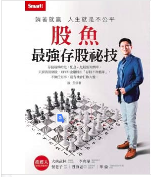

```
躺著就贏　人生就是不公平：股魚最強存股祕技
作者： 股魚  
出版社：Smart智富  
出版日期：2021/03/24
語言：繁體中文
```

#### 買書推薦網址：

- 博客來: [購買網址](https://www.books.com.tw/exep/assp.php/kkdailin/products/0010885819?utm_source=kkdailin&utm_medium=ap-books&utm_content=recommend&utm_campaign=ap-202201)

# 前言:

這是 2022 第一本讀完的書，其實讀到一半很久了。只是我對元投資理財的書籍都有問題，就是很難一次把它全部看完。 可能今天股市大漲就會想來看相關的處理章節，如果遇到回修的調整，也會來看面對套牢的股票該如何來處理。 當初會買一這一本書也是因為看了 YouTube 相關的頻道內容後，發現這個講者真的是言之有物之外，解釋股票的方式也不是透過技術線型，而是很認真的來研究關於基本面與存股的標的。跟我本身的方式比較類似，於是想說買來看。   結果發現由於本身是工程背景出身，對於股票的分析也相當的「工程師」認真的研究公司的財報，理性的分析每一個數字背後的涵義與未來的影響。身為工程師的你，如果也想要長期投資，建議一定要看這一本書。


<iframe width="560" height="315" src="https://www.youtube.com/embed/TpodAcZKhng" title="YouTube video player" frameborder="0" allow="accelerometer; autoplay; clipboard-write; encrypted-media; gyroscope; picture-in-picture" allowfullscreen></iframe>


# 內容簡介與心得:

```
41歲就離開職場的存股達人股魚認為，個人和公司相比，當然是公司的賺錢效率高。既然如此，乾脆就把資金交給公司，讓公司幫自己賺錢。至於什麼樣的公司可以幫自己賺錢呢？最好是那種公司名稱雖然很少人聽過，但卻賺得肥滋滋的公司。這種公司一旦被挖掘出來公開亮相，股價將不可同日而語。只要能夠找出這種具潛力的好公司，並且長期持有，就能帶來豐厚的獲利。至於該怎麼做呢？別擔心，股魚已經擷取歷年來的存股精華放入書裡，並由淺至深地進行說明，希望能帶大家找到可以幫你賺不停的好公司。
```

## 章節條列

### 基礎先修班

一開始先分析「存股」的法則，並且透過四個分析圖來分析每一個讀者所屬於的類型。不同的類型。

理財先理債，不要讓負債變成投資裡面的大變因。

- 月薪部分扣除固定支出，有了其他方面支出就可以考慮投資。
- 年終獎金部分扣除相關應用後，需要先本存一部分投資自己的部分。再來投資股票。

這邊也教導相關的進出場所會產生的費用：

- 價差
- 買進手續費
- 賣出手續費
- 證交稅
- 盈餘或是虧損： 就是價差扣以上所有的相關費用。

以上的相關知識雖然基本但是也相當的重要。

### 新手敲門磚

接下來這邊開始比較細節關於相關投資數字的部分，有許多相當值得學習的基礎知識：

- 第一招： 連續十年配發現金股利
  - 存股又希望有現金流的投資人，在意的就是有現金股息的產生。
  - 這個條件就相當的重要。
- 第二招：一般存股標的建議要 `ROE > 8`
  - ROE (股東權益報酬率):  錢滾錢的指標，股東投資一元，所會帶來整體公司報酬的比例。
  - `ROE =  稅前淨利 /  股東權益總數`
- 第三招：本業收入比例超過 80%
  - 存股在意的長期的「穩定」發展，所以有著穩定並且持續長的「本業收入」。
- 第四招：企業經營以民生為基礎
  - 作為存股標的，建議不受市場波動影響，並且穩定成長的標的最佳。
  - 相關標的：
    - 金融：2022 年初的大漲，金融最後一棒棒棒棒。富邦金 2881，兆豐金 2886。
    - 電信：中華電信2412，台哥大，遠傳
    - 民生類股：大台北瓦斯(9908)，德麥，大統益。
    - 數據交換：關貿 6183

篩選存股標的，有些指標可以篩選存股標地：

- 企業金鐘罩
  - 營業活動現金流量 > 0 ，自由現金量 > 0 
  - 負債比 < 60%
- 存股黑馬護城河：
  - EPS 成長幅度： EPS =  稅後淨利 / 普通股在外流通股數
- 看清財報
  - 公司財務三高：毛利率，營業利益率 (>10%)，稅後淨利率
  - 本益成長比 (PEG)  = 本益比 / 淨利複合成長率
    - `< 0.8` 成長動能被低估
    -  `> 1.5` 股價成長已經高於成長動能

相關許多的數值都在這個章節有提到。

### 進階投資學

打造不敗戰隊：

- 需要有低波動的股票
- **需要有高成長量:** 0050 或是 2330
- **求穩為主：** 大統益等等民生股票。
- **守住獲利：** 債卷相關的投資標的

高殖利率加上低波動 ==> 就是勝率比較高的配股策略

#### 股息迷思:

- 挑選股息高的股票不是重點，而是能順利填息的公司。
- 能填息才是真正入袋
- 高股息可能會造成股價的波動（注意填息率）。

#### 4 種估價策略;

- 第一種方式：找出難以跌破的底價
  - 高登零成長模型:
    - `合理估價 = 鼓勵 / (要求報酬率 - 盈餘成長率)`
  - 第二種計算方式：
    - `合理估價 = 淨值 x (股東權益報酬率 / 要求報酬率)`
- 第二種方式：殖利率法： `合理估值 = 現金股利 /  期待殖利率`
- 第三種方式：本益比法： `合理股價 = 預期本益比 x 每股稅後盈餘(EPS)`
  - 對於股利發放比例比較低的股票可以透過本益比法來計算股價。 (e.g. 2383 台光電)
  - 預期 EPS 推估方式：
- 第四種方式： `每股現金價值  = (帳面現金 - 負債總額) / 總股本`

#### 買進後用 6 指標定期檢視:

```
德國證券教父柯斯托蘭尼：「股價是狗，而財報是牽狗的主人。不論狗跑得多遠，終究會回到主人的身邊。」
```

買定存股後，其實還是需要有 6 個指標來定期檢視。

- ROE > 10% or 12%
  - 負面案例：
    - 2014 大豐電跌破 8%
    - 2013 HTC ROE 跌到負值。
- 營業利益率 > 0%
- 營業現金流動量 > 0
- 估價沒有超漲變貴
  - `昂貴價 = 現金股利 / 殖利率區下緣 (3%)`
  - `便宜價 = 現金股利 / 殖利率區下緣 (6%)`
  - 但是如果 ROE 持續成長，估價可以相對應的調整。
- 是否能安心抱著股票睡覺
  - 儘量不要挑選變動大的股票。
- 無負面消息。
  - 2012力成倒帳風波 

相關進階方法都是建立在許多的數據上面。


### 不敗操作術

- 全球貨幣寬鬆，利率下調，資金匯入台股

- 長期持續上漲的標的（任何點都是存股時機）

  - 只有開始買了以後，才有相對應的便宜（下跌）機會。

- 保持現金比例，視狀況加碼入場。

- 指數高檔的存股痛點。

  - 記住自己投資屬性，要存長期持有切勿短期操作。

- 常見存股難題：

  - 越存越賠，沒有定期檢視股票公司體質的改變。
  - 波段操作套牢變成存股（這樣往往會一直跌下去，這時候勇敢停損才是方式）。
  - 存股難得解套了，該賣還是該持有？確認未來展望，如果有持續成長機會。應該不要輕易賣掉。
  - 存股變成變成波段投資。如果存股標的沒有改變體質，其實不需要變更標的。除非有更好的成長標的。

- 投資 ETF

  - 0050 成長均值 8%
  - 0056 殖利率高，每年填息。
  - 透過標的與屬性來選擇適合自己的 ETF 。
  - 小心 ETF 的溢價，因為溢價超過 1% 會啟動 ETF 購買方的主動放股調整。

- 定期定額創造財富

  - 定期定額創造微笑曲線
  - 越高股價越需要定期定額零股購買
  - 零股建立個人化 ETF ，比起全部壓一個可能夠有穩定的收入與成長的可能。

  

### 投資野戰隊

- 敲定觀察的存股名單
- 設定篩選的標的
- 資料庫查詢相關數據
- 同產業比較強弱


### 投資心法學


## 心得:

