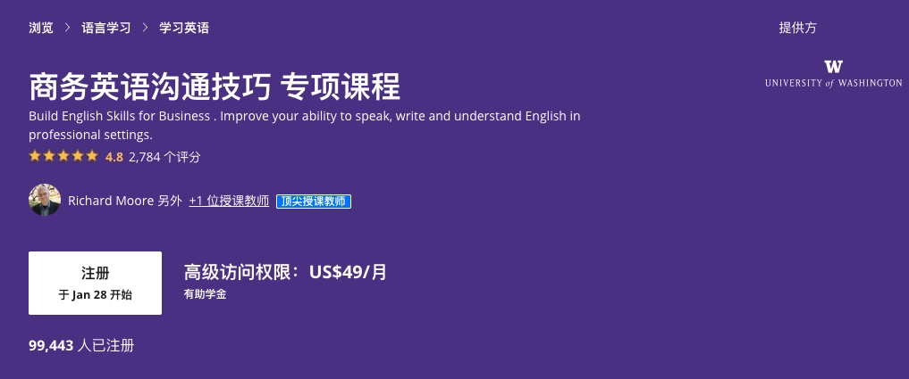

## 前言

## 課程資源

- [專業系列課程](https://www.coursera.org/specializations/business-english)
- [Business English Meeting 課程表](https://www.coursera.org/learn/business-english-meetings/home/welcome)

## 第一週課程

## What make meeting successful

### Vocabulary for Meeting

- Agenda
  - Item for a meeting
- Action items
- Chair : Who is host the meeting
- Meeting Minutes 

### Internal Meeting

- 

