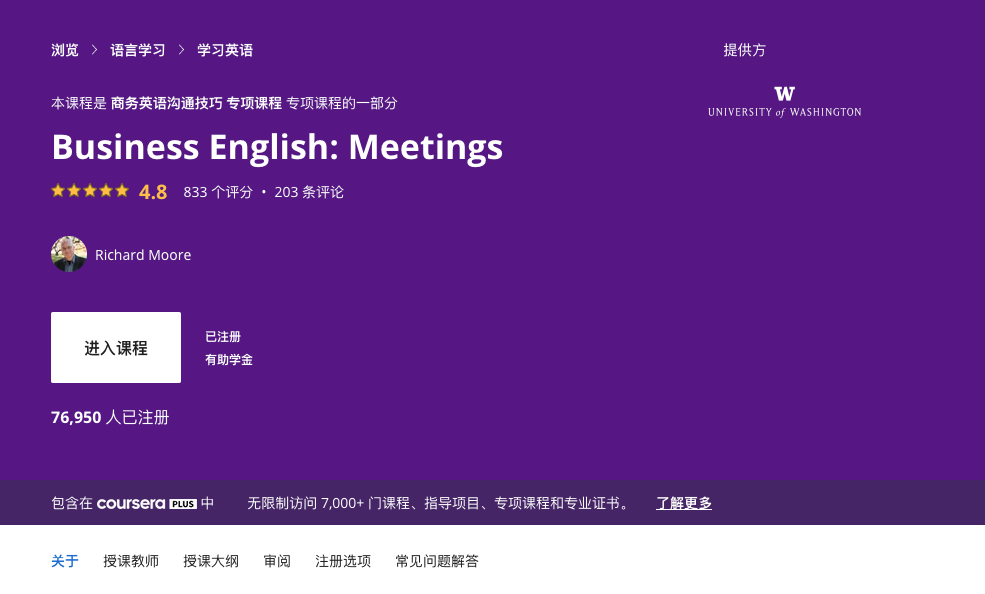

## 前言

最近上了這堂課，發現挺不錯的，蠻推薦的。 雖然本身是屬於英文的學習課程，但是裡面有許多關於開會上的一些用語之外，更有「如何準備好一個商業會議的重點』。  透過會議的開會流程的增進，你會學得以下相關的用語：

- 哪一些開會素材需要準備
- 開會中需要哪些流程
- 會議後需要有哪些代辦事項
- 如何追蹤會議的成果

其實本來對於這一篇還蠻期待的，上課內容也真的很不錯。但是大多是我已經熟悉的開會流程。 很推薦剛工作幾年的人可以看一下。 特別是英文不好的工程師，裡面的一些用語，千萬不要用錯。


## 課程資源

- [Business English Meeting 課程表](https://www.coursera.org/learn/business-english-meetings)

```
This course will teach you vocabulary and skills related to participating in meetings. You will learn terms and phrases used both in email and in speaking to arrange, participate in, and conclude meetings. The goals of this course are to enable you to participate effectively in on-site meetings and teleconferences and to prepare you to write a proposal as an outcome of a meeting.

Course Learning Objectives

•	Arrange a meeting though email and by telephone 
•	List expectations and protocols related to on-site meetings and teleconferences
•	State phone numbers, dates, currencies and sales figures accurately 
•	Write a proposal with appropriate organization and vocabulary
```


### Three suggestion of make your own voice:

1. Focus your reader
2. Write Actively 
   1. 透過主動式（儘量用主動式動詞）
3. Be Positive & Sincere 
   1. Make sure the reader can see your smile in your writing.

### Transition words

- And, But, So,  （需要考慮前後句關係）
- 可以用 a; b 來取代連接詞


