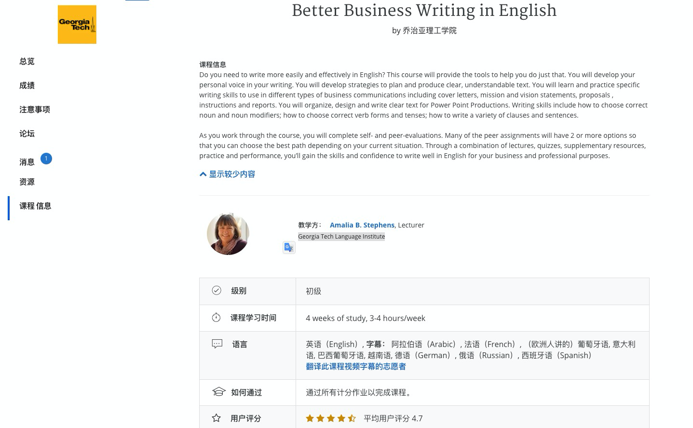

## 前言

## 課程資源

- [Business English Writing 課程表](https://www.coursera.org/learn/business-writing-english/home/info)

## 第一週: Sentense Types

### Three suggestion of make your own voice:

1. Focus your reader
2. Write Actively 
   1. 透過主動式（儘量用主動式動詞）
3. Be Positive & Sincere 
   1. Make sure the reader can see your smile in your writing.

### Transition words

- And, But, So,  （需要考慮前後句關係）
- 可以用 a; b 來取代連接詞

### 關於履歷表內的時態 (Tense)：

- Make it easy to read, keep it in short and focus.

#### 現在式：

- Facts
- Opinions
- Habit, routines

#### 作業： 寫一個求職信 (Cover Letter) - 其中的相關重點:

- **第一段: Greeting**

  - Begin with Mr/Mrs ...
  - 1 ~ 2 sentense
  - 形容語句，現在式

- **第二段： 過去貢獻**

  - 用過去式
  - Tell a story, include with link. Keep it simple.

- **第三段： 展現你的熱情**

  - 用現在式
  - 確認可以清楚的敘述興趣與熱情

- **第四段： 要求面試**

  - 用未來式
  - 提供相關聯絡方式，或是相關對方有幫助的地方。

  

  
  
  

