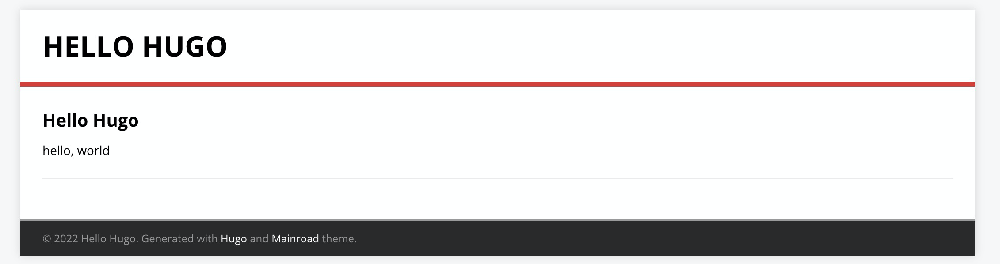
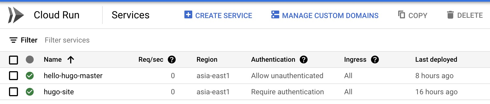

## 前言:

## 流程：

流程大多是依照 [Automatic Deployment of Hugo Sites on Firebase Hosting and Drafts on Cloud Run](https://developers.googleblog.com/2020/08/automatic-deployment-of-hugo-sites-on-firebase-hosting.html) 來修改成中文版本。

### 開啟 Cloud Run 

### 成品

你會發現有兩個 Cloud Run ，一個是你設定的 Trigger 。 第二個 `hugo-site`  就是透過設定跑起來 CICD 的 Cloud Run 。

點進去之後，你會看到上面有一個完整的 URL ，就是可以對外的網址。

最後網站: [https://hello-hugo-master-khga4c2v3a-de.a.run.app](https://hello-hugo-master-khga4c2v3a-de.a.run.app)

## 相關文章：

- [Automatic Deployment of Hugo Sites on Firebase Hosting and Drafts on Cloud Run](https://developers.googleblog.com/2020/08/automatic-deployment-of-hugo-sites-on-firebase-hosting.html)
- [Google CloudRun 打造 hugo 靜態網站環境，並搭配CICD持續部署，用多少收多少無基本費](https://www.minwt.com/website/server/22837.html)
