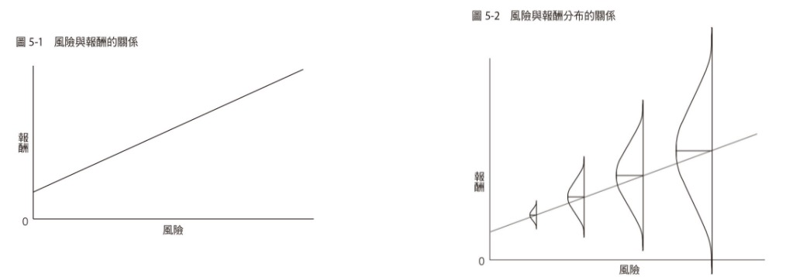
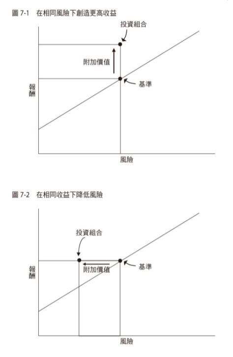

<div><a href="http://moo.im/a/03tvxZ" title="投資最重要的事"></a></div>


```
[好書分享] 投資最重要的事 : 一本股神巴菲特讀了兩遍的書
The Most Important Thing Illuminated : Uncommon Sense for the Thoughtful Investor
作者： 霍華．馬克斯  
原文作者： Howard Marks  
譯者： 蘇鵬元  
出版社：商業周刊 
出版日期：2017/02/23 
```

#### 買書推薦網址：

- [Readmoo 電子書購買](http://moo.im/a/03tvxZ)

# 前言:

這是 2022 第二本讀完的書，這一本是被許多人稱為最重要的一本投資聖經 ，更是被許多人稱為投資應該看的入門教材。雖然大家都說得超經典，這一本卻放在我的購物車內遲遲內沒有下單（因為要看的投資書籍真的太多了）。 但是大年初二去了誠品快速翻了一下之後，馬上就被他的章節說明吸引到了。光是看到「第二層思考」加上「對抗情緒帶來的影響」就讓我受益無窮。 這是一本投資的心法修練書籍，他教導了身為投資人該有的基本心態，並且也挑出了投資人常有的一些錯誤，真的會相當的有用。

# 內容簡介與心得:

```
巴菲特：這本書，我讀了兩遍！
華爾街日報：他的備忘錄，媲美波克夏的股東大會。
價值投資者必讀經典—霍華•馬克斯20項投資法則

傳奇大師精鍊投資最重要的事，
加值4位頂尖投資專家評注筆記，
無論入門者或是老手，都能從大師洞見中找出自己的致勝方法！

在美國投資界與巴菲特齊名的霍華．馬克斯，其所聯合創辦的橡樹資本成立時間超過二十年，管理資產規模已達千億美元，其長期績效表現更是驚人，二十八年來（包含六位創辦人任職TCW時期）平均複合報酬率高達一九%（同期美股標準普爾五百指數表現只有一○‧一%，MSCI全球指數只有四‧九%）。也就是說，如果在二十八年前將一百萬交給橡樹資本管理，現在已擁有一億七千萬。

霍華．馬克斯從不吝於和市場分享其投資洞見，持續以「投資備忘錄」與客戶及所有投資人溝通。橡樹備忘錄受到美國投資界高度重視，地位等於巴菲特波克夏每年股東大會，連巴菲特本人也罕見背書：「只要在郵件信箱裡看到霍華．馬克斯的投資備忘錄，我會馬上打開與閱讀！」
```

## 章節條列

###  第1章　學習第二層思考

許多投資人都有基本的市場概念（當然投資市場裡面的其他人也有），比如說看到好的財報就瘋狂追高，看到不好的財報就拋售。但是這一本書的第一個章節就叫你要有「第二層思考」，也就是要跳脫投資大眾的思考。 因為我們做投資的主要想法就是「打敗大盤」，也可以說是在投資的市場中獲利，那麼你就要有第二層思考：

- 第一層思考：看到好公司，買這個股票。
- 第二層思考會想，雖然是好公司，但是現在的股價會部會太高？ 會不會有回檔的危險？

第二層思考不是無意意思的反對，而是需要你針對第一層思考的資料再仔細去審核，把每一個風險都能看透，這樣才能獲得更高的獲利。

###  第2章　了解效率市場與局限

 「效率市場的定義」在於你無法輕易地打敗大盤，因為整個市場的投資者都是具有專業素養的投資者。根據這些投資者共同努力堆積出出來的價格具有相關的公信力。在紐約証卷交易所中，全部投資者看壞的股票，其中有多少可能性被錯估呢？反之「無效率市場」則定義了相反的市場狀況。 而真正的狀況是，市場有能會有效率地反映一個股票應該有的價值，但是有時候也會無效率的“錯估”某個股票的真正價值。

###  第3章　準確估計實質價值 （價值投資與成長股投資）

那如何在把握在「無效率市場中」找出有價值的股票，等待市場轉到「效率市場」後給予他真正的價值呢？ 這裡講解了兩個重點「價值投資」(Value Investing) 與「成長股投資」(Growth Investing) 。

**價值投資**：會買進股票，因為相信目前的價值相對高於現在的股價。儘管未來沒有成長性，他們還會投資。

- 不用相信未來
- 透過客觀數據推敲出公司價值
- 追求股價跟價值的匹配
- 股價下跌時候會加碼（因為變得更便宜）

**成長股投資**：買進股票是看好未來的成長價值，即使現在的價值遠遠低於原有的股票價格。

- 只在意未來
- 有某些成面的主觀數據認定公司的成長性
- 追求爆發性的成長
- 股價下跌時候，重新審視成長動能與成長因子是否還存在。

###  第4章　找出價格與價值的關係

```
成功的東西，不是因為買了個好標的。而是在正確的價位上，買進了那個好標的。
「成功投資不是因為”買了好東西“，而是因為”東西買得好“。」
```

最安全的投資就是： 在沒有人喜歡的時候買進，等到投資標的受歡迎之後，他的價格只會一路上漲。

挑選好的投資標的相當的重要，但是更重要的是如何在正確的價位買入。因為正確價位買入可以帶來：

- 較高的勝率（調整後股價，比較容易獲利）
- 風險較低的投資（就算賠可能也不會賠太多)
- 利用槓桿不會變得更好的投資，反而容易增加風險。

每個泡沫都是像有幾分的真實中產生，不論是:

- 十七世紀的荷蘭鬱金香
- 兩千年的網路公司
- 2008 的房貸風暴

其中都是有幾分真實的獲利與誘因，但是風險都是在裡面去探究出來的。

###  第5章　理解風險

```
風險意味著可能發生的事，比即將發生的事還多。
- 倫敦商學院教授 Elory Dimson
```

投資第一件事情就是了解 ` 沒有人能準確的知道未來 `，所以免不了都有風險，而投資就應該建築在最低的風險上面。


#### 風險與報酬

- 風險是不好的，請規避必要的風險
- 風險與獲利有相關係，透過均衡調整 (equilibrration) 找出適當的風險與報酬。
- 投資結果應該是將風險與報酬合併在一起計算的成果。



我們都以為風險與報酬是 5-1 ，其實真正的風險與報酬分佈是像 5-2 。 同樣的風險狀況下，根據不同的投資策略其實可以有兩個極端的報酬分佈。（正向相當大，就是賺很大; 反之就是巨大虧損）。

幾件事情整理：

- 風險難以判斷，有多種隱含的統計指標，但是依舊很難有明顯量化方式。
- 投資就是應對未來，並且理解風險一定會發生。
- 投資組合的調配上，要以如果發生了風險，最大虧損的狀況來評估。來作為風險的控管。

###  第6章　確認風險

了解風險是必然存在，那麼就來開始確認風險的本質：

- 風險只會分散，不會消失。
- 只要市場環境改變，風險是需要重新評估
- 風險的任性：風險也會隨著投資人的瘋狂而改變

###  第7章　控制風險

```
投資人最重要的課題就是為了獲利來承擔風險，
最好的投資人跟其他人的區別就是能把這件事做到最好。（指的是儘量地降低風險到最低）。
```



這張圖是我認為這本書數一數二重要的觀念之一。

大家都以為好的投資人就是如 7-1 在同樣風險下增加附加價值。但是`真正厲害的投資人，是相同的獲利下可以將風險降到最低的人`。因為無效率市場下，能降低最低風險的投資人。就可以鎖住獲利，並且可以有更好的投資成果。

就像是壽險公司來說:

- 每個保戶一定都會死，所以保單一定會賠償。
- 透過精算壽險公司可以合理的承擔風險，並且透過健康狀況來調整保費降低到最低的風險。
- 只要合理狀況下，所有保戶透過精算的狀況下，壽險公司就能有獲利。

**風險無法逃避，只能控制**

- 一個 40% 的虧損，需要有 67% 的報酬才能回本。
- 更進階的 50% 的虧損，隔年則需要 100% 的報酬才能回本。

風險的控制相當的重要。

###  第8章　注意景氣循環

#### 信用循環

- 經濟進入繁榮
- 資金很多
- 大家瘋狂投資，風險趨避變少
- 爭奪市場，金融機構降息
- 開始有呆帳產生
- 放款條件增高
- 資金變少
- 景氣萎縮

景氣循環不會停止，但是會有長短不一的狀況。

###  第9章　意識到鐘擺效應

景氣週期就像是鐘擺，必定有相關的高檔與低檔的產生。 但是讓投資人摸不清楚的是，往往中間的狀態卻是相當的長。

#### 多頭市場三階段

- 少數人覺得事情會變好
- 大多數投資人覺得變好
- 新聞與所有人覺得變好

接下來就是空頭市場的開始。

相信鐘擺效果的人，要了解恐懼和貪婪是鐘擺的兩個高點。但是大多數都在兩個高點的中間，極端市場一定會反轉。

###  第10章　對抗情緒帶來的負面影響

貪婪會讓投資人，忘記風險。恐懼與貪婪相反，會讓人過度憂慮。

#### 錯誤投資的七種心態

- 貪婪
- 恐懼
- 將質疑拋諸腦後
- 從眾的傾向（群眾效應）
- 妒忌
- 自負
- 投降

事情好的不像是真的，代表其中一定不是真的。（也就是有著泡沫與風險）

###  第11章　反向投資

```
在別人組喪拋棄時候買進，在興奮的時候賣出。全部需要最大的勇氣，但是也會提供最豐厚的獲利。
- Sir John Templeton
```

反向投資有相當高的風險：

- 市場並不常出現有讓你獲利的極端狀況，跟著反向投資往往會虧損。
- 即使現在價格過低，也不代表明天就會恢復。（可能會很多年）
- 只做相反的事情是不夠的，還需要有更多的資訊來支撐你的行為。

小心並且熟練地接著掉下來的刀子。

###  第12章　找出便宜標的

###  第13章　耐心等待時機

###  第14章　認清預測的局限

###  第15章　察覺所在的景氣位置

###  第16章　認識運氣扮演的角色

###  第17章　採取防禦型投資策略

###  第18章　避開投資陷阱

###  第19章　增加價值

###  第20章　合理預期

###  第21章　把所有重要的事做好


## 心得:


