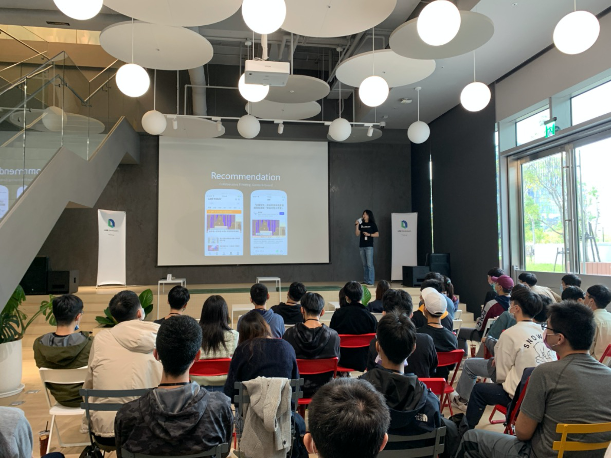

# 前言

# 來 LINE 台灣企業參訪

你知道 LINE 台灣的辦公室在哪裡嗎？ 好奇 LINE 台灣的工程團隊都是在如何的辦公環境工作呢？ 這裡我們也歡迎所有的學校單位來申請企業參訪。透過企業參訪同學們可以暸解：

## LINE 台灣辦公室開放空間參觀：

<iframe width="560" height="315" src="https://www.youtube.com/embed/vy58Kabmus4" title="YouTube video player" frameborder="0" allow="accelerometer; autoplay; clipboard-write; encrypted-media; gyroscope; picture-in-picture" allowfullscreen></iframe>

LINE 工程團隊的企業文化重視的就是 「 Be Open 」「 Trust and Respective」 跟 「Take Ownership」。而在新辦公室的裝潢上也是充滿了相關的理念，重視著高度開放與同仁間彼此信任的設施。 歡迎每一位同學們來了解，來感受一下外商的辦公環境。

這裡也分享許多 YouTuber 的影片給各位參考：

- [台灣LINE辦公室的福利竟然比蘋果好！HR直接透露提高錄取率的方法！連我們都想來上班！](https://www.youtube.com/watch?v=u6Gt3gxHbS4)
- [LINE總部海外第一大新家開箱！導演竟然邊拍邊應徵詢問職缺？福利好成這樣！](https://www.youtube.com/watch?v=YXQE84_6gJM&t=285s)
- [LINE全球海外最大辦公室在台灣｜4公尺新熊大有 3 個不同｜全新LINE Studio創作者空間首度曝光](https://www.youtube.com/watch?v=LAul_sE0s5k) 

## LINE 工程團隊的介紹

想知道外商工作的軟體開發流程是如何呢？ 如何打造出數百萬人流量的服務呢？ 企業參訪的同時， LINE 工程團隊也會安排相關的開發流程分享，讓每一位參加的同學都能了解

# 在 LINE 台灣技術實習 - TECHFRESH 介紹與相關福利

LINE 台灣工程團隊每年透過 LINE TECH FRESH – 技術新星人才計劃，招募資訊科技相關科系，或對此領域有所涉略的大學生 / 研究生加入 LINE 團隊進行長期實習 (一年期)，讓同學們能在國際級科技公司中觀摩學習。LINE TECH FRESH 由經驗豐富的技術專案經理帶領團隊，接觸多元化的專案與產品開發，學習業界實際的軟體專案分工，並體驗跨國團隊合作。往年工作內容包含 server、web、mobile app、chatbot、IoT、data、DevOps 等領域，並透過實習熟悉 LINE 平台系統、SDK、API 等。值得一提的是，LINE TECH FRESH 是有給薪的實習機會，對於軟體開發有熱情、有想法的同學們，千萬別錯過這個揮灑創意與衝勁的機會！

更多關於 LINE TECH FRESH 介紹文章有:

- [TECH FRESH 實習的一年間，除了開發還有什麼內部活動呢？](https://engineering.linecorp.com/zh-hant/blog/line-tech-fresh-2020-graduate/)
- [【訪談】TECH FRESH 工作老實說 – 後續花絮與相關資訊整理](https://engineering.linecorp.com/zh-hant/blog/what-is-tech-fresh-interview/)
- [Life in LINE – 直擊 TECH FRESH 實習內容！](https://engineering.linecorp.com/zh-hant/blog/life-in-line-tech-fresh-sharing/)
- [TECHPULSE 2020 青春主場 – TECH FRESH 議程與攤位介紹](https://engineering.linecorp.com/zh-hant/blog/techpulse-2020-tech-fresh-session/)

## 小結

立即加入「LINE開發者官方社群」官方帳號，就能收到第一手Meetup活動，或與開發者計畫有關的最新消息的推播通知。▼

「LINE開發者官方社群」官方帳號ID：[@line_tw_dev](https://lin.ee/s5RsZHo)

# 關於「LINE 開發社群計畫」

LINE 今年年初在台灣啟動「LINE 開發社群計畫」，將長期投入人力與資源在台灣舉辦對內對外、線上線下的開發者社群聚會、徵才日、開發者大會等，已經舉辦 30 場以上的活動。歡迎讀者們能夠持續回來察看最新的狀況。詳情請看:

- [2019 年 LINE 開發社群計畫活動時程表](https://engineering.linecorp.com/zh-hant/blog/line-taiwan-developer-relations-2019-plan/)
- [LINE Taiwan Developer Relations 2019 回顧與 2019 開發社群計畫報告](https://engineering.linecorp.com/zh-hant/blog/line-taiwan-developer-relations-2019/)
- [2020 年 LINE 開發社群計畫活動時程表](https://engineering.linecorp.com/zh-hant/blog/2020-line-tw-devrel/)
- [2021 年 LINE 開發社群計畫活動時程表 (持續更新)](https://engineering.linecorp.com/zh-hant/blog/2021-line-tw-devrel/)