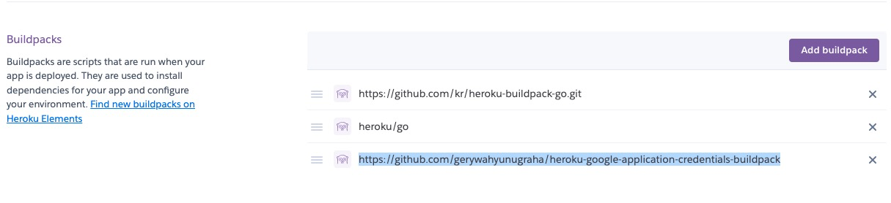

## 前言:

以往的時候，如果要使用 Google Cloud 相關的 API (比如說: Google Cloud Storage) 存取 API ，只能透過 JSON 檔案來操作。但是如果你想要放上 Heroku 的時候，就必須要放上 GitHub ，這個時候就很容易不小心誤放 JSON 檔案而被機器人掃走而盜用。

本篇文章將告訴你，透過環境變數跟 Golang Buildpack 可以幫助你在安全無慮的狀況下部署 Herokuu 專案，也可以開源到 Github 。

## 流程：

其實這一篇 [Adding Google Cloud Credentials to Heroku](https://devdojo.com/bryanborge/adding-google-cloud-credentials-to-heroku) 的內容算是蠻完整的，但是裡面的 buildpack 最近用起來怪怪的。

1. 下載你的 JSON Key 
2. 

## 相關文章：

- [Adding Google Cloud Credentials to Heroku](https://devdojo.com/bryanborge/adding-google-cloud-credentials-to-heroku)
- [Stackoverflow: How to use Google API credentials json on Heroku?](https://stackoverflow.com/questions/47446480/how-to-use-google-api-credentials-json-on-heroku)
- [Simple Golang API File Uploader Using Google Cloud Storage](https://adityarama1210.medium.com/simple-golang-api-uploader-using-google-cloud-storage-3d5e45df74a5)
