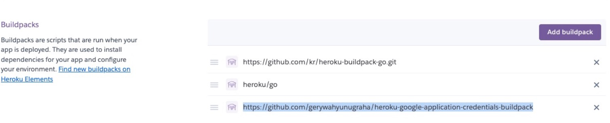

# 前言:

大家好，我是 LINE 台灣的資深技術推廣工程師的 Evan Lin 。 

# Demo (展示) :

# 開發流程記錄：

這邊透過一些開發流程，來跟各位分享該如何在 LINE 聊天機器人中來完成這樣的開發：

## 如何在 Heroku 上面開發 Golang 的 App 



以往的時候，如果要使用 Google Cloud 相關的 API (比如說: Google Cloud Storage) 存取 API ，只能透過 JSON 檔案來操作。但是如果你想要放上 Heroku 的時候，就必須要放上 GitHub ，這個時候就很容易不小心誤放 JSON 檔案而被機器人掃走而盜用。透過環境變數跟 Golang Buildpack 可以幫助你在安全無慮的狀況下部署 Herokuu 專案，也可以開源到 Github ，歡迎[參考這篇文章](https://www.evanlin.com/til-heroku-gcp-key/)。

以下也提供一個簡單的測試程式碼，可以確認連接到 GCP 是否有正確連結。

<script src="https://gist.github.com/kkdai/1a81605d33f22603762354e981990596.js"></script>

## 如何投過官方帳號 (Official Account) 來抓取 LINE 聊天對話中的影片或是聲音檔案

首先，當官方帳號收到圖片訊息(image)，影片訊息(video) 或是聲音訊息(audio) 的時候，通常會透過以下幾個 Message Hook.

- [Image Messagge Webhook](https://developers.line.biz/en/reference/messaging-api/#wh-image)
- [Video Message Webhook](https://developers.line.biz/en/reference/messaging-api/#message-event)
- [Audio Messageg Webhook](https://developers.line.biz/en/reference/messaging-api/#message-event)

以 Video Message Webhook 為例子，你會看到以下的例子（來自 LINE Dev Doc)


- 如果 Video Message 的影片提供者是外部服務，可能還可以取得檔案的連結。
- 但是如果你透過上傳影片給官方帳號，你可能會發現官方帳號無法直接存取到檔案內容。需要透過  [Get content](https://developers.line.biz/en/reference/messaging-api/#get-content) 的 API 來取的相關資訊。

以下提供範例的 Golang 程式碼，來展示如何取得上傳到 LINE 平台的影片檔案內容：

```go
	for _, event := range events {
		if event.Type == linebot.EventTypeMessage {
			switch message := event.Message.(type) {
			.......
      case *linebot.VideoMessage:
              //Get Video binary from LINE server based on message ID.
              content, err := bot.GetMessageContent(message.ID).Do()
              if err != nil {
                log.Println("Got GetMessageContent err:", err)
              }
              defer content.Content.Close()
```

這個方式就可以取得檔案的 IO Reader 內容，就可以透過 `content` 這個 IO Reader 來將檔案抓下來，或是直接上傳到 Google Cloud Storage 。

## 如何將檔案上傳到 Google Cloud Storage


## 如何取得 GCS 對外的公開位置

### 打開分享權限

建議透過介面打開來權限

- [到 Console](https://console.cloud.google.com/storage/browser)  到擁有 Google Cloud Storage 的專案
- 透過 More Button 打開 Edit Access


### 注意事項：
- 如果你想透過 code 來改權限，請不要使用一個個檔案來打開。會出錯。 （[這段在最近使用就會有問題](https://github.com/GoogleCloudPlatform/golang-samples/blob/HEAD/storage/objects/make_public.go)）
- 打開一次資料夾權限，之後不需要再調整。

### 取得公開對外的檔案位置

已經修改資料夾權限，讓他可以 Public 後。如何取得 Google Cloud Storage 對外鏈結呢？

規則如下：

```
https://storage.googleapis.com/{{BucketName}}/{{ObjectName}}
```

所以可以寫成一個簡單的 function ，來幫你結合。


# 相關文章：

- [GCS Doc: Make data public](https://cloud.google.com/storage/docs/access-control/making-data-public)
- [iThome 鐵人賽 - Day 23 Google Cloud Speech-to-Text - 子系列最終章](https://ithelp.ithome.com.tw/articles/10223077?sc=iThelpR)
- [[學習文件\] 如何在 Heroku 上面使用透過 Golang 來存取 Google Cloud 服務](http://www.evanlin.com/til-heroku-gcp-key/)
- [GCP: Speech-to-Text client libraries](https://cloud.google.com/speech-to-text/docs/libraries?hl=zh-tw#client-libraries-resources-go)
-  [Stackoverflow: How do I retrieve a file from GCS using a browser if all I know is the gs scheme URI?](https://stackoverflow.com/questions/34214491/how-do-i-retrieve-a-file-from-gcs-using-a-browser-if-all-i-know-is-the-gs-scheme)

  

   
