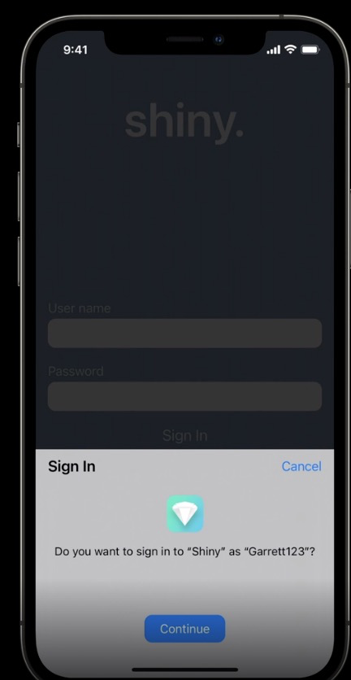

# 前情提要:

[WWDC22](https://developer.apple.com/videos/wwdc2022/) 雖然說是 Apple 的開發者大會，但是當天在看 Keynote 的時候，這個 [Passkeys](https://developer.apple.com/documentation/authenticationservices/public-private_key_authentication/supporting_passkeys) 的功能卻讓我相當的驚喜。 於是等到整個細節的議程[ Meet passkeys 的議程 ](https://developer.apple.com/videos/play/wwdc2022/10092/)，整個議程帶來許多新的想法。於是認真的的研究一下，原來 Apple 在 WWDC 21 就已經開發出來 Passkey 的相關流程跟開發方式（參考 [WWDC21 議程: Move beyond passwords](https://developer.apple.com/videos/play/wwdc2021/10106/))。但是到了 iOS16 才有原生支援在手機與 iOS App 端。

# 什麼是 Passkeys ?

Passkey 是一個溝通協定，可以比起舊的 Password 機制來說更佳的安全。現在的認證有以下幾種:

- Memorized passwords:
  - 就是輸入 ID, PW 的方式。然後用人力來記錄。非常危險，因為經常怕忘記而全部使用同一個。
- Password manager:
  - 舉凡 Apple/Chome AutoFill 都算是，獲釋

(From:[WWDC21 議程: Move beyond passwords](https://developer.apple.com/videos/play/wwdc2021/10106/) )

(from [WWDC22 Session: Meet passkeys](https://developer.apple.com/videos/play/wwdc2022/10092/))

# 身為後端開發者，你該怎麼應用?

# 

# Reference

-  [Apple Doc: Supporting Passkeys](https://developer.apple.com/documentation/authenticationservices/public-private_key_authentication/supporting_passkeys)
-  [WWDC22 Session: Meet passkeys](https://developer.apple.com/videos/play/wwdc2022/10092/)
-   [WWDC21 議程: Move beyond passwords](https://developer.apple.com/videos/play/wwdc2021/10106/)
-  [FIDO2: Web Authentication (WebAuthn)](https://fidoalliance.org/fido2-2/fido2-web-authentication-webauthn/)

