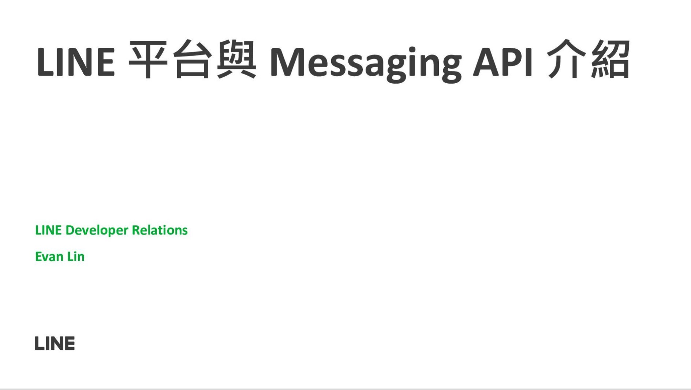

# 前言

大家好，我是 LINE Taiwan Developer Relations 團隊的資深開發技術推廣工程師 - Evan Lin 。主要的工作項目就是平台技術推廣與技術品牌的建立與溝通。 這一次跟大家來分享 LINE 的平台介紹，並且介紹關於 Messaging API 開發上的相關細節。 本次的介紹將會有以下的部分：

- 基礎的 LINE 平台介紹
- 2022 所開放的新功能簡介
- 相關的學習資源

而本篇文章將會專注在 2022 的相關新功能與學習資源，希望能讓所有讀者能夠更了解關於 2022 的相關新功能介紹。

## 投影片

<iframe class="speakerdeck-iframe" frameborder="0" src="https://speakerdeck.com/player/03a90c9b72924b0a806731066338249f" title="2022 新星挑戰賽-LINE 平台與 Messaging API 介紹" allowfullscreen="true" mozallowfullscreen="true" webkitallowfullscreen="true" style="border: 0px; background: padding-box padding-box rgba(0, 0, 0, 0.1); margin: 0px; padding: 0px; border-radius: 6px; box-shadow: rgba(0, 0, 0, 0.2) 0px 5px 40px; width: 560px; height: 314px;" data-ratio="1.78343949044586"></iframe>

**教學影片：**

# LINE 平台的介紹跟相關整理：

希望大家可以參考以前相關的相關學習文章。

1. [關於LINE Bot](https://engineering.linecorp.com/zh-hant/blog/line-bot-guideline-1/)
2. [使用Webhook URL接收請求時的注意事項](https://engineering.linecorp.com/zh-hant/blog/line-bot-guideline-2/)
3. [發送 API 請求時的注意事項](https://engineering.linecorp.com/zh-hant/blog/line-bot-guideline-3/)
4. [LINE Login ](https://engineering.linecorp.com/zh-hant/blog/line-bot-guideline-4/)
5. [LINE Login (補充)](https://engineering.linecorp.com/zh-hant/blog/line-bot-guideline-5/)
6. [其他相關功能](https://engineering.linecorp.com/zh-hant/blog/line-bot-guideline-6/)

# 2022 的新功能整理

## 2022/02/02 Rich Menu Playground 

<iframe class="speakerdeck-iframe" frameborder="0" src="https://speakerdeck.com/player/03a90c9b72924b0a806731066338249f?slide=47" title="2022 新星挑戰賽-LINE 平台與 Messaging API 介紹" allowfullscreen="true" mozallowfullscreen="true" webkitallowfullscreen="true" style="border: 0px; background: padding-box padding-box rgba(0, 0, 0, 0.1); margin: 0px; padding: 0px; border-radius: 6px; box-shadow: rgba(0, 0, 0, 0.2) 0px 5px 40px; width: 560px; height: 314px;" data-ratio="1.78343949044586"></iframe>

在 2022/02/02 有開放一個 [Rich Menu Playground is now available](https://developers.line.biz/en/news/2022/02/02/rich-menu-playground/) 的文章，可以過投影片裡面的 QR Code （或是[這個連結](https://liff.line.me/1645278921-kWRPP32q/?accountId=try_richmenu))來加入一個官方帳號。透過這個[官方帳號](https://liff.line.me/1645278921-kWRPP32q/?accountId=try_richmenu)，你可以測試一些 RichMenu 的相關功能，不論是：

- 透過 RichMenu 來挑選時間的 - [datetime picker action](https://developers.line.biz/en/reference/messaging-api/#datetime-picker-action)
- 快速切換 RichMenu 的 -  [rich menu aliases](https://developers.line.biz/en/docs/messaging-api/using-rich-menus/#switching-between-multiple-rich-menus)

## 2022/04/19 Webhook Redelivery 

<iframe class="speakerdeck-iframe" frameborder="0" src="https://speakerdeck.com/player/03a90c9b72924b0a806731066338249f?slide=48" title="2022 新星挑戰賽-LINE 平台與 Messaging API 介紹" allowfullscreen="true" mozallowfullscreen="true" webkitallowfullscreen="true" style="border: 0px; background: padding-box padding-box rgba(0, 0, 0, 0.1); margin: 0px; padding: 0px; border-radius: 6px; box-shadow: rgba(0, 0, 0, 0.2) 0px 5px 40px; width: 560px; height: 314px;" data-ratio="1.78343949044586"></iframe>

開發者常常詢問到如果在自己開發的 LINE Bot 伺服器發生問題的時候，是否有辦法可以讓 LINE 平台在發送一次訊息呢？ 這時候 [In the Messaging API, a feature to redeliver webhooks that fail to be received has been added](https://developers.line.biz/en/news/2022/04/19/webhook-redelivery/) 所公布的 Webhook Redelivery 就是一跟相當時用的設定。 透過在 LINE Developer Console 的設定，你就可以完成以下的功能：

1. 增加 Webhook Redeliivery 的設定 - [Add the webhook redelivery feature](https://developers.line.biz/en/news/2022/04/19/webhook-redelivery/#add-webhook-redelivery-2022-04-19)
2. LNE 平台傳送的訊息中將會增加 Webhook Event 的元件 - [Add common properties to webhook event objects](https://developers.line.biz/en/news/2022/04/19/webhook-redelivery/#add-common-properties-2022-04-19)
3. 可以有一個總結的表格，讓你一目了然自己開發的伺服器是否有發生問題？ - [Publish error statistics aggregation](https://developers.line.biz/en/news/2022/04/19/webhook-redelivery/#publish-error-statistics-2022-04-19)

## 2022/05/13 New RichMenu Actions

<iframe class="speakerdeck-iframe" frameborder="0" src="https://speakerdeck.com/player/03a90c9b72924b0a806731066338249f?slide=49" title="2022 新星挑戰賽-LINE 平台與 Messaging API 介紹" allowfullscreen="true" mozallowfullscreen="true" webkitallowfullscreen="true" style="border: 0px; background: padding-box padding-box rgba(0, 0, 0, 0.1); margin: 0px; padding: 0px; border-radius: 6px; box-shadow: rgba(0, 0, 0, 0.2) 0px 5px 40px; width: 560px; height: 314px;" data-ratio="1.78343949044586"></iframe>

# 關於 LINE 學生實習機會: LINE TECH FRESH 介紹

LINE 台灣工程團隊每年透過 [LINE TECH FRESH – 技術新星人才計劃](https://career.linecorp.com/linecorp/career/detail/20000111/704/5570?classId=&locationCd=TW&page=)，招募資訊科技相關科系，或對此領域有所涉略的大學生 / 研究生加入 LINE 團隊進行長期實習 (一年期)，讓同學們能在國際級科技公司中觀摩學習。LINE TECH FRESH 由經驗豐富的技術專案經理帶領團隊，接觸多元化的專案與產品開發，學習業界實際的軟體專案分工，並體驗跨國團隊合作。往年工作內容包含 server、web、mobile app、chatbot、IoT、data、DevOps 等領域，並透過實習熟悉 LINE 平台系統、SDK、API 等。值得一提的是，LINE TECH FRESH 是有給薪的實習機會，對於軟體開發有熱情、有想法的同學們，千萬別錯過這個揮灑創意與衝勁的機會！

更多關於 LINE TECH FRESH 介紹文章有:

- [TECH FRESH 實習的一年間，除了開發還有什麼內部活動呢？](https://engineering.linecorp.com/zh-hant/blog/line-tech-fresh-2020-graduate/)

- [【訪談】TECH FRESH 工作老實說 – 後續花絮與相關資訊整理](https://engineering.linecorp.com/zh-hant/blog/what-is-tech-fresh-interview/)

- [Life in LINE – 直擊 TECH FRESH 實習內容！](https://engineering.linecorp.com/zh-hant/blog/life-in-line-tech-fresh-sharing/)

- [TECHPULSE 2020 青春主場 – TECH FRESH 議程與攤位介紹](https://engineering.linecorp.com/zh-hant/blog/techpulse-2020-tech-fresh-session/)

# 參與者們的相關詢問：

## 1. 履歷的撰寫上是否需要美工排版？

###  A:

- 不需要，比起漂亮的排版。面試官比較希望收到內容簡單實在的記事本文件。

- 

# 關於 LINE  開發者官方社群

立即加入「LINE開發者官方社群」官方帳號，就能收到第一手Meetup活動，或與開發者計畫有關的最新消息的推播通知。▼

「LINE開發者官方社群」官方帳號ID：[@line_tw_dev](https://lin.ee/s5RsZHo)

## 關於「LINE開發社群計畫」

LINE 2019 年初在台灣啟動「LINE開發社群計畫」，將長期投入人力與資源在台灣舉辦對內對外、線上線下的開發者社群聚會、徵才日、開發者大會等，已經舉辦30場以上的活動。歡迎讀者們能夠持續回來察看最新的狀況。詳情請看:

- [2019 年LINE 開發社群計畫活動時程表](https://engineering.linecorp.com/zh-hant/blog/line-taiwan-developer-relations-2019-plan/)
- [LINE Taiwan Developer Relations 2019 回顧與 2019 開發社群計畫報告](https://engineering.linecorp.com/zh-hant/blog/line-taiwan-developer-relations-2019/)
- [2020 年LINE 開發社群計畫活動時程表](https://engineering.linecorp.com/zh-hant/blog/2020-line-tw-devrel/)

