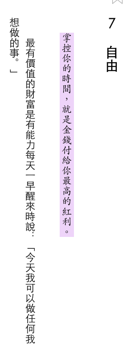

<div><a href="http://moo.im/a/37fkzY" title="致富心態"></a></div>


```
致富心態 - 關於財富、貪婪與幸福的20堂理財課
The Psychology of Money : Timeless Lessons on Wealth, Greed, and Happiness
作者： 摩根．豪瑟  原文作者： Morgan Housel  
出版日期：2021/01/27
```

#### 買書推薦網址：

- [Readmoo 線上書籍購買](http://moo.im/a/37fkzY)

# 前言:

這一本是今年所讀完的第十七本書。致富心態也是許多投資書籍都會提到的經典之一，他不是一本投資的書籍。卻告訴你如何有著讓你致富的心態準備。 另外一方面，經常會聽到有人講到有一些心態往往讓你越省錢，卻越貧窮。 脫離不了貧窮的思維，就應該來看看這本書帶給你的想法。


# 內容簡介:

```
看穿投資與理財的本質，改進理財的缺陷、偏見與不良行為
人人都能邁向財務自由的人生

世界上有賺很多錢卻破產的人，也有賺很少錢卻有辦法捐大錢做慈善的人。為什麼？
因為理財結果與運氣和風險有關，而且不受才智與個人努力影響，更重要的是，與其了解許多理財專業知識，適當的言行舉止更加關鍵。

這就是致富心態，這是現今社會不可或缺的軟實力。

《華爾街日報》知名專欄作家摩根‧豪瑟發覺，我們是用理解知識的方式在思考、學習金錢觀，而不是用理解心智與行為模式的方式在學習投資與理財。不過，我們的理財行為卻深受各種情緒的影響。每個人看待世界運作的方式各不相同，所以看待金錢運作的觀點天差地別，結果是有人成為富翁，有人卻窮困潦倒。
```

這一本將許多容易致富的思維，拆解成許多的相關章節。

### 1. 沒有人真的是瘋子

這一個章節講解的是「對於風險的承受度」，很多時候我們不論是看到少年股神，或是某某大神都會非常羨慕。但是相對的自己來做股票，卻是只有百萬分之一就嚇得要死。這其實很大部分在於每個人對於風險的承受程度不同。並且也跟他看過的股市表現狀況有著天壤之別，這本書也列出許多相關數據調查：

- 物價膨脹的狀態
- 股市波動的狀態
- 勞動人口的變化

###  2. 運氣與風險

接下來提到了比爾蓋茲與他全球前幾大的微軟的故事，這一些都跟他的「運氣」（註解：其實大家都知道，比爾蓋茲他家裡超有錢，他媽還是 IBM 董事之一），從小能進入為數不多有電腦的高中就讀，因此「運氣很好」的結識了他微軟的共同創辦人艾文斯。其實也雖然也是運氣的一種，但是往往跟實力還有原本家裡的財富有關。有著較好的家庭狀況，可以選擇最好的電腦高中，自然而然能找到為數不多的程式高手（因為其他人連電腦的設備都沒有）。

同上，透過好的環境與適當的狀態可以讓你的風險較低（也就是我們常說的運氣好）。投資也是如此，經常在大崩盤的時候容易看到少年股神，因為那個時候進場的人基本上風險就是比較低。相對的報酬也會比較高。

### 3. 貪得無厭

這一篇討論的是在獲利的時候，絕對不要貪得無厭。更何況去貪得自己其實不是很需要的更多財富。（相較之下，你需要冒的風險更佳的大）。這篇提到了拉傑特，古普斯塔，因為貪得無厭而觸犯了內線交易的罪而被關。還有「龐氏騙局」的查爾斯龐是，他們原本都已經非常有錢，但是卻透過手法來賺取巨大的財富。 滿足感是一個混淆的感受，人會因為貪婪而讓滿足感不斷拉高。

如果獲利會讓你賠上更高的代價，請三思。（自由，名聲，家人，幸福）。

### 4. 讓人混淆的複利

複利是獲利的最大來源，而「時間」是他最重要的過程。巴菲特為人所讚歎的投資之神，但是雖然他的技能在「投資」。他的優勢卻是在「時間」。透過長時間，不會因為一次的失敗就畢業的方式。讓時間來讓自己的投資效益複利產生出來。

### 5. 致富跟守財

這邊就要提另外一個極端的反向例子- 傑西李佛摩。被稱為市場上最傑出的交易員，不僅僅可以三十歲之前就在還沒人懂交易員裡的時候，賺到一大筆錢。並且在經濟大蕭條得時候，放空賺到超過三十億美元。但是他並沒有因此而馬上收手，四年後他因為不斷的投資失敗，在家中自殺身亡。

很重要的理財致富手法：「不要因為一次失敗就畢業，要儘可能地活下去！」

回去看上一章節的巴菲特：

- 他經歷過十四次經濟衰退，卻沒有畢業。
- 他沒有敗壞自己名譽
- 他沒有讓自己過來，必須要提早退休。
- 他沒有死守某一個策略，讓自己一成不變。
- 他沒有依靠別人的錢（經常依靠別人的金錢，會因為常常會被抽走而被迫停損）

### 6. 長尾效應

一個成功的創投公司，可能的投資狀況如下：

- 65% 的投資賠錢
- 2.5% 賺十倍
- 1 % 賺20 倍
- 0.5% 獲利超過 50 倍。

成功的投資人也是如此，不可能有人全部的投資都獲利（巴菲特亦然）。但是你需要讓自己的總投資報酬要是成長即可。

所以成為投資的投資者，需要全面都看然後透過時間來讓獲利高度成長。

這邊也提到一些故事：

- 喜劇演員克里斯洛克，在大獎之前會去小劇場表演一段時間。練習所有的笑話，然後透過裡面挑選出最好笑的在大獎的頒獎典禮。
- 彼得林區他的選股策略無法讓自己全部獲利，但是他自我要求只要有「超過60％」就可以。

透過時間的驅策，讓長尾效應出來。適當時候的出清失敗的部分。

### 7. 自由



掌握你的時間，就是金錢付給你的最高紅利。 財富就讓是你可以儘可能地把時間拿來做你想做的事情。 金錢最高的價值就是給予你掌握時間的能力，很可惜沒有人能夠清楚的知道這一點。為了節省一點點小錢，而消耗掉自己得時間。

- 自己決定退休的時間
- 有「足夠」的金錢讓你的精神富足（這邊很重要的是精神富足）

其實許多的人都已經有「足夠」的金錢，我們只是不斷在追求更高的金錢。卻忘記金錢是為了讓我們更加的心靈滿足，或是可以做更多自己喜歡的事情。讓時間花在家人，跟自己最愛的事物再一起。卻又不斷地捨棄時間拿來賺錢。

### 8. 超跑車主謬論 / 9. 財富其實是你看不到的資產

一個泊車小弟說：「許多買超跑的人，都是喜歡被人觀看。但是其實大家根本不在乎誰開，而是看車子本身」。並且超跑不會是他所有資產，真正資產的部分你可能都看不到。

財富隱而不見，財富是一種選項，但是不是說要以後才能花用。他的價值在於可以提供你各種選項，彈性與增值。未來你可以買下更多的物品。

### 10. 存錢

這邊的存錢是提醒每個人都可以透過「設定自己的消費慾望控制，可以讓自己又更高的價值」。因為盲目的購買並不是一種選擇，但是精心挑選甚至是一種慾望的控制與抉擇，才是一種訓練。更可以讓你的儲蓄率提高，換個角度來看也就是說你的可運用金錢會變高。並且可以放入投資的錢也會變得更高。

### 11. 合理性大過理性

發燒不是一個很好的事情，因為會讓身體發炎並且變熱來對抗細菌。但是發燒對整個免疫系統卻是好事。這一個章節要告誡我們的是，在投資上有許多「理性」的想法。

- 虧錢的時候要停損
- 牛市要退場

但是這時候更需要「合理性」，好好去想為什麼要離場，思考出他的合理性更加的重要。

### 12. 意外 / 13. 預留犯錯的空間

這個世界告訴我們的事情就是「意外會不斷發生」，不論是次級房貸，大蕭條，或是各種戰爭帶來的經濟影響。對於各種意外要有一些相關的防備，接下來提到的計畫也很重要ㄡ

```
計畫裡面最重要的事情不是依照計畫執行，而是為了計劃來做計畫。 （預留犯錯的空間）
```

賭博 21 點裡面，高超的賭客會在勝面比較高的時候壓下比較高的賭注。是因為要讓勝利的機率變高。

班傑明-葛拉漢提出過的「安全邊際理論」他的重點是要讓預測變得沒有必要，也就是說就算你猜錯了。透過安全邊際理論你也不會虧損過多。巴菲特也跟股東保證過，不會因為超額的利潤來讓自己無法睡好覺。

### 14. 你會改變


# 心得

