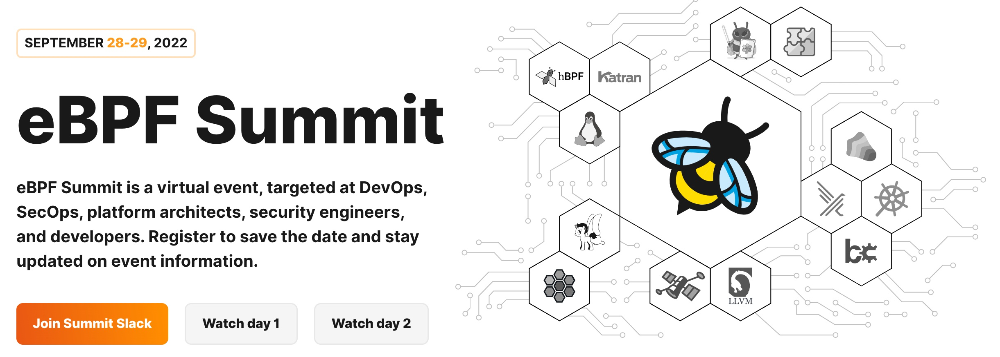
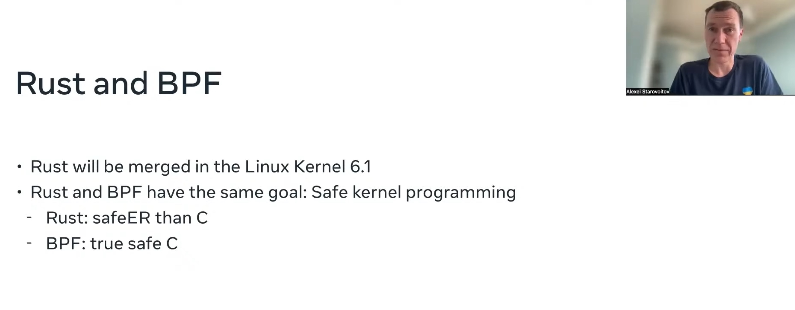
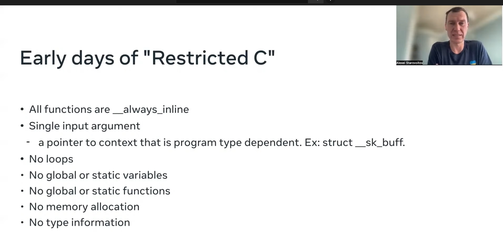
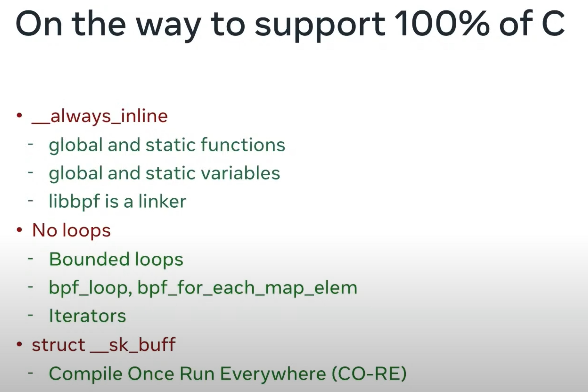
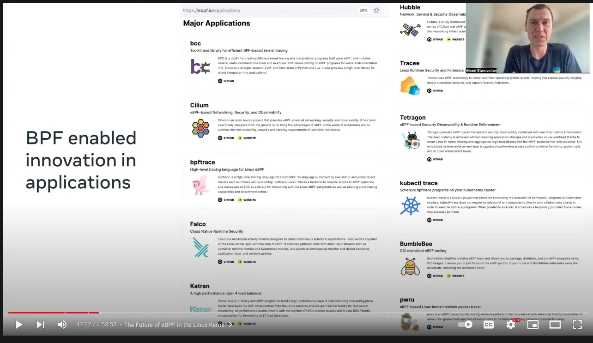
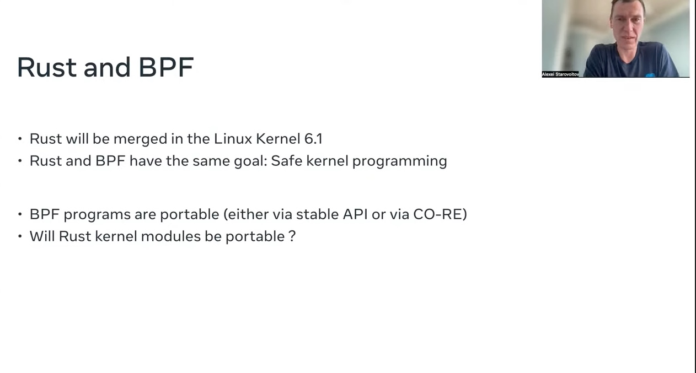

(圖片來源： [eBPF Summit 2022](https://ebpf.io/summit-2022/))

## The future of eBPF in the Linux Kernel by Alexei Starovoitov

Linux kernel  正式整合 Rust 之後，透過 Rust 可以做更多 eBPF 相關的應用。

當初在使用 "Restricted  C" 開發上有相關的限制，

隨著 Linux kernel 6.1 的提升，其實能增加的部分也越來越多了。

許多 e[bpf 的相關小工具](https://ebpf.io/applications):  其實這些工具不是專門為了 ebpf 而開發，但是這個頁面有告訴你如何應在 BPF 裏面。

## 小結論：

## 相關文章：

- 
