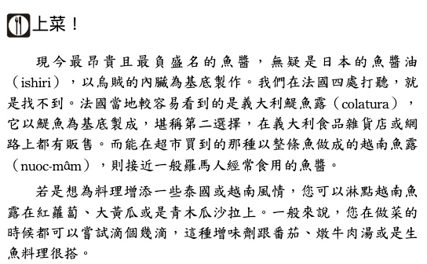

<div><a href="http://moo.im/a/jqrASZ" title="美食也吹牛"></a></div>

```
美食也吹牛: 羅馬人的魔法藥水是魚醬？以前喝咖啡加鹽不加糖？鮭魚壽司不是日本傳統料理？原來餐桌上的食物很有事！
Bouffes Bluffantes – La véritable histoire de la nourriture, de la préhistoire au kebab
原文作者： Nicolas Kayser-Bril  
譯者： 陳文瑤  出版社：馬可孛羅 
出版日期：2022/08/09
```

#### 買書推薦網址

- [Readmoo 線上書籍購買](http://moo.im/a/jqrASZ)

# 前言

這一本是今年所讀完的第二十本書。當初會買這一本書，也是因為讀墨官方帳號推薦的相關新聞：

- [壽司上的鮭魚，原先是挪威的滯銷貨？](https://news.readmoo.com/2022/08/16/salmonsushi/)
- [麵條在義大利人手中大放異彩，竟和銀行家有關？](https://news.readmoo.com/2022/08/11/noodles-banks/)

由於這兩個新聞真的都還蠻有趣的小常識，並且也跟一些歷史相關。我就忍不住把這本書買了下來看。

# 內容簡介

```
早期喝咖啡加的不是糖，竟然是鹽！
比釀酒師更先出現的職業居然是毒品販
炙手可熱的香料在地理大發現後被眾人唾棄QQ
「義大利麵」名稱從何而來，這都要感謝文藝復興
日本壽司上的鮭魚原先是芬蘭滯銷貨？
這些知識不明白不能算是饕客！

史前時代到二十一世紀
餐桌上佳餚的起源與復甦
歡迎享用這場跨越兩千年的盛宴
```

整本內容不算多，但是透過許多小故事依照歷史年份來排列。我這邊僅僅列出我覺得蠻特別的段落：

- ## 西元前五十年 二 古代── 羅馬人的魔法藥水是魚醬

這一小段故事很有趣， 魚醬(grarum) 在古代義大利半島被認為是一種魔法藥水。因為透過鹽漬來發酵的製作方式不容易腐敗，還附有蛋白質跟微量元素。可以讓身體恢復體力與健康。

每一篇故事後面，也有如何做這個料理的方法說明，很有趣。



- ## 第五世紀 四 猶太教 ── 猶太飲食戒律如何拯救肥肝

羅馬帝國因為貪吃（與貪腐）而衰敗之後，許多美食慢慢的消失。但是有一種美食卻跨朝代到了現代，就是肥肝。因為猶太人不能吃豬肉，作為良好蛋白質來源的雞，鴨還有鵝就是容易攜帶的糧食。並且鴨油也很好的代替了豬油作為許多油炸的油料。 在西元一世紀猶太羅馬戰爭後，猶太人繼續著肥鵝肝這樣的美食。

- ## 十六到十八世紀 十 宗教改革 ── 叛亂者的奶油

在十五世紀的歐洲，普遍都習慣吃奶油來當作烹煮食物的油。（真肥）但是在齋戒日的時候，不僅僅是肉類，可是連奶油都不能吃的。想要吃奶油的人，必須要花錢去買「贖罪券」才能吃奶油。（果然吃奶油就是有錢）。

- ##  十七世紀起 十一 奴隸制度 ── 「糖即是惡」

十七世紀開始，糖類被大量的應用在料理上。而蔗糖的製作過程其實很繁瑣並且需要大量的人力，所以大量的奴隸都是用來採收甘蔗。而糖其實對於人類的身體發展相當不好，但是糖類的擁有者遵循著香菸研究的方式。贊助給許多研究糖類是對人類很好的科學研究來掩蓋許多壞處。

- ## 十八世紀 十三 現代 ── 馬鈴薯改變了世界的臉

馬鈴薯具有高度的蛋白與澱粉，有相當的好種植與攜帶。但是在十七世紀的時候，因為外表不討喜其實沒什麼人要吃。直到軍隊打到某些的農田發現了馬鈴薯之後，容易攜帶並且可以很快的種植採收的特性。馬鈴薯被帶到了義大利。然後 1744 年的三十年戰爭有一個藥劑師安托萬，帕蒙耶提，偶然的狀況下吃到了軍人帶來的馬鈴薯驚為天人，於是帶回去給路易十六皇帝。好種植，高營養並且產量也相當大的馬鈴薯就這樣開始盛行。並且馬鈴薯有豐富的維他命 A 與 D 也是當時能慢慢脫離壞血病的大功臣。

- 十九世紀末 十五　規範準則 ── 你好規格化，再見彎黃瓜

- 二十世紀初期 十六 民族主義 ── 布列塔尼可麗餅：遊客催生的地方點心

- 二十世紀 十七　殖民主義 ── 庫斯庫斯，堪稱法國人的最愛

- 二十世紀後半 十八　消費社會 ── 鮭魚壽司，日本「傳統」料理

- 二十世紀末 十九　歐盟 ── K霸：歐洲認證的土耳其三明治？

- 現在與未來 二十　那麼之後呢？ ── 不是誰都搭得起的生菜沙拉艙

# 心得

這一本充滿了許多有趣的小知識，透過年代的排列方式。可以讓你知道其實美食也會影響朝代的迭代，許多食物類型的興起更是有其背景。 想知道許多傳統食物的由來與背景，都可以在這一本書查到。此外，這一本還有列出一些食物的處理方式（透過文字）。可以感受處理實務需要注意的事項與方式，也可以感受到作者對於食物本身的熱情與研究。

總之，這是一本都是文字的書，但是卻有滿滿食物的香味充斥在文字之間。可以讓你感受到食物的歷史香味。
