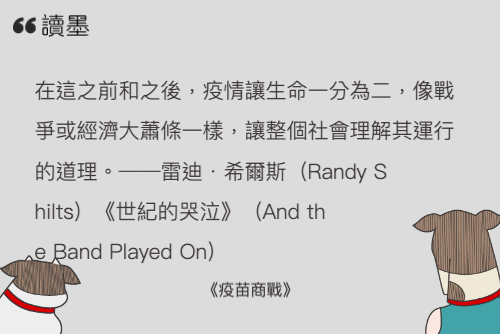

<div><a href="http://moo.im/a/79nATX" title="疫苗商戰"></a></div>


```
疫苗商戰 - 新冠危機下AZ、BNT、輝瑞、莫德納、嬌生、Novavax的生死競賽
A Shot to Save the World : The Inside Story of the Life-or-Death Race for a COVID-19 Vaccine

作者： 古格里．祖克曼  
原文作者： Gregory Zuckerman  
譯者： 廖月娟  張玄竺  鍾榕芳  黃瑜安 
```

#### 買書推薦網址：

- [Readmoo 線上書籍購買](http://moo.im/a/79nATX)

# 前言:

這一本是今年所讀完的第二十一本書，


# 內容簡介:

```
小說般精彩起伏的劇情
生物醫學史上最激勵人心的篇章
 
溯源超過40年 訪問超過300位產官學研專家
以宛如小說的筆法 生動展現新冠疫苗5大廠牌的激烈商戰 
 
「一本鼓舞人心、資訊豐富，讓人愛不釋手的書。」
──《賈伯斯傳》作者 華特‧艾薩克森
 
2020年新冠肺炎爆發時，幾乎沒有人做好準備。政府官員、企業領導人和公共衛生專家對於百年來最具破壞性的流行病束手無策，就連許多世界上最大的藥廠和疫苗製造商都反應遲緩，無法拯救絕望的世人。
 
當病毒劫持世界，此時挺身而出的，竟是一群看起來不可靠的科學家和商人！
 
包括狀似滿口謊話的法國商人班塞爾（莫德納執行長）、沒有研發病毒疫苗經驗的土耳其移民吳沙忻（BNT創辦人）、使用可疑技術的波士頓科學家巴魯克（腺病毒專家）、被同儕排擠的英國科學家沃倫和匈牙利籍研究員考里科（mRNA研究先鋒）……
 
為了與死亡賽跑，這些科學家與商人群起而戰，爭相將畢生的努力投入新冠疫苗，力圖在這場研發競賽中奪得勝利。 
 
《華爾街日報》調查記者、《紐約時報》暢銷書第一名作家古格里‧祖克曼帶我們潛進高度機密的實驗室及各大疫苗機構高層。深入淺出的報導，加上高潮迭起的劇情，讓本書不只是當代最重要的疫苗科學編年史，也成就一則關於競爭、野心與信念的動人故事。 
```

## 第一章　　人類第一支疫苗（一九七九年──一九八七年）



疫苗的概念起於 1777 年，英國的農夫發現家中的擠奶女工中有一個得到了牛痘的，沒有受到致命性的天花影響。於是他用縫紉針把牛痘搓破後取得濃液。讓他的家人免於天花的感染，這樣的方式不僅僅不衛生還很危險， 但是卻是疫苗的開始。後來的英國醫生 - 愛德華 - 詹納透過更多的實驗與觀察將這個寫成了論文。

後續的沙克與沙賓兩位醫生也是使用類似的方式，先後打造出小兒麻痺的疫苗。造福了千千萬萬的小孩子。

## 第二章 ～ 第五章　　破解ｍＲＮＡ難題（一九九七年──二○○九年）

這四張講解了 mRNA 的發展過程，這是一個相當長遠的發展。一開始許多的藥廠都在努力打造出抵抗愛滋病的疫苗。


# 心得

