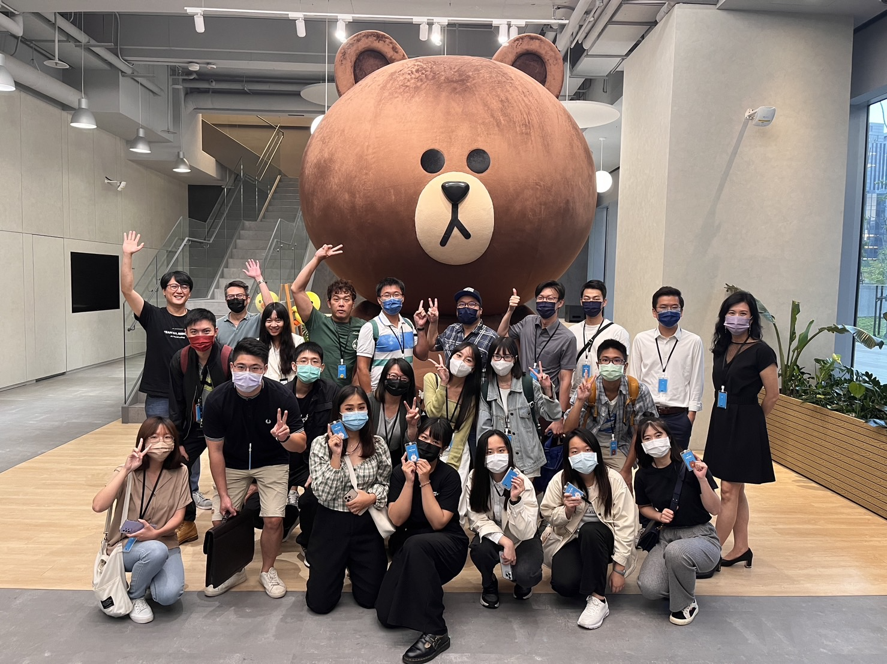

# 前言

大家好，我們是來自 LINE 台灣開發者關係與技術推廣部門 (Developer Relations)。 LINE Taiwan 開發工程團隊於 2022 年初的 「[關於 LINE 台灣開發者關係與技術推廣部門的校園相關資源](https://engineering.linecorp.com/zh-hant/blog/line-devrel-campus/)」文章中，有敘述到關於 LINE Taiwan 所提供給理工相關科系學校同學的企業參訪機會，除了讓學校同學可以了解 [LINE 的研發工程文化](https://engineering.linecorp.com/zh-hant/culture)之外，更可以了解相關的技術實習的機會。

日前「LINE新星計劃」連續第四年攜手國立台北市商業大學，共同主辦「2022 LINE CHATBOT對話機器人設計大賽」，本屆共吸引55組企業與學生團隊、超過200人次報名參加，參賽作品包括應用對話機器人於旅遊、消費、金融理財、美妝、寵物、運動、教育及生活等各種主題。 [並且在 2022/10/30 當天進行決賽，選出了優秀的作品](https://linecorp.com/zh-hant/pr/news/zh-hant/2022/4385)。

# **TPM (Technical Project Manager) 技術專案經理的分享 - Zephyr Chang**

<iframe class="speakerdeck-iframe" frameborder="0" src="https://speakerdeck.com/player/77c10453fedc4b0c900a0f2b7fc0be77" title="台大資工所企業訪談 - TPM (Technical Project Manager) 技術專案管理經理的分享" allowfullscreen="true" mozallowfullscreen="true" webkitallowfullscreen="true" style="border: 0px; background: padding-box padding-box rgba(0, 0, 0, 0.1); margin: 0px; padding: 0px; border-radius: 6px; box-shadow: rgba(0, 0, 0, 0.2) 0px 5px 40px; width: 560px; height: 314px;" data-ratio="1.78343949044586"></iframe>

首先由 LINE 台灣的 TPM (Technical Prject Manage) Zephyr 帶來的分享，先提到軟體開發流程並且帶出軟體開發的生命週期。並且說明清楚在軟體生命週期中，每一個階段有哪一些角色的協力合作。也會詳細的說明每一個角色的相關職責，為什麼他們在這個專案的流程中如此重要。

## 相關問與答

### 問: 針對重大災害影響，是否專案管理與軟體工程的影響上該如何處理

針對軟體工程的角度來說，事先需要有相關的準備，並且針對 HA (high availability) 有相關的設計與防範。在各種重大災害的演練上，有各種面向的演練。

### 問: 對於各種故障的偵測是否有哪一些特殊的偵測方式？

每一個服務都有相關的監控，任何時候發生問題的時候，都會有監控的服務可以立即偵測，並且通知相關的處理團隊來處理。

### 問: TPM 跟軟體開發的主管有點像，那執行面有哪一些的不同？

在 LINE 來說以專業分工來切割工作， TPM 是屬於一種技術端的專案管理工作，負責專案與服務開發上的大大小小事情。在 LINE 的文化上，我們的組織相當的扁平並且都是透過專業分工。所以即便 TPM 不是屬於主管職務，也是有他專業分工管理的範圍。

## 相關職缺

- [TECH FRESH](https://careers.linecorp.com/jobs/83)

# **從測試出發談 LINE 軟體開發流程 - Richard Chang**

<iframe class="speakerdeck-iframe" frameborder="0" src="https://speakerdeck.com/player/df7b84399f5d41dfbf82d6cf54fe1671" title="台大資工所企業訪談 - QA 相關討論" allowfullscreen="true" mozallowfullscreen="true" webkitallowfullscreen="true" style="border: 0px; background: padding-box padding-box rgba(0, 0, 0, 0.1); margin: 0px; padding: 0px; border-radius: 6px; box-shadow: rgba(0, 0, 0, 0.2) 0px 5px 40px; width: 560px; height: 314px;" data-ratio="1.78343949044586"></iframe>

Richad 先透過跟同學的互動，分享了 QA 跟 Testing 兩者的差別？ 首先 Richard 先透過 Bug Fixing Cost 來點出一個問題在每個流程中找出來所引出的成本。 如果在設計階段就能夠將問題找出來，那麼他的成本會是最低的。

也就是在設計階段，當需求端（可能是 PM ，可能是 Business Owner）有新的需求，身為測試人員就要協助審視設計端的需求。盡可能地找出裡面可能有的問題。

到了開發階段，雖然開發人員開始去撰寫開發程式碼，身為測試人員需要準備好相關的測試資料（假資料），甚至開始開發相關的 MockServe 或是自動化測試的相關串接方式。

到了測試階段的時候，則是大量的測試工具來協助。 不論是 CUJ (Critical User Journey) 的流程測試，或者是探索性的測試，甚至是 E2E (End-To-End)的測試流程。

到了正式上線之後，測試人員也有許多工作要做。 如何透過 CI/CD 流程的優化，如何定期確認服務的狀態。

## 相關職缺

- [TECH FRESH](https://careers.linecorp.com/jobs/83)
- [Service QA Engineer](https://careers.linecorp.com/jobs/19)
- [QA Automation Engineer](https://careers.linecorp.com/jobs/18)

# 在 LINE 台灣技術實習 - TECHFRESH 介紹與相關福利

如果對於 LINE TECH FRESH 技術新星實習計畫有興趣的同學，歡迎了解以下的相關文章。

### 更多關於 LINE TECH FRESH 介紹文章有:

- [TECH FRESH 實習的一年間，除了開發還有什麼內部活動呢？](https://engineering.linecorp.com/zh-hant/blog/line-tech-fresh-2020-graduate/)
- [【訪談】TECH FRESH 工作老實說 – 後續花絮與相關資訊整理](https://engineering.linecorp.com/zh-hant/blog/what-is-tech-fresh-interview/)
- [Life in LINE – 直擊 TECH FRESH 實習內容！](https://engineering.linecorp.com/zh-hant/blog/life-in-line-tech-fresh-sharing/)
- [TECHPULSE 2020 青春主場 – TECH FRESH 議程與攤位介紹](https://engineering.linecorp.com/zh-hant/blog/techpulse-2020-tech-fresh-session/)

### 如何申請 LINE TECH FRESH 技術新星的實習計畫呢？

對於 [TECH FRESH 計畫](https://careers.linecorp.com/jobs/83)有興趣並想了解內容，歡迎大家參考 [LINE Career 中的細節](https://careers.linecorp.com/jobs/83)。

## 小結

立即加入「LINE開發者官方社群」官方帳號，就能收到第一手Meetup活動，或與開發者計畫有關的最新消息的推播通知。▼

「LINE開發者官方社群」官方帳號ID：[@line_tw_dev](https://lin.ee/s5RsZHo)

# 關於「LINE 開發社群計畫」

LINE 於 2019 年初在台灣啟動「LINE 開發社群計畫」，將長期投入人力與資源在台灣舉辦對內對外、線上線下的開發者社群聚會、徵才日、開發者大會等，已經舉辦 30 場以上的活動。歡迎讀者們能夠持續回來察看最新的狀況。詳情請看:

- [2019 年 LINE 開發社群計畫活動時程表](https://engineering.linecorp.com/zh-hant/blog/line-taiwan-developer-relations-2019-plan/)
- [LINE Taiwan Developer Relations 2019 回顧與 2019 開發社群計畫報告](https://engineering.linecorp.com/zh-hant/blog/line-taiwan-developer-relations-2019/)
- [2020 年 LINE 開發社群計畫活動時程表](https://engineering.linecorp.com/zh-hant/blog/2020-line-tw-devrel/)
- [2021 年 LINE 開發社群計畫活動時程表](https://engineering.linecorp.com/zh-hant/blog/2021-line-tw-devrel/)