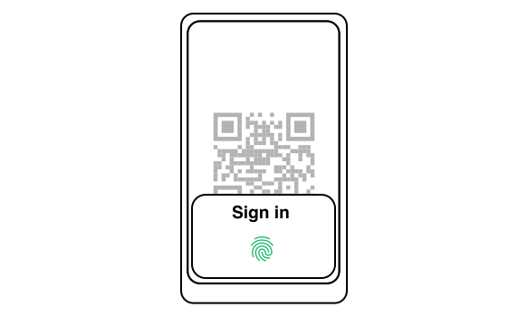
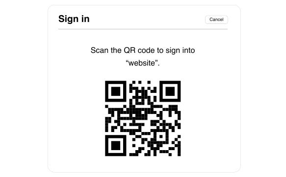
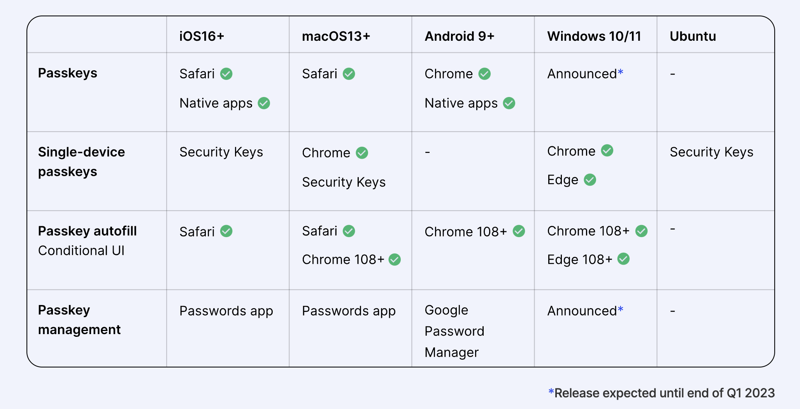
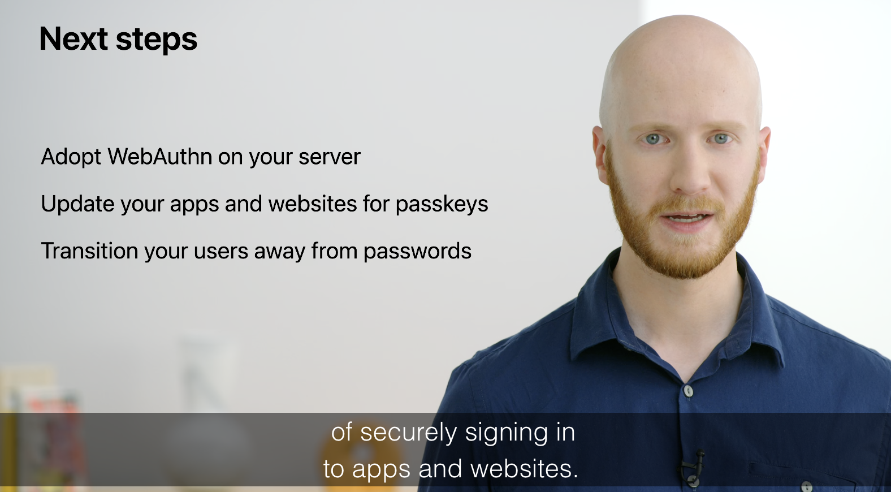

# 前情提要:

我曾經在 WWDC 結束後有寫了一篇關於 [Passkeys 的整理文章](https://www.evanlin.com/til-apple-passkeys/)。結果前幾天就看到一個有趣的 tweet ，讓我重新的檢視自己熟悉的程度如何？到底真正 Passkeys 的流程（第一次與之後的）有什麼不同？ 這一篇文章將對這個部分做一個整理。

# (2022/12/10更新)如果是第一次創建帳號，需要幾次手續？ 為什麼？

之前看到的 tweet ，裡面有提到為什麼看到 [Yubico/java-webauthn-server 有接近 21 個步驟](https://github.com/Yubico/java-webauthn-server#architecture)？ 這也讓我好奇地去檢查了一下相關流程的原意：

(Pic from [https://github.com/Yubico/java-webauthn-server#architecture]( https://github.com/Yubico/java-webauthn-server#architecture))

根據這個元件的說明圖，大家會很好奇。這裡需要合併跟另外一張圖一起來看：

- **Step: 1 ~ 4:** 
  - 帳號建立的時候，由於需要支援比較舊型的瀏覽設備（瀏覽器/OS) ，所以這裡還是要帳號跟密碼。整個流程跟以往的資料庫一樣，但是接下來流程有一些不同。
  - 如果是有支援 Passkeys 的 User-Agent 並且沒有要 Backward Compatability 的話，其實不需要 1 ~ 4 (不過應該都要有)。
- **Step: 5:**
  - 這裡是參考 [PKCE 的方式](https://www.evanlin.com/go-oauth-pkce/)來生成Challenge ，也就事某個 AES 加密過後的數值。
- **Step 6 ~ 9:**
  - 這時候可以產生 credential ID (optional) 回傳給 client 端作為 client agent 產生的數值。
    - User-Agent 可能傳過來 Challenge + credential command + credential ID

- 

# Passkeys 的登入體驗

# 對於相關設備的支援

(From: [https://www.passkeys.io/](https://www.passkeys.io/))

# 最後

(From: [WWDC22 Session: Meet passkeys](https://developer.apple.com/videos/play/wwdc2022/10092/) )

如同這一篇影片最後的一樣， Passkeys 並不是在節省整個登入流程。 而是在加強整個登入流程的安全性與使用者便利性。為了達到真正的 Password-less 的境界，其實需要許多業界的配合：

- 伺服器端需要都使用 WebAythn 來寫自己的登入端應用。
- 並且讓相關伺服器的版本更新到最新版本
- 也提醒使用者要使用新的版本的手機（好像比較簡單）。

# Reference

-  [Apple Doc: Supporting Passkeys](https://developer.apple.com/documentation/authenticationservices/public-private_key_authentication/supporting_passkeys)
-  [WWDC22 Session: Meet passkeys](https://developer.apple.com/videos/play/wwdc2022/10092/)
-   [WWDC21 議程: Move beyond passwords](https://developer.apple.com/videos/play/wwdc2021/10106/)
-  [FIDO2: Web Authentication (WebAuthn)](https://fidoalliance.org/fido2-2/fido2-web-authentication-webauthn/)
-  [Passkeys for web authentication](https://www.hanko.io/blog/passkeys-part-1)
-  [What Apple's WWDC Passkeys Announcement Means for Enterprise IAM](https://blog.hypr.com/what-apples-wwdc-passkeys-announcement-means-for-enterprise-iam)
-  [https://github.com/duo-labs/webauthn](https://github.com/duo-labs/webauthn)
- [WebAuthn.io: A demo of the WebAuthn specification](https://webauthn.io/)
- [What is WebAuthn? How to Authenticate Users Without a Password](https://www.freecodecamp.org/news/intro-to-webauthn/)

