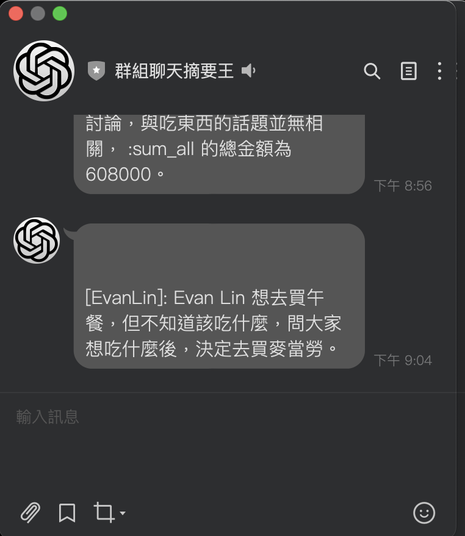
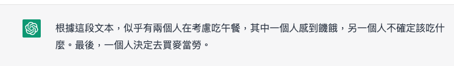
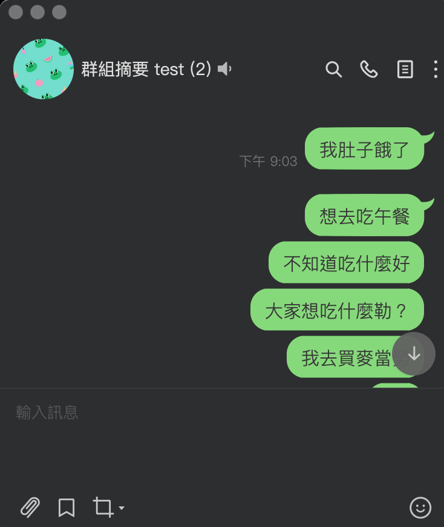

# 前言:

大家好，我是 LINE 台灣的資深技術推廣工程師的 Evan Lin 。前一段時間， [OpenAI](https://openai.com) 將他們知名的 GPTv3 的 NLP Model 開放出來給大家使用，並且提供一個好用的介面 [ChatGPT](https://chat.openai.com/chat) 。 在全世界受到相當多的注意，也看到有相當多社群的開發者有分享相關的開發案例。

- [我嘗試將 GPT-3 整合到 LINE 聊天機器人中](https://dev.classmethod.jp/articles/chatgpt-line-chat-bot/)
- https://beta.openai.com/docs/api-reference/completions/create
- https://github.com/isdaviddong/chatGPTLineBot
- [https://github.com/memochou1993/gpt-ai-assistant](https://github.com/memochou1993/gpt-ai-assistant)

但是其實 [ChatGPT](https://chat.openai.com/chat)  不是直接串接到聊天機器人就好，或許他也可以幫助我們解決許多以前的痛點。 以下這篇文章將分享如何透過  [ChatGPT](https://chat.openai.com/chat) 來打造出一個專門在群組間幫你做摘要的聊天機器人。


# 解決的問題痛點

大家是否都有類似的問題？ 常常加入一個群組內，有太多的訊息在裡面跑來跑去，一回頭來看，發現已經有太多未讀的訊息在裡面了。 常常需要進去後，慢慢地追每一個訊息來避免自己錯過太多 (FOMO) ？

筆者因為工作的關係，有許多群組也有相當多的訊息。以前常常思考到如何透過 NLP 或是 AI 的方式來幫助自己來整理相關內容的摘要。但是一直沒有比較好的成果。 但是從 [ChatGPT](https://chat.openai.com/chat)  橫空出世後，這個部分的功能似乎可以實現了，我們來試試看。


## 如何使用 ChatGPT 幫你總結群組聊天訊息

- 到一個聊天群組，按下複製將你需要的訊息複製起來。
- 將他貼到  [ChatGPT](https://chat.openai.com/chat)  並且加上 `幫我總結` 即可。

````
幫我用繁體中文總結

```
[Evan Lin]: 我肚子餓了 . 2022-12-29 13:04:01
[Evan Lin]: 想去吃午餐 . 2022-12-29 13:04:05
[Nijia Lin]: 不知道吃什麼好 . 2022-12-29 13:04:08
[Nijia Lin]: 大家想吃什麼勒？ . 2022-12-29 13:04:13
[Evan Lin]: 我去買麥當勞 . 2022-12-29 13:04:18
```
````

#### ChatGPT 總結成果



# 如何打造自己的群組總結聊天機器人

## 原始碼：

#### [https://github.com/kkdai/LINE-Bot-ChatSummarizer](https://github.com/kkdai/LINE-Bot-ChatSummarizer)

## 獲取 LINE Bot API 開發者帳戶

- 如果你想使用 LINE Bot，請確保在 [https://developers.line.biz/console/]( https://developers.line.biz/console/) 註冊 LINE 開發者控制台的帳號。
- 在「基本設定」選項卡上創建新的消息通道並獲取「Channel Secret」。
- 在「Messiging API」選項卡上獲取「Channel Access Token」。
- 從「基本設定」選項卡中打開 LINE OA 管理器，然後轉到 OA 管理器的回復設定。在那裡啟用「webhook」。

## 獲取 OpenAI API Token

- 在 https://openai.com/api/ 註冊帳戶。
- 一旦你有了帳戶，就可以在帳戶設定頁面找到你的 API 權杖。
- 如果你想在開發中使用 OpenAI API，你可以在 API 文檔頁面中找到更多信息和說明。

請注意，OpenAI API 只面向滿足某些條件的用戶開放。你可以在 API 文檔頁面中找到有關 API 的使用條件和限制的更多信息。

## 部署在 Heroku 上

- 輸入「Channel Secret」、「Channel Access Token」和「ChatGPT Access Token」。

- 記住你的 Heroku 伺服器 ID。

## 在 LINE Bot Dashboard 中設置基本 API：

- 設置你的基本帳戶信息，包括「回調 URL」在 [https://{YOUR_HEROKU_SERVER_ID}.herokuapp.com/callback](https://{your_heroku_server_id}.herokuapp.com/callback)。


# 成果

- 依照「如何安裝」進行相關的部署流程。
- 將機器人加入群組聊天室。
[](https://github.com/kkdai/LINE-Bot-ChatSummarizer/blob/master/img/chat_1.png)

- 能夠記住群組內的對話。


- 直接送群組內容摘要私訊給你。


### 相關指令如下

- `:gpt xxx`: 直接對 ChatGPT 來對談，可以直接問他。
- `:list_all`: 列出群組的訊息紀錄（all)
- `:sum_all`: 幫你做訊息摘要。


# 開發流程記錄 (Golang 為主)：

以下將逐步講解該如何開發出這樣的聊天機器人：

### 如何取得聊天群組 (group) 的資訊（透過 Webhook)，並且儲存訊息：

首先，你需要知道你有在一個聊天群組內。所以如何取得 Group ID ，並且


## 相關技術文件：

- [LINE News: Plans to discontinue providing company internal identifiers of chat rooms to LIFF apps](https://developers.line.biz/en/news/2022/12/27/liff-spec-change/)
- [LINE API: Getting user profiles](https://developers.line.biz/en/docs/android-sdk/managing-users/#get-profile)
- [LINE API: Get group chat member profile](https://developers.line.biz/en/reference/messaging-api/#get-group-member-profile)
- [LINE API: Get group chat summary](https://developers.line.biz/en/reference/messaging-api/#group)


# 未來相關工作


如果你有任何建議或是疑問，歡迎透過 [LINE Developers 的官方討論區](https://www.facebook.com/groups/linebot)或是[LINE 開發者官方社群的官方帳號跟我們聯絡](https://lin.ee/qZRsSTG)。

