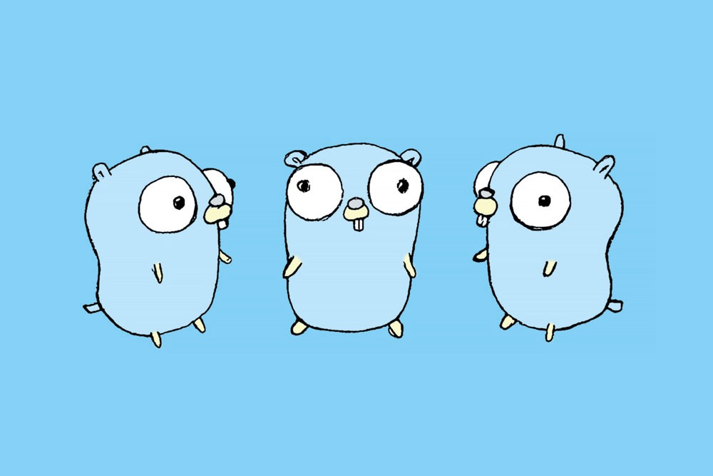
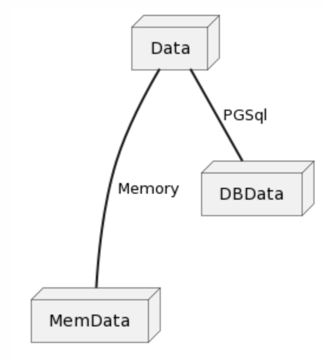

# 前提

平常在準備 LINE Bot 的相關範例程式碼的時候，通常都是沒有加上資料庫。但是有一些的範例程式碼其實有一些儲存資料會比較好。 所以這時候需要加上資料庫的相關讀寫。

當然.... 資料庫也是有窮人版的。由於許多服務都要對於他們的資料庫服務收費之後，這時候就需要有一些變通的方式。 使用記憶體當作資料庫的架設。

這一篇文章將開始敘述，如何透過 Golang 的 Interfaces 的方式來達到類似繼承的效果。 使用同一份的程式邏輯程式碼，可以根據你設定的參數不同來讀取不同得資料庫。

# 使用的範例程式碼

這次透過上一次的範例文章 

 ## 資料架構切割圖

# 相關程式碼

