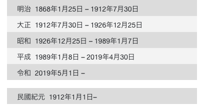

<div><a href="https://moo.im/a/1rFKNV" title="丼丼丼丼丼"></a></div>


```
丼丼丼丼丼
日本五大丼飯誕生祕辛！
 共 27 人評分
作者： 飯野亮一  譯者： 陳嫺若  出版社：臺灣商務印書館 
出版日期：2021/09/01 
```

#### 買書推薦網址：

- Readmoo: [購買網址](https://moo.im/a/1rFKNV)

# 前言:

這是 2023 年第二本讀完的書，當初會購買這本書就是肚子餓(不是) 因為即將準備去日本旅遊，想要了解一下日本的**丼（要唸作 ㄉ ㄢ v)**究竟有什麼樣的歷史。整本書的內容摘要相當有趣，就讓人想要買下來慢慢閱讀一下相關的知識了。

此外，這本書很需要日本年號跟西元年份的對照表：



# 內容摘要：

```
1.透過史料，了解熱門的天丼．豬排丼．牛丼．鰻魚丼．親子丼誕生過程
2.以富有歷史感的圖片呈現丼飯誕生時景況
3.闡述各種丼飯早期的食用方法及食材

探索江戶時代，風靡全日本的庶民美食
品嘗充滿飯香的跨時代歷史風味

原本被當作下酒菜的蒲燒鰻，如何搖身一變成為日本最早的丼飯？
原本不吃雞肉的日本人，如何發明出國民美食親子丼？
原本來自海外的牛，如何受到歐洲人影響轉變為日本食材？
原本薄薄的豬肉排，又是如何增加厚度，甚至改名為炸豬排？

天丼•豬排丼•牛丼•鰻魚丼•親子丼，五種在民間掀起熱潮的丼飯，但你很可能不知道它們的由來。

本書追溯從江戶時期到明治時期的軼聞趣事，探索日本國民如何爭相倣效丼飯作法，以及享用丼飯的熱切心境。想一窺大和庶民生活核心，領略日本邁向近代的驅動力，就從了解這五種丼飯開始！
```

## 丼飯出現以前

丼（念為“膽”）飯出現之前，其實江戶從 1805 年就開始有吃茶泡飯的過程。（原來茶泡飯那麼早啊）。


## 鰻魚丼的誕生

蒲燒鰻魚很早就開始在日本出現（1688~1704) 年，就開始出現在江戶高級餐廳之中。之後在 1777 年開始有蒲燒魚加上白飯的餐點。

在 1804 年的琾町的贊助者 - 太久保今助因為喜歡吃鰻魚，所以把它用飯放在一起吃。這個據說就是鰻魚飯起始。

那麼鰻魚丼是如何開始的呢？

1837 年開始京都跟大阪將鰻魚飯叫做 (Mabushi) 也就是鰻魚丼飯的簡稱。大概的價錢是： 200 文。 裡面主要是五六條小鰻魚去頭後，烤起來。

值得注意的是雖然說，筷子的用法是來自於中國。但是 `免洗筷`也就是吃完就可以丟掉的筷子，卻是來自於日本的。因為在當時江戶與京都的鰻魚丼飯都是有附上不回收的筷子。並且醬汁也從京都的比較濃的醬油口味，逐漸變成了甜的口感。


## 天丼的誕生

天丼也就是天婦羅的丼飯，在一開始天婦羅也是單獨吃的。 但是因為在日本橋的天婦羅的吉兵衛，因為他的天婦羅太好吃，旁變得蕎麥麵也變成是一起的爆紅。變成了日本橋周遭的名店，那時候的天婦羅也都是搭著蕎麥麵來一起販賣的。

但是從 1797 年開始，許多的茶泡飯店家都已經有搭著販賣天婦羅。後來受到大舉的歡迎，甚至也有了天婦羅專賣店。裡面在 1874 年也開始有了「天丼」這個名字的產生。那時候的天丼也就是把天婦羅沾了醬汁，或是稍微泡過後放在飯裡面一起端上來。這時候的做法也跟現在的天丼沒有太大的差別。

## 親子丼的誕生

## 牛丼的誕生


# 心得:

