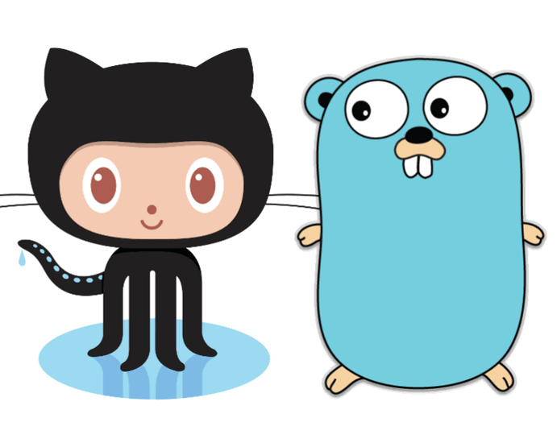
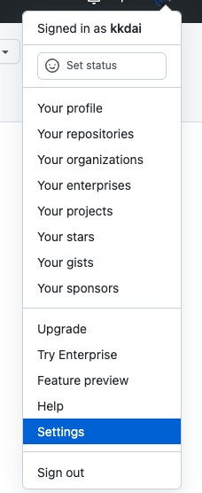
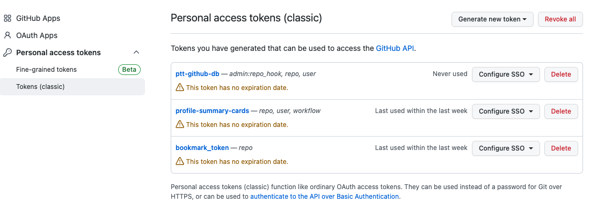

# 前提

之前說過許多資料庫都已經開始收費了，所以想要找一個免費的資料庫來使用的其實相當麻煩。不論是使用 Heroku 或是 Render 的資料庫其實都是一筆不小的費用。 所以，常常動歪腦筋到一些奇怪的儲存體來當資料庫，今天這一篇文章將透過 Github Golang 的 API 來將你個人的隱私 (Private Repository) 的 issue 來當成資料庫來使用。

### 開源套件 https://github.com/google/go-github

# 如何取得 Github Token

首先要使用 Github 的 API ，你需要取得 Github Token ，這裡附上流程：

打開設定

選到開發者選項 (Developer settings)

這邊選 **Personal Access Token** ，記得選 **Tokens (Classic)**

如此就可以取得一個開發者的 Access Token ，記得不要搞丟了。（或是不要存在 github 上面）

# 使用 Github Issue 當成資料庫的前提與方法

## API Rate Limit

如果想要使用這樣方式當成資料庫的人，首先對於你的資料格式要相當的簡單。或者是說你的資料存取是比較低流量的。因為 Github API 具有 [Rate Limit](https://docs.github.com/en/graphql/overview/resource-limitations#rate-limit)  相關資訊可能如下：

- Core:
  - Limit: 5000 (60mins)
- Search:
  - Limit: 30 (60mins)
- GraphQL:
  - Limit: 5000 (60mins)

## 資料擺放的建議

- Title: 資料庫名稱
- 每一個格子

## 未來發展

