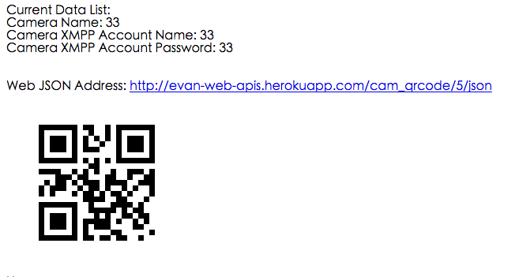

**前言:**
想要試著做做看一個簡單的相機資料管理系統，並且可以顯示QRCode到該相機資料庫並且顯示JSON資料． 主要也是趁個機會把Django再拿出來複習一下．雖然也是有打算用Golang來寫，但是Golang沒有找到比較方便的QRcode 模組就先緩些時間．

**步驟:**

- 把相關的模組與設定加到原來的Django網站． 這部分可以參考Django toturial 恢復記憶
<pre class="prettyprint">
    source venv/bin/activate
    //Install related component
    pip install django-qrcode
    //Write back to requirement.ext
    pip freeze > requirements.txt
    //Crete new app for this website
    python manage.py startapp cam_qrcode
</pre>

- 接下來要設定資料庫，這裡資料庫相當簡單，相機就只有名稱而已．並且有一個XMPP 賬戶做IOT(Internet Of Thing)使用．

<pre class="prettyprint">
class Camera(models.Model):
    camera_id = models.IntegerField()
    camera_name = models.CharField(max_length=200)
    camera_xmpp_account = models.CharField(max_length=200)
    camera_xmpp_password = models.CharField(max_length=200)
    def was_published_recently(self):
        return self.pub_date >= timezone.now() - datetime.timedelta(days=1)
    def __unicode__(self):
        return self.camera_name
</pre>        
-  關於QRCode產生的部分，我使用的是 [Django-qrcode](https://pypi.python.org/pypi/django-qrcode/0.3)．使用上相當簡單，而且很方便．
-  可以顯示之後就是要準備產生Json，這裡我是用Simplejson 來使用
<pre class="prettyprint">
    cam = get_object_or_404(Camera, pk=cam_id)
    response_data = {}
    response_data['cam_id'] =  cam.camera_id
    response_data['camera_name'] = cam.camera_name
    response_data['camera_xmpp_account'] = cam.camera_xmpp_account
    response_data['camera_xmpp_password'] = cam.camera_xmpp_password
    out_obj = json2.dumps(response_data)
</pre>- 
 
這樣就完成了，作品在[Heroku](http://evan-web-apis.herokuapp.com/cam_qrcode/)上面．大概花費四五個小時...  

**遇到問題:**

列出來所遇到的一些問題：
- Django 升級後反而不能跑
    - 已試過把Django從1.6.2 升級到 1.7，就發現無法正常執行伺服器．  這部分先採取downgrade處理，之後有空再看．  
<pre class="prettyprint">
     pip install django 1.6.2
</pre>
     
- 'function' object has no attribute 'dumps'
    - 這個主要是json似乎跟某個版本搞混，所以無法獲得正常的json．
    - 我解決方法是使用simplejson 並且更改名稱到json2
<pre class="prettyprint">    
import simplejson as json2
</pre>

**參考資料:**

- Django QRcode Generator
    - [https://pypi.python.org/pypi/django-qrcode/0.3](https://pypi.python.org/pypi/django-qrcode/0.3)    
- Django Model Fields Document
    - [https://docs.djangoproject.com/en/dev/ref/models/fields/](https://docs.djangoproject.com/en/dev/ref/models/fields/) 
- 成品的網站
    - [http://evan-web-apis.herokuapp.com/cam_qrcode/](http://evan-web-apis.herokuapp.com/cam_qrcode/)    
- 產生json.dumps 的方法:
    - [http://stackoverflow.com/questions/2428092/creating-a-json-response-using-django-and-python](http://stackoverflow.com/questions/2428092/creating-a-json-response-using-django-and-python)     
- 官方的json文件
    - [https://docs.python.org/2/library/json.html](https://docs.python.org/2/library/json.html)
- Simplejson的文件
    - [https://pypi.python.org/pypi/simplejson](https://pypi.python.org/pypi/simplejson)     
        
