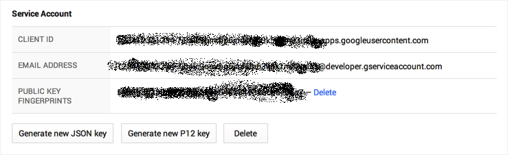

## Preface

Working on Android application development, you will need to have IAP (In-App Purchase) items. Normally it is simple, if your application is standalone not connect to any server. 

If you app need connect to server for IAP items (such as game server, database service ...), it might have risk that here might be a fake app (or crack app) to fake the purchase command in your app to get privilege action or items.

In this case, our server will need to do a sever-to-server side certification with Google Play.

Android has done great documentation in their [Android portal](http://developer.android.com/). But it separate into different part, so I am trying to summarized it here. 

Hope it help.

### Google Service Entrypoint - Google API

When we want to communication with any Google Service, the only entry point is using [Google API Console.](https://console.developers.google.com).

So, here let's start to connect to Google API.

According to [Google spec](https://developers.google.com/accounts/docs/OAuth2ServiceAccount), this diagram describe about how to communication with Google API via HTTP/REST.

However it might be easy to communication via OAuth2 in Golang.

### Google API certification flow:

Before jump into Google API function call. Please take a look about [OAuth2 server account document](https://developers.google.com/accounts/docs/OAuth2ServiceAccount). Here is the basic diagram come from Google Document, it is the basic concept if you want to using OAuth2 with Google API from Web Application to using client (end-user) Google Account.

However, in our case. Our server could using Google API directly if we already have a account in [Google developer console](https://console.developers.google.com).

Here is the simple flow:

- Create server related google API account in [Google developer console](https://console.developers.google.com).
- Request P12 key or Json file to setup client.
- Server client using Google OAuth2 to connect Google API and query related result.

Let's start a simple case to make it more clear.

### Sample to connect to Google API with Golang OAuth2

In this case, we will enable one simple API service call ["Google Contacts API"](https://developers.google.com/google-apps/contacts/v3/)

- Enable Google Play Console API to Authentication. Refer [here](https://developers.google.com/android-publisher/authorization)
- Using Service OAuth2 solution [here](https://developers.google.com/accounts/docs/OAuth2ServiceAccount)
- It have two ways to retrieval data one is using p12 key, another is config json file from Google Console Panel.
- To get json file from [Google Console](https://console.developers.google.com):
    - Enter [Google Console](https://console.developers.google.com)
    - Choose "Project" (or create new one)
    - Make sure you enable the API you need. (ex:[Contacts API](https://developers.google.com/google-apps/contacts/v3/))
    - Choose "credential" -> "Create New Client ID"
    - Choose "Server Account"
    - Click "Generate New JSON key" to download json file or click "Generate new P12 Key" to download key.   
- Here is a [sample](https://godoc.org/golang.org/x/oauth2/google#JWTConfigFromJSON) to use json file to setup oauth2.

        package main
        
        import (
        	"golang.org/x/oauth2"
        	"golang.org/x/oauth2/google"
        	"io/ioutil"
        	"log"
        )
        
        func main() {
        	//Note: your json file need to put together with this program.
        	data, err := ioutil.ReadFile("downloaded.json")
        	if err != nil {
        		log.Fatal(err)
        	}
        	conf, err := google.JWTConfigFromJSON(data, "https://www.google.com/m8/feeds")
        	if err != nil {
        		log.Fatal(err)
        	}
        	client := conf.Client(oauth2.NoContext)
        	res, err := client.Get("https://www.google.com/m8/feeds/contacts/default/full")
        	if err != nil {
        		log.Println("err:", err)
        	}
        	body, err := ioutil.ReadAll(res.Body)
        	log.Println(string(body))
        }

Here is a [response sample](https://developers.google.com/google-apps/contacts/v3/#retrieving_all_contacts) from Google Contact API
        
        <feed xmlns='http://www.w3.org/2005/Atom'
            xmlns:openSearch='http://a9.com/-/spec/opensearch/1.1/'
            xmlns:gContact='http://schemas.google.com/contact/2008'
            xmlns:batch='http://schemas.google.com/gdata/batch'
            xmlns:gd='http://schemas.google.com/g/2005'
            gd:etag='feedEtag'>
          <id>userEmail</id>
          <updated>2008-12-10T10:04:15.446Z</updated>
          <category scheme='http://schemas.google.com/g/2005#kind' term='http://schemas.google.com/contact/2008#contact'/>
          <title>User's Contacts</title>
          <!-- Other entries ... -->
        </feed>

### Let's start to connect to Google Play

Let me summarized the detail step here:

- Your Android app provide IAP UI for uesr to purchase.
- User complete purchase process, Google Play will return the receipt to your App.
- App collect the receipt to server for server certification.
- Server using Google OAuth2 to connect to Google Play API
- Request related receipt information and make sure user already purchase.
- Add some IAP item in server side.

#### Start from your Android App

In [Android Doc: Implementing In-app Billing-Purchasing an Item](http://developer.android.com/google/play/billing/billing_integrate.html#Purchase), onActivityResult get JSON data which contains purchase info as follow:

<pre class="prettyprint">  
 @Override
protected void onActivityResult(int requestCode, int resultCode, Intent data) { 
   if (requestCode == 1001) {           
      int responseCode = data.getIntExtra("RESPONSE_CODE", 0);
      String purchaseData = data.getStringExtra("INAPP_PURCHASE_DATA");
      String dataSignature = data.getStringExtra("INAPP_DATA_SIGNATURE");//this is the signature which you want

      if (resultCode == RESULT_OK) {
         try {
            JSONObject jo = new JSONObject(purchaseData);//this is the JSONObject which you have included in Your Question right now
            String sku = jo.getString("productId");
            alert("You have bought the " + sku + ". Excellent choice, 
               adventurer!");
          }
          catch (JSONException e) {
             alert("Failed to parse purchase data.");
             e.printStackTrace();
          }
      }
   }
}
</pre>

Mobile device will provide their IAP receipt result as [spec](http://developer.android.com/google/play/billing/billing_reference.html#getBuyIntent). 

        [
          {
            INAPP_PURCHASE_DATA: {
              "orderId": "123456",
              "packageName": "com.example.iap", //Use it later
              "productId": "test",              //Use it later 
              "purchaseTime": 1424588354666,
              "purchaseState": 0,
              "developerPayload": "TEST_DEV_PAYLOAD",
              "purchaseToken": "TOKEN"          //Use it later
            },
            INAPP_DATA_SIGNATURE: "SIGNATURE_CODE",
            RESPONSE_CODE: 0
          }
        ]

#### Send your request to Google Play

All related IAP API will separate into following:

- [android-publisher/purchases/product](https://developers.google.com/android-publisher/api-ref/purchases/products)
    - It is single time IAP item which might be some extra item or extra services.
- [android-publisher/purchases/subscriptions](https://developers.google.com/android-publisher/api-ref/purchases/subscriptions)
    - It is subscription IAP, it will auto renew your subscription.

We will focus on purchase/product first, here is a sample code to connect to Google Play. Please refer [here](https://developers.google.com/android-publisher/api-ref/purchases/products/get) for each parameter your need. 

Note: You still need the json file which contains keys and OAuth2 information.

    package main
    
    import (
    	"encoding/json"
    	"golang.org/x/oauth2"
    	"golang.org/x/oauth2/google"
    	"io/ioutil"
    	"log"
    	"strconv"
    	"time"
    )
    
    type GoogleIAP struct {
    	Kind               string `json:"kind"`
    	PurchaseTimeMillis string `json:"purchaseTimeMillis"`
    	PurchaseState      string `json:"purchaseState"`
    	ConsumptionState   bool   `json:"consumptionState"`
    	DeveloperPayload   string `json:"developerPayload"`
    }
    
    func main() {
    	data, err := ioutil.ReadFile("downloaded.json")
    	if err != nil {
    		log.Fatal(err)
    	}
    	conf, err := google.JWTConfigFromJSON(data, "https://www.google.com/m8/androidpublisher")
    	if err != nil {
    		log.Fatal(err)
    	}
    
    	client := conf.Client(oauth2.NoContext)
    	res, err := client.Get("https://www.googleapis.com/androidpublisher/v2/applications/`com.example.iap`/purchases/products/`test`/tokens/`TOKEN`")
    	if err != nil {
    		log.Println("err:", err)
    	}
    	body, err := ioutil.ReadAll(res.Body)
    	log.Println(string(body))
    
    	appResult := &GoogleIAP{}
    
    	err = json.Unmarshal(body, &appResult)
    	log.Printf("Receipt return %+v \n", appResult)
    
    	//To transfer to purchase time millisecond to time.Time
    	time_duration, _ := strconv.ParseInt(appResult.PurchaseTimeMillis, 10, 64)
    	log.Println(time_duration)
    
    	time_purchase := time.Unix(time_duration/1000, 0)
    	log.Println(time_purchase.Local())
    
    	// Compare with receipt to make sure the receipt if valid.
    
    	// 1. appResult.PurchaseTimeMillis need equal to purchaseTime get from App.
    	// 2. appResult.ConsumptionState need to be 1. (User already consumed)
    	// 3. appResult.PurchaseState need to be 0. (Order is completed.)
    
    	Do_SOMETHING_IN_SERVER_PART()
    }

#### Reference

- [OAuth2 server account document](https://developers.google.com/accounts/docs/OAuth2ServiceAccount) 
- Using [Google Developer API - IAP API](http://developer.android.com/google/play/billing/gp-purchase-status-api.html#subscriptions_api_overview) to connecting to Google Play using OAuth and REST communication.
- [http://developer.android.com/google/play/billing/billing_integrate.html](http://developer.android.com/google/play/billing/billing_integrate.html)
- [http://stackoverflow.com/questions/16067180/server-side-verification-of-google-play-in-app-billing-version-3-purchase](http://stackoverflow.com/questions/16067180/server-side-verification-of-google-play-in-app-billing-version-3-purchase)
- [http://developer.android.com/google/play/billing/billing_integrate.html#Purchase](http://developer.android.com/google/play/billing/billing_integrate.html#Purchase)
- [https://developers.google.com/android-publisher/getting_started](https://developers.google.com/android-publisher/getting_started)
- [https://developers.google.com/accounts/docs/OAuth2](https://developers.google.com/accounts/docs/OAuth2)
- [https://developers.google.com/accounts/docs/OAuth2ServiceAccount](https://developers.google.com/accounts/docs/OAuth2ServiceAccount)
- [https://developer.android.com/google/play/billing/gp-purchase-status-api.html#using](https://developer.android.com/google/play/billing/gp-purchase-status-api.html#using)
- [http://robertomurray.co.uk/blog/2013/server-side-google-play-in-app-billing-receipt-validation-and-testing/](http://robertomurray.co.uk/blog/2013/server-side-google-play-in-app-billing-receipt-validation-and-testing/)

