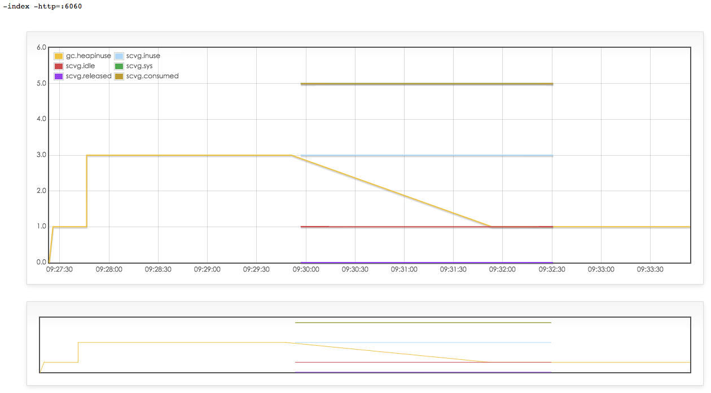

## 前言:

架設好主機後，接下來開始就是要優化效能．其實有很多人建議了不少的優化與調整工具，不過這裡還是使用兩個視覺化可以很快調整的工具．

- [gcvis](https://github.com/davecheney/gcvis): 由[Dave Cheney](http://dave.cheney.net/)所開發的工具，可以很清楚的觀察GC(Garbage Collection)發生的時間點與Heap的大小，讓你可以了解系統由於GC消耗的多少的系統資源．
- [pprof](https://golang.org/pkg/net/http/pprof/):這個系統build-in的工具，可以讓你產生每個function所產生的方塊圖可以讓你清楚找出系統裡面的bottleneck．

這裏只是簡單的使用流程與心得，不過應該會有更多的資料補充．

## 關於gcvis

### 安裝與使用

- go get github.com/davecheney/gcvis
- 使用相當簡單 `gcvis YOUR_APP -index -http=:6060`

就會打開一個網頁顯示目前的heap與GC狀態

## 關於pprof

必須要先安裝好[Graphviz](http://www.graphviz.org/)

- 執行`go tool pprof http://localhost:YOUR_WEB_PORT/debug/pprof/profile`
- (pprof) top10
- (pprof) web

會出現一個圖類似以下:

###問題: Go-martini會將handler預設是沒有開放的，所以會得到`404 page not found`:
 
這邊有個[討論串](https://github.com/go-martini/martini/issues/228)，我覺得[Patrick](http://blog.simplypatrick.com/)[這個解法](https://github.com/go-martini/martini/issues/228#issuecomment-41661238)挺好的．

     
     import "net/http/pprof"
     
     //Some martini init here.
     m.Group("/debug/pprof", func(r martini.Router) {
            r.Any("/", pprof.Index)
            r.Any("/cmdline", pprof.Cmdline)
            r.Any("/profile", pprof.Profile)
            r.Any("/symbol", pprof.Symbol)
            r.Any("/block", pprof.Handler("block").ServeHTTP)
            r.Any("/heap", pprof.Handler("heap").ServeHTTP)
            r.Any("/goroutine", pprof.Handler("goroutine").ServeHTTP)
            r.Any("/threadcreate", pprof.Handler("threadcreate").ServeHTTP)
        })

## 心得:

- 使用`gcvis`可以幫助你瞭解目前Heap的數量，記憶體使用數量與GC發生的次數．記住，越多的GC代表著系統資源消耗在回收與釋放記憶體．
- `pprof`可以完成一個樹狀圖．不過，目前在Web Application這裏可能還需要有更多的技巧找出真正卡住系統資源的地方．
- Go 1.5 有出新的[tracer](http://golang.org/s/go15trace), 等 1.5出來可以試著用用看....  

## 相關文件:

- pprof:
    - [Go的pprof使用](http://www.cnblogs.com/yjf512/archive/2012/12/27/2835331.html)
    - [Debugging performance issues in Go programs](https://software.intel.com/en-us/blogs/2014/05/10/debugging-performance-issues-in-go-programs)
        - Intel出的研究文章，相當詳細的解釋．
    - [bee](http://astaxie.gitbooks.io/build-web-application-with-golang/content/en/14.6.html)
    - [Godoc:pprof](https://golang.org/pkg/runtime/pprof/)
- gcvis:
    - [dfc: Visualising the Go garbage collector](http://dave.cheney.net/2014/07/11/visualising-the-go-garbage-collector)   
