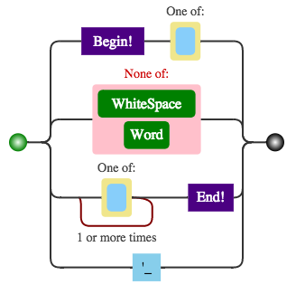

## 前言 

之前學習MIT關於分散式系統的部分，其實對於MapReduce與BigData的部分還是一知半解．這一堂課似乎是大家所期盼的課程，所以來學習．其實課程的節奏算是合適，我想整個Loading也不會太重．

## 相關文章

edx 課程網址在這裡 [https://www.edx.org/course/introduction-big-data-apache-spark-uc-berkeleyx-cs100-1x](https://www.edx.org/course/introduction-big-data-apache-spark-uc-berkeleyx-cs100-1x)

- [[MOOCS:edx]BerkeleyX CS100.1x- Introduction to Big Data with Apache Spark (一)](http://www.evanlin.com/mooc-edx-berkeayx-cs1001x-1/)
- [[MOOCS:edx]BerkeleyX CS100.1x- Introduction to Big Data with Apache Spark (二)](http://www.evanlin.com/mooc-edx-berkeayx-cs1001x-2/)
- [[MOOCS:edx]BerkeleyX CS100.1x- Introduction to Big Data with Apache Spark (三)](http://www.evanlin.com/mooc-edx-berkeayx-cs1001x-3/)
- [[MOOCS:edx]BerkeleyX CS100.1x- Introduction to Big Data with Apache Spark (四)](http://www.evanlin.com/mooc-edx-berkeayx-cs1001x-4/)

## 課程筆記 

### 本堂課的目標 

**edx給的官方目標:**

- 學習關於 Data Science的定義與本質
- 如何使用 Data Science
- 學習 [Apache Spark](https://spark.apache.org/)

**我自己的目標:**

- 瞭解 Data Science
- 瞭解 Big Data相關應用
- 學習並且了解 Apache Spark

### WEEK1 (Lecture 1/2) 

主要是設定環境跟一些 Big Daa的簡介，內容其實相當的淺顯易懂．

- 環境設定方面:
    - 主要使用[VirtualBox](https://www.virtualbox.org/) + [Vagrant](https://www.vagrantup.com/)．
    - 透過Vagrant設定好[Spark](https://spark.apache.org/)之後，可以透過[IPython Notebook](http://ipython.org/notebook.html)來操作．

- Tranditional Machine Learning(以下簡稱: Machine Learning) 與 Data Science的差異:
    - Machine Learning為了建立有效的Model而Data Science使用建立好的models來分析資料
    - Data Science的產出會是一個BI (Business Intellegence)而Machine Learning 產生是一個數據良好的模型．
- Data Science 流程:
    - 取得資料
    - 整理資料 (ETL: Extract-Transform-Load)
    - 分析資料
- Data Science實際上可能由於突變因子造成數據不可信任
    - ex: 新聞與事件造成Google Search string 分析失誤
    - 解決方式： 移除該因子所造成的髒資料(Dirty Data)，重新跑運算

### WEEK2 (Lecture 3/4)

(Spark: 組成圖來源Spark 官網)

本週進度主要是介紹關於Apache Spark的優點(相較於 [Hadoop MapReduce](http://hadoop.apache.org/docs/r1.2.1/mapred_tutorial.html))

- 關於Map Reduce的[原理與方法](http://hadoop.apache.org/docs/r1.2.1/mapred_tutorial.html)
- Cluster Computer最困難的莫過於處理： 
    - (1) 把工作分散給各個機器 
    - (2) 處理某些機器的fail或是過於緩慢的速度
- 緩慢回應(slow)與失效節點(fail)處理方式:  重啟另外的節點，把運算轉移到新節點
- Apache Spark 與 Hadoop MapReduce的差異：
    - 使用In-Memory Data Shading: (最大差異)
        - 將儲存到Hard disk的資料，全部放到記憶體上 (由於記憶體的成本逐漸降低)
    - 新的資料結構RDDs(Relient Distributed Datasets)
        - 具有track lineage information 可以發現並且修復某些資料
        - 建立後不能更改，但是可以根據已經存在的RDDs修改並建立新的
        - 支援Parallel處理下的資料集合
    - Generalized pattern, Lazy Evaluation, lower overhead and less expensive shuffles

#### 關於RDD的相關程式碼 

##### RDD 宣告 

        data = [1, 2, 3, 4, 5]
        rdd = sc.parallelize(data, 4)

這段程式碼有以下特點:

-  建立RDD，並且具有4 個 partition
-  根據 Lazy Evaluation 他不會執行任何動作．只是建立RDD

        distFile = sc.textFile("...", 4)
        
- 由檔案讀入並且，建立四個partition的RDD
- 每一行事當成一個Element

##### Transformation 

Spark 支援至少以下數種tranformations

- map
- filter
- distinct
- flatMap

而以上的tranformation並且也支援lambda，也就是說可以有以下數種處理:

        data = [1, 2, 3, 4]
        rdd = sc.parallelize(data, 4)

以下語法都使用同樣的rdd:
    
        rdd.map(lambda x: x*2)
        # 轉成一個map [1, 2, 3, 4] -> [2, 4, 6, 8]

若是改成filter
  
        rdd.filter(lambda x: x%2 = 1)
        # 轉成 [1, 3]

flatMap是一個會把所有set 切成平面

        rdd.flatMap(lambda x:[x, x+3])
        # 轉成 [ [0, 3], [1. 4], [2. 5], [3, 6], [4, 7]] => [0, 1, 2, 3, 3, 4, 4, 5, 6, 7]

**切記：  transformation 並不會馬上執行**．        

##### Action 

透過Action，Spark才會去執行transformation 並且把結果傳回給driver． 這是唯一能拿到結果的方式．

Spark 支援以下幾種的 Action:

- reduce: 可以傳回所有的集合總和
- take(n): 只拿前面n個結果
- collect(): 把整個集合傳回
- takeOrdered(n, func): 拿回符合func的前面n個結果，相當有用的action

##### Caching #####

想要避免action跑完後，需要原始的資料，可以透過 cache來把資料先暫存起來．記住，他一樣是屬於lazy evaluation所以是不會執行．

    data = [1, 2, 3, 4, 5]
    rdd = sc.parallelize(data, 4)
    #create cache並且儲存 x*2 的結果
    c1 = rdd.map(lambda x: x*2).cache()
    #將rdd修改成 x= x*3
    ret1 =rdd.map(lambda x: x*3).take(3)
    print ret1
    #此時cache依舊是舊的資料，可以直接開始其他action.
    print c1.collect()
    

##### RDD Lifecycle #####

- RDD create
    - sc.parallelize() or sc.textFile
    - transform 會將RDD製造新的副本出來... (Lazy create)
- Action 之後，RDD就會結束.. 除非你有用cache 把RDD複製一份起來...

##### Shared Variables #####

rdd的function closure稱為worker，worker彼此間是無法溝通的．唯一能夠讓worker與driver溝通的方式就是透過以下兩種shared variables. (其實跟OpenCL很類似)

根據方向上而言，可以分為以下兩種:

- Driver -> Worker (Broadcast)
    - Driver將read-only資料，傳送給各個worker
- Worker -> Driver (Accumulator)
    - Worker將各個計算結果傳回給Driver這裏的資料是Write-only
    - Accumulator 只能在worker存取，並且每次worker只能寫一次

### LAB1 Word Count###

透過iPython Notebook的Lab作業，因為是一步一步地執行．其實是相當的簡單．而且，就算真的看不懂要幹嘛～其實看下一個檢查的地方，就能了解你需要做什麼事情．幾個需要注意的地方：

- 需要了解`map`與`reduceByKey`真正的差異在哪裡． 尤其是面對 key-value資料的處理上， `map`會一個個的iterate 但是`reduceByKey` 會已經透過key把重複的抓過來這個function比對．
- 要注意到，每一個transform 與 action的關係，由於action 是一個closure所以不要把action 結果帶去另外一個transform
- 對於我而言，一開始常犯的錯誤是: 把 `map`當作是`filter`來使用． 要注意的是:
    - `map` 會 iterator 每一個元素並且輸出結果．
    - `filter` 才會把符合function的放入你的結果中．
- Lab1 整體很簡單，依照教學與只是可以做簡單的word count概念的功能．不過卡住我最久的竟然是regular expression，我是用[regulex](https://jex.im/regulex/)來幫助我了解與分析結果．    

一個regular expression 的圖示，去除掉頭尾的空白與所有字串中的非字元與空白的字．

## 參考鏈結

- [這一堂課程在EDX上面的鏈結](https://courses.edx.org/courses/BerkeleyX/CS100.1x/1T2015/)
- [Apache Spark](https://spark.apache.org/)
- 論文:
    - [Spark: Cluster Computing with Working Sets](http://people.csail.mit.edu/matei/papers/2010/hotcloud_spark.pdf)
    - [Resilient Distributed Datasets: A Fault-Tolerant Abstraction for In-Memory Cluster Computing](http://usenix.org/system/files/conference/nsdi12/nsdi12-final138.pdf)
